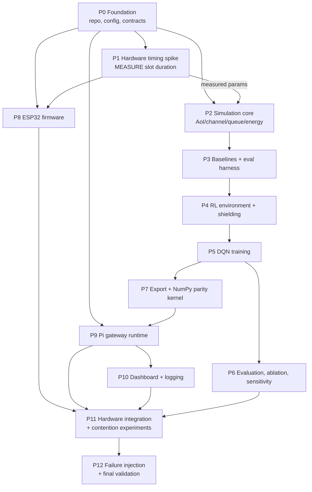
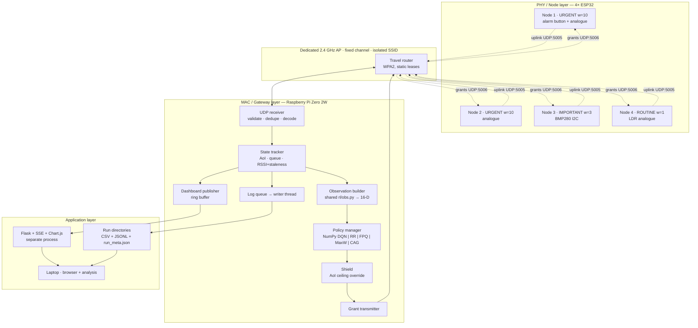
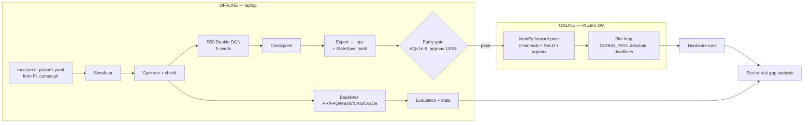

# ENGINEERING BLUEPRINT — PHASE-BY-PHASE PLAN, JUSTIFICATION, AUDIT

**Project:** DRL-Based Age-of-Information-Aware Cross-Layer Scheduler for Mixed-Criticality Wireless IoT Networks with Embedded Hardware Validation
**Course:** BECE497J · Project – I · School of Electronics Engineering, VIT Chennai
**Team:** Kanish Kannan (23BEC1192), Indirajeet Sudharsan (23BEC1405), Rohith S (23BEC1450)
**Guide:** Dr. Vydeki D., Professor Grade I

> **STATUS: PLANNING ARTIFACT. NO IMPLEMENTATION CODE. PENDING PROJECT OWNER APPROVAL.**

---

## 0. HOW TO READ THIS DOCUMENT

Every phase preserves the decision history required by the master prompt:

`D. Original Proposed Plan` → `E. Original Implementation Plan` → `F. Justification` → `G. Alternatives` → `H. Audit` → `I. Findings` → `J. Audited Plan` → `K. Original vs Audited` → `L. Decision Records` → `M. Tasks` → `N. Tests` → `O. Acceptance` → `P. Risks` → `Q. Outputs` → `R. Human Decision Required`

**Decision classes:** `ESTABLISHED` (explicit in the project context), `RECOMMENDED` (my technically justified addition), `PROVISIONAL` (cannot be responsibly fixed without measurement or owner input).

**Unresolved-value markers:** `TO BE MEASURED` (needs a bench experiment), `TO BE TUNED` (needs a sweep), `DECISION REQUIRED` (needs the owner).

Global IDs used throughout: `Fn.m` = audit finding, `Dn.m` = decision record, `Tn.m` = task, phase `n`.

---

## 0.1 WHAT THE ORIGINAL CONTEXT ACTUALLY FIXES

Read strictly, the project context establishes the following and nothing more. Everything else in this document is `RECOMMENDED` or `PROVISIONAL` and is flagged as such.

| # | ESTABLISHED decision | Source in context |
|---|---|---|
| E1 | Problem: AoI-aware scheduling of mixed-criticality traffic on a shared wireless channel | §1 |
| E2 | Method: DQN (not tabular Q-learning, not bandits, not MPC, not convex/Lyapunov as sole method) | §1 |
| E3 | Experience replay + target network as stabilisers | §1 |
| E4 | Topology: 4 ESP32 nodes + 1 Raspberry Pi Zero 2W gateway + laptop dashboard | §2, §4 |
| E5 | Criticality classes: 2× Urgent, 1× Important, 1× Routine; weights 10 / 3 / 1 | §4, §9 |
| E6 | Training offline on laptop; inference on Pi | §2 |
| E7 | State ≈ AoI, RSSI, queue length per node (context says "12 continuous numbers") | §1 |
| E8 | Network size 64×64 hidden, ~5k params, ~20 KB | §2 |
| E9 | NumPy hand-rolled forward pass as the zero-dependency deployment fallback to ONNX Runtime | §2 |
| E10 | Slot duration is to be **measured**, not assumed (100 ms was a placeholder) | §2 |
| E11 | Scheduler decision clock is **decoupled** from delivery confirmation; non-blocking receives both sides | §2 |
| E12 | Shielding safety override: hard AoI ceiling force-grants a node regardless of policy | §2 |
| E13 | Baselines: Round Robin and Fixed Priority Queue (+ Lyapunov/convex as theoretical comparator) | §1, §7 |
| E14 | Deliberate contention is mandatory in the demo or no gap will be visible | §2 |
| E15 | CSV logging is the evidence; live demo is theatre | §2 |
| E16 | Channel model = path loss + shadowing; RSSI is the cross-layer state variable | §3 |
| E17 | Energy model E = P_tx × T_slot | §3 |
| E18 | Framing is **soft** real-time, contention-aware — not a hard guarantee | §2 |
| E19 | Static criticality classes are the core; the alarm button is the one live dynamic-escalation demo | §9 |
| E20 | Hysteresis is the fix for threshold flapping | §9 |
| E21 | Novelty is arbitration under contention, not urgency detection | §9 |
| E22 | Sensitivity analysis on the 10/3/1 weights (e.g. vs 5/3/1) | §9 |
| E23 | Hardware budget ≈ ₹5,000; simulation-first | project record |

**Explicitly "Not specified in original proposal"** and therefore filled here as `RECOMMENDED`/`PROVISIONAL`:
packet formats, ports, clock-synchronisation strategy, the exact AoI definition (generation-time vs reception-time), RSSI staleness handling, reward function algebra, replay/target hyperparameters, ESP32 SDK choice (Arduino vs ESP-IDF), Wi-Fi power-save configuration, AP topology, dashboard framework, repository layout, configuration single-sourcing, seed/reproducibility policy, the exact baseline set, and the train/test load-split protocol.

---

## 0.2 THE FIVE FINDINGS THAT MATTER MOST

These are lifted out of the per-phase audits because they change the project's shape. Full detail in the referenced phases.

| ID | Finding | Severity | Why it matters |
|---|---|---|---|
| **F2.1** | **No clock-synchronisation strategy exists.** AoI is a difference of timestamps taken on two different oscillators (ESP32 crystal vs Pi). Without a defined strategy every AoI number the project reports is offset by an unknown constant. | CRITICAL | Invalidates the headline metric. Fix: nodes report *elapsed local duration* (`age_at_tx_us`), never absolute time — reduces the requirement from clock *sync* to bounded clock *drift over ~100 ms*, which is trivially satisfied. See D2.1. |
| **F5.2** | **The proxy heuristic used in the Zeroth Review demo (`w_i × Δ_i × p_s`) is also the strongest baseline, and the DQN may not beat it.** The context treats it as a stand-in for the agent; an examiner will treat it as a competitor. | CRITICAL | Reframes the contribution: the heuristic needs a *known* `p_s(RSSI)` channel model; DQN is model-free and learns it. Report both. See D6.1 and Risk R-01. |
| **F4.1** | **Criticality must be in the state vector, not implicit in the node index.** The context's 12-D state (4 nodes × AoI/queue/RSSI) works only while classes are static — but E19 requires the alarm button to escalate a class live. | HIGH | State becomes 16-D (4 nodes × 4 features). Without this the deployed agent cannot react to the one live demo you plan. See D4.1. |
| **F3.2** | **RSSI for un-granted nodes goes stale exactly when it matters.** A starved node's channel estimate is oldest precisely when the agent must decide whether to spend a slot on it. | HIGH | Add a 2 s unsolicited heartbeat + RSSI freshness decay toward the class prior. See D3.2. |
| **F1.1** | **Slot duration must be measured before the simulator's parameters are frozen, not after training.** The context correctly says measure it (E10), but the implied phase order trains first and deploys second. | HIGH | Insert Phase 1 (hardware timing spike) *before* the simulator is parameterised. This is the single biggest change to the plan's shape. |

---

## 0.3 PHASE MAP

The master prompt's 22-item list is a checklist of *areas*, not a dependency order. Derived from actual dependencies, the project decomposes into **13 phases**. Merges and splits are justified below the table.



| Phase | Name | Maps to master-prompt areas | Merge/split rationale |
|---|---|---|---|
| P0 | Foundation, config, and frozen contracts | 1, 2 | Merged. Environment setup without frozen interfaces is worthless; frozen interfaces without a repo have nowhere to live. |
| P1 | **Hardware timing characterisation spike** | *(new)* | **Split out and moved early.** Not in the master list. Required by E10: the simulator cannot be parameterised with an invented slot time. |
| P2 | Simulation core — AoI, channel, queue, energy models | 6, 7 | Merged. The models *are* the simulator; separating them creates an empty shell phase. |
| P3 | Baseline schedulers + evaluation harness | 8, 12 (partial) | Merged. A baseline you cannot measure is not a baseline. Building the harness here forces the DQN to be scored by the same code as RR/FPQ — removes a whole class of comparison bugs. |
| P4 | RL environment interface + shielding layer | 9, 16 | Merged. Shielding modifies the action *before* it reaches the environment; it must exist when the env contract is frozen or training and deployment diverge. |
| P5 | DQN implementation + training | 10, 11 | Merged. Splitting implementation from training produces a phase whose only exit criterion is "the code compiles". |
| P6 | Evaluation, ablation, sensitivity | 12, 17 (sim half) | — |
| P7 | Model export + NumPy inference parity | 13 | — |
| P8 | ESP32 firmware | 3, 4 | Merged. The protocol is defined in P0; P8 implements the node side of it. |
| P9 | Pi gateway runtime | 5, 14, 15 | Merged. Receiver, grant logic, and inference are one process with one slot loop. |
| P10 | Dashboard + logging/experiment infrastructure | 17, 18 | — |
| P11 | Hardware integration + contention experiments | 19, 21 | — |
| P12 | Failure injection + final validation | 20, 22 | — |

---
---

# PHASE 0 — FOUNDATION, CONFIGURATION, AND FROZEN CONTRACTS

## A. Phase Objective

Establish the repository, the reproducible Python environment, and — critically — the four **frozen contracts** that every later phase must obey: the mathematical definitions, the wire protocol, the configuration schema, and the logging schema. Produce no behaviour; produce the things that make later behaviour consistent.

## B. Why This Phase Exists

The project has three implementations of the same system (Python simulator, Pi runtime, ESP32 firmware) that must agree on AoI, on state layout, on criticality weights, and on packet bytes. Historically this is where hardware-in-the-loop student projects fail: the simulator computes AoI one way, the gateway another, and the numbers in the report cannot be defended. This phase exists to make divergence structurally impossible rather than a matter of discipline. It is first because every other phase imports from it.

## C. Dependencies

* Previous phases: none.
* Hardware: none.
* Software: Git, Python ≥3.11, VS Code or equivalent.
* Frozen decisions required: none (this phase produces them).

## D. ORIGINAL PROPOSED PLAN

The context does not describe a foundation phase. It establishes the system's parts (4 ESP32 + Pi + dashboard), the offline-train/on-Pi-infer split, and the intent to log everything to CSV, but:

> "Not specified in original proposal." — repository structure, configuration mechanism, packet formats, the authoritative AoI definition, seeding/reproducibility policy, or how the ESP32 firmware and Python code stay in agreement on shared constants.

The implicit original workflow is: write the simulator, train, export, write firmware, integrate.

## E. ORIGINAL IMPLEMENTATION PLAN

Followed literally, the original approach produces:

* A flat repository: `sim.py`, `train.py`, `gateway.py`, `firmware.ino`, `dashboard.py`, plus notebooks.
* Constants (`SLOT_MS`, weights `10/3/1`, node count, ports) declared as literals at the top of each file.
* AoI computed wherever it is needed, in whatever way is locally convenient.
* Packet contents decided ad hoc when the firmware is written (Phase 8), i.e. *after* the simulator has already fixed the state vector.
* Data flow: `sim.py` → `train.py` → weights file → `gateway.py`; firmware and gateway agree by inspection.
* Expected outputs: a runnable simulator and a training script.

## F. ORIGINAL PLAN JUSTIFICATION

* **It matches the actual dependency intuition.** Simulation genuinely does come before firmware, and the context's simulation-first stance is correct.
* **It minimises upfront work** on a student timeline where the review deadlines are real and the temptation to show a working plot early is strong.
* **Assumption it depends on:** that three codebases maintained by three people can hold shared constants in sync by convention.
* **Trade-off introduced:** every shared constant becomes a silent failure mode. A weight of `10` in the trainer and `10.0` in the gateway is fine; a slot of `100 ms` in the firmware and `80 ms` in the trained policy is a corrupted result that still runs and still produces a plot.

## G. ALTERNATIVES CONSIDERED

| Approach | Fit | Complexity | Reproducibility | Risk | Verdict |
|---|---|---|---|---|---|
| **A0-1 Flat repo, literal constants** (original) | Works for one person for two weeks | Lowest | Poor — no config snapshot per run | Silent sim/hardware divergence | Rejected |
| **A0-2 Python package + single YAML config, hand-copied into firmware** | Good for Python side | Low | Good | Firmware still diverges by hand-copy | Partial |
| **A0-3 Python package + single YAML + code-generated `generated_config.h`** | Full | Low-medium (one ~60-line generator script) | Strong — one source of truth, snapshot per run | Generator must be re-run; enforced by CI/pre-commit | **Recommended** |
| **A0-4 Full monorepo with Protocol Buffers / nanopb for wire format** | Overkill | High | Strong | nanopb on ESP32 adds build complexity for a 40-byte packet | Rejected — see D0.2 |
| **A0-5 Hydra/OmegaConf config management** | Good | Medium | Strong | Extra dependency, learning curve, no benefit at this parameter count | Rejected |

## H. PHASE PLAN AUDIT

**Technical correctness.** The flat approach runs. It does not fail loudly; it fails quietly, which is worse for a project whose entire output is measurements.

**Integration.** The original plan defines packet formats in Phase 8 (firmware), but the state vector is frozen in Phase 2 (simulation). If the packet cannot carry what the state needs — RSSI as measured at the node, criticality flags, an age field — the simulator's state is unrealisable on hardware and either training is redone or the report quietly compares two different systems.

**Interface consistency.** Three separate risks: (i) AoI defined by generation time in one place and reception time in another differ by one-way delay ≈ 30 ms, which is ~30 % of a slot; (ii) state feature *order* is positional and unnamed — a transposition between trainer and gateway is undetectable by inspection; (iii) normalisation constants (`Δ_max`, `RSSI_min/max`) live in two places.

**Hardware feasibility.** No concern at this phase. Note for later: the Pi Zero 2W has 512 MB RAM and a single 2.4 GHz radio — this constrains P9/P10, not P0.

**Wireless feasibility.** N/A this phase, but P0 must reserve packet fields for things P1 will measure (e.g. a per-node RSSI byte), or the protocol is re-cut later.

**ML correctness.** The state vector must be defined once, as a named, ordered schema, with normalisation attached. Anything else risks a train/deploy feature mismatch — the most common and most invisible deployment bug in applied RL.

**Research validity.** Reproducibility is a stated evaluation requirement. Without a per-run config snapshot and git SHA, "we ran 20 seeds" is unverifiable.

**Experimental validity.** Logging schema must be frozen here. If a metric the report needs (e.g. shielding activation count) is not logged from run 1, every prior run must be repeated.

**Complexity.** A0-3 adds one generator script and one YAML file. That is a genuinely small cost.

**Timeline.** 3–4 days including the contract-freeze workshop. It saves more than that in P11 alone.

**Failure handling.** N/A this phase.

**Security.** Deliberately minimal — an isolated lab SSID. But packet validation (magic, version, length, CRC) belongs in the frozen contract, not bolted on after the first malformed-packet crash. This is also a QA requirement: P12 injects malformed packets.

## I. AUDIT FINDINGS

| ID | Finding | Severity | Problem | Consequence | Recommended Correction |
|---|---|---|---|---|---|
| F0.1 | Shared constants duplicated across Python and C++ | HIGH | No single source of truth | Sim/hardware divergence produces plausible but wrong results | Single `config/system.yaml` + generated `firmware/include/generated_config.h`; pre-commit hook fails if stale |
| F0.2 | Wire protocol defined in P8, after state vector frozen in P2 | HIGH | Reversed dependency | Either retraining or an undefendable sim/hardware mismatch | Freeze packet schema in P0; P8 implements it |
| F0.3 | AoI definition not stated | CRITICAL | Generation-time vs reception-time AoI differ by one-way delay | Headline metric is ambiguous; two modules can legitimately disagree | Adopt generation-time AoI as authoritative (D0.1); implement once in `common/aoi.py`, import everywhere |
| F0.4 | State vector positional and unnamed | MEDIUM | Silent feature transposition | Deployed policy behaves randomly with no error | Named `StateSpec` with explicit index map + normalisation; asserted at load in trainer and gateway |
| F0.5 | No per-run provenance | MEDIUM | Results not reproducible | Weakens the report and violates the stated reproducibility requirement | Every run writes `run_meta.json` (git SHA, config hash, seed, timestamp, host, policy id) |
| F0.6 | Logging schema undefined | MEDIUM | Metric discovered late requires rerunning all experiments | Lost weeks near the deadline | Freeze per-slot CSV columns + JSONL event schema in P0 (see §12/§13) |
| F0.7 | No packet validation contract | LOW | Malformed packet handling ad hoc | P12 failure tests have nothing to test against | Magic + version + length + CRC16-CCITT specified in P0 |
| F0.8 | No seeding policy | LOW | "20 seeds" unverifiable | Reviewer cannot reproduce | Seeds `0..N-1`, recorded per run; NumPy `Generator`, not global `np.random` |

## J. AUDITED / RECOMMENDED PLAN

**Unchanged:** simulation-first ordering; Python for the host side; CSV as the evidence format; offline-train/on-Pi-infer split.

**Modified:** repository becomes an installable package (`pip install -e .`) with a `common/` module that both trainer and gateway import — so a train/deploy mismatch is an import-time failure rather than a silent one.

**Newly introduced:**
1. `config/system.yaml` — the single source of truth for every parameter in §15.
2. `tools/gen_firmware_config.py` — emits `generated_config.h`; pre-commit hook fails the build if regeneration would change the file.
3. `common/contracts/` — `aoi.py` (the one authoritative AoI implementation), `state_spec.py` (named state schema + normalisation), `packets.py` (struct definitions, pack/unpack, CRC), `log_schema.py`.
4. `run_meta.json` provenance record per run.
5. A **contract-freeze review** with the guide before P2 begins.

**Removed:** nothing — the original had nothing here to remove.

## K. ORIGINAL VS AUDITED PLAN

| Area | Original Proposal | Audited Recommendation | Status | Reason |
|---|---|---|---|---|
| Repo layout | Flat scripts | Installable package, `common/` shared by trainer + gateway | CHANGED | Makes train/deploy mismatch an import error |
| Constants | Literals per file | `config/system.yaml` + generated C header | CHANGED | F0.1 |
| AoI definition | Not specified | Generation-time, one implementation | ADDED | F0.3 — CRITICAL |
| Packet format | Defined in firmware phase | Frozen in P0 | MODIFIED | F0.2 |
| State vector | 12 positional floats | Named `StateSpec`, asserted at both ends | MODIFIED | F0.4 |
| Provenance | Not specified | `run_meta.json` per run | ADDED | F0.5 |
| Logging schema | "Log everything to CSV" | Frozen column/event schema | MODIFIED | F0.6 |
| Simulation-first | Yes | Yes | UNCHANGED | Correct |
| Serialisation | Not specified | Fixed-size little-endian `struct`, not protobuf | ADDED | D0.2 |

## L. DECISION RECORDS

### DECISION D0.1 — Authoritative AoI definition

**Original proposal:** AoI = "time since the last successfully received update from a sensor" (§1). Correct in spirit, ambiguous in implementation.

**Agent analysis:** Two readings exist. (a) *Reception-time AoI:* `Δ_i(t) = t − r_i(t)`, where `r_i` is when the gateway received the freshest packet. (b) *Generation-time AoI:* `Δ_i(t) = t − u_i(t)`, where `u_i` is when the sensor *sampled* the value in the freshest received packet. These differ by the one-way delay, which P1 will likely measure at 20–40 ms — roughly 30 % of a nominal 100 ms slot. Definition (b) is the standard in the AoI literature and the only one that makes the cross-layer claim meaningful, because it charges the scheduler for the delay its own decisions cause. Definition (a) makes a slow channel look free.

**Alternatives:** (a) reception-time (simpler, no age field needed, understates the problem); (b) generation-time (standard, requires an age field in the packet); (c) peak-AoI only (a metric, not a replacement definition).

**Agent recommendation:** Generation-time AoI, implemented once in `common/contracts/aoi.py`, imported by simulator, trainer, evaluator, gateway, and dashboard. Report peak AoI and P95 AoI as *additional* metrics, not alternative definitions.

**Status:** ADDED
**Reason:** The context does not specify it; the difference is ~30 % of a slot and would be discovered during hardware integration at the worst possible time.
**Trade-offs:** Requires an `age_at_tx_us` field in the uplink packet (2 extra bytes over a 16-bit µs field, 4 with headroom) and a small amount of firmware bookkeeping. Gains: the metric matches the literature and the simulator's numbers mean the same thing as the hardware's.
**Risk:** LOW. Field is cheap; bookkeeping is a subtraction of two `esp_timer_get_time()` calls.
**Validation:** Unit test — a synthetic trace with known generation and reception times must produce a hand-computed AoI sawtooth to within 1 µs. Cross-check: gateway and simulator fed the same trace must produce byte-identical AoI series.
**Confidence:** HIGH
**Project owner approval required:** YES — it changes the definition of the headline metric and should be stated explicitly in the report.

### DECISION D0.2 — Wire serialisation format

**Original proposal:** Not specified.
**Agent analysis:** Candidates are fixed-size C `struct` / Python `struct` with explicit little-endian layout; JSON; MessagePack; nanopb/protobuf. Packets are ≤48 bytes and the schema will not evolve after P0. JSON costs 3–5× the bytes and adds parse jitter on the ESP32; protobuf adds a build-system dependency to the firmware for zero benefit at this size.
**Alternatives:** as above.
**Agent recommendation:** Fixed-size little-endian `struct` with explicit `__attribute__((packed))` on the C side and `struct.Struct` format strings generated from the same YAML. CRC16-CCITT over the payload.
**Status:** ADDED
**Reason:** Smallest, most deterministic, lowest firmware risk.
**Trade-offs:** Not human-readable on the wire — mitigated by a `tools/pcap_decode.py` helper for Wireshark work. No forward compatibility — acceptable, and a `version` byte allows a hard reject rather than silent misparse.
**Risk:** LOW — ESP32 and Pi are both little-endian ARM/Xtensa; a compile-time `static_assert` on `sizeof(packet)` catches padding surprises.
**Validation:** Round-trip property test — 10,000 randomly generated packets pack/unpack identically in Python; a golden-bytes fixture shared between the Python test suite and a firmware unit test.
**Confidence:** HIGH
**Project owner approval required:** NO

### DECISION D0.3 — Configuration single-sourcing

**Original proposal:** Not specified.
**Agent analysis:** See F0.1. The parameter set (§15) is ~45 values, of which ~12 are shared between Python and firmware.
**Alternatives:** hand-copy with a comment; shared JSON parsed at ESP32 boot (adds runtime parsing and a failure mode); code generation.
**Agent recommendation:** Code generation from `config/system.yaml` into `generated_config.h`, with a pre-commit hook and a CI check that regeneration is a no-op.
**Status:** ADDED
**Reason:** F0.1.
**Trade-offs:** Contributors must re-run the generator. The hook makes forgetting a build failure rather than a silent bug.
**Risk:** LOW.
**Validation:** CI job asserts `git diff --exit-code` after regeneration.
**Confidence:** HIGH
**Project owner approval required:** NO

## M. PHASE IMPLEMENTATION TASKS

| Task | Objective | Deps | Files | Requirements | Interfaces | Tests | Acceptance | Deliverable |
|---|---|---|---|---|---|---|---|---|
| **T0.1** | Repo + env | — | `pyproject.toml`, `.gitignore`, `README.md`, `.pre-commit-config.yaml` | Python 3.11; pinned deps; `pip install -e .` works on laptop *and* Pi OS 64-bit | — | `pip install -e . && pytest -q` on both hosts | Clean install on both, zero warnings | Installable package |
| **T0.2** | Config schema | T0.1 | `config/system.yaml`, `common/config.py` | Every §15 parameter present with unit + class (fixed/configurable/measured/tuned); loader validates types and ranges and rejects unknown keys | `load_config(path) -> Config` | Reject a config with an unknown key, a missing key, and an out-of-range value | All three rejections raise with a named field | Validated config loader |
| **T0.3** | AoI contract | T0.2 | `common/contracts/aoi.py` | Implements D0.1 exactly; pure function over an event list; no I/O | `aoi_series(events, t_grid) -> np.ndarray` | Hand-computed sawtooth fixture; monotone-increase-between-deliveries property test | Matches fixture to 1 µs | The single AoI implementation |
| **T0.4** | State contract | T0.2 | `common/contracts/state_spec.py` | Named ordered features + per-feature normalisation + `to_vector`/`from_vector`; emits a schema hash | `StateSpec.hash() -> str` | Round-trip; hash changes when order changes | Hash embedded in every checkpoint | Named state schema |
| **T0.5** | Packet contract | T0.2, D0.2 | `common/contracts/packets.py`, `tools/gen_firmware_config.py` | Uplink + grant + heartbeat + hello structs per §13; CRC16-CCITT; version byte | `pack_*/unpack_*` | 10k round-trip property test; golden-bytes fixture; `static_assert` sizes | Golden fixture identical in Python and C | Frozen wire protocol |
| **T0.6** | Logging contract | T0.2 | `common/contracts/log_schema.py` | Per-slot CSV columns and JSONL event types per §13.6; writer with explicit `flush` policy | `SlotLogger`, `EventLogger` | Write 10k rows, reload, assert schema + no dropped rows | Reloads to identical dataframe | Frozen log schema |
| **T0.7** | Provenance | T0.1 | `common/provenance.py` | `run_meta.json` with git SHA, dirty flag, config hash, `StateSpec` hash, seed, host, policy id, UTC timestamp | `write_run_meta(dir, ...)` | Dirty-tree run is flagged | Every run dir contains it | Reproducibility record |
| **T0.8** | Contract freeze review | T0.3–T0.7 | `docs/CONTRACTS.md` | Human sign-off on AoI, state, packets, config, logs | — | — | Guide + team signed | Frozen baseline tag `v0-contracts` |

## N. PHASE TEST STRATEGY

| Test | Setup | Action | Expected | Pass criterion |
|---|---|---|---|---|
| UT-0.1 | Synthetic delivery trace, known generation times | Call `aoi_series` | Sawtooth matching hand computation | Max abs error < 1 µs |
| UT-0.2 | Random `StateSpec` vectors | `to_vector` → `from_vector` | Identity | Exact for all 10k |
| UT-0.3 | 10k random valid packets | Pack → unpack | Identity | Exact; CRC valid |
| UT-0.4 | Corrupt one bit in each packet | Unpack | Rejected | 100 % rejection, no exception escapes |
| UT-0.5 | Golden-bytes fixture | Decode in Python and in the firmware unit test | Same field values | Byte-identical |
| IT-0.1 | Modify `system.yaml` | Run generator | `generated_config.h` changes | CI fails when generator not re-run |
| IT-0.2 | Fresh clone on Pi OS 64-bit | `pip install -e .` | Success | Install + `pytest -q` green on Pi |

## O. PHASE ACCEPTANCE CRITERIA

- [ ] `pip install -e .` succeeds on laptop and on Raspberry Pi OS Lite 64-bit
- [ ] `pytest -q` green on both hosts
- [ ] `config/system.yaml` contains every §15 parameter, each with unit and class
- [ ] Exactly one AoI implementation exists (`grep -rn "def.*aoi" --include=*.py` returns one definition)
- [ ] `StateSpec` hash is emitted and stored
- [ ] Golden-bytes packet fixture passes in Python and in the firmware test
- [ ] Regenerating `generated_config.h` is a no-op in CI
- [ ] `docs/CONTRACTS.md` signed off by guide and team; repo tagged `v0-contracts`

## P. PHASE RISKS

| Risk | Probability | Impact | Mitigation | Fallback |
|---|---|---|---|---|
| Team treats the freeze as bureaucracy and edits contracts ad hoc | MEDIUM | HIGH | Contract changes require a PR that bumps the version byte and re-runs all affected tests | Re-freeze and rerun affected experiments; budget 3 days |
| Pi OS Python version differs from laptop | MEDIUM | MEDIUM | Pin 3.11 on both; test install on Pi in T0.1 not P9 | Use `venv` with `--system-site-packages` on Pi |
| Over-engineering consumes review-1 time | LOW | MEDIUM | Timebox to 4 days; nothing here needs to be beautiful | Ship YAML + contracts, defer pre-commit hook |

## Q. PHASE OUTPUTS

Installable package · `config/system.yaml` · `common/contracts/{aoi,state_spec,packets,log_schema}.py` · `tools/gen_firmware_config.py` · `firmware/include/generated_config.h` · `docs/CONTRACTS.md` · golden-bytes fixture · CI config · git tag `v0-contracts`

## R. HUMAN DECISION REQUIRED

**YES — two decisions:**
1. **D0.1** — adopt generation-time AoI as the authoritative definition. This changes the headline metric and must be stated in the report.
2. **Contract freeze sign-off** — the guide should see the AoI, state, and packet definitions before P2 begins, because changing them later invalidates trained models.

---
---

# PHASE 1 — HARDWARE TIMING CHARACTERISATION SPIKE

## A. Phase Objective

Measure, on the actual hardware in the actual room, the numbers the simulator needs and cannot invent: uplink one-way delay distribution, grant→data round-trip distribution, packet delivery ratio versus RSSI, RSSI stability, and the shortest slot duration that keeps grant-miss probability acceptably low. Output a **measured parameter file** that P2 consumes.

## B. Why This Phase Exists

The context is explicit (E10) that slot duration must be measured rather than assumed, and that observed ESP32 Wi-Fi UDP round trips are 40–60 ms typical with 200–400 ms spikes. But an implied ordering of "simulate → train → deploy → measure" means the agent would be trained against an invented slot time and an invented `p_success(RSSI)` curve, and the sim-to-real gap the project intends to *measure* would instead be an artefact the project *created*. Moving measurement before parameterisation converts the largest unknown into an input.

It sits after P0 because the packets it sends must be the frozen packets, so that the measured numbers describe the real protocol. It runs in parallel with early P2 work on structure.

## C. Dependencies

* Previous phases: P0 (packet contract, config, logging).
* Hardware: 2 ESP32 dev boards minimum (4 preferred), 1 Raspberry Pi Zero 2W, 1 dedicated 2.4 GHz router, microSD, PSUs. Optional: a USB Wi-Fi adapter for a monitor-mode capture, and a second radio source as a controlled interferer.
* Software: minimal echo firmware, minimal Pi probe script, `iperf3`, `tcpdump`.
* Frozen decisions: D0.1 (AoI), D0.2 (packets), F0.2 resolution.

## D. ORIGINAL PROPOSED PLAN

The context establishes the *need* for measurement (E10) and the *reason* (E11: decouple the decision clock; treat "no response yet" as rising AoI). It does not specify a measurement procedure.

> "Not specified in original proposal." — how many samples, over what duration, at what distances, with what interference present, how RSSI→PDR is to be characterised, whether Wi-Fi power save is disabled, whether the Pi is AP or station, or what statistic of the delay distribution sets the slot duration.

## E. ORIGINAL IMPLEMENTATION PLAN

Taken literally: write a small sketch that echoes UDP packets, ping it a few hundred times from the Pi, look at the mean (~66 ms per the synthetic bench log in §7 of the context), pick a slot duration a bit larger, and proceed.

* Components: `echo.ino`, `probe.py`.
* Data flow: Pi sends timestamped packet → ESP32 echoes → Pi logs RTT.
* Output: a mean and a histogram.

## F. ORIGINAL PLAN JUSTIFICATION

* **Correct instinct.** Measuring beats assuming, and the context reached this conclusion for the right reason.
* **Cheap.** A day's work with hardware already in the budget.
* **Assumption it depends on:** that a mean RTT is the statistic that determines slot duration.
* **Trade-off:** a mean is exactly the wrong statistic here. A slot sized at the mean fails ~50 % of the time. What determines slot duration is a high quantile of the *grant→data* delay, and what determines the agent's channel model is the RSSI→PDR relationship, which an echo test does not produce at all.

## G. ALTERNATIVES CONSIDERED

| Approach | What it yields | Effort | Fidelity | Verdict |
|---|---|---|---|---|
| **A1-1 Echo-RTT mean only** (original) | One number | 0.5 day | Low — hides the tail and the RSSI relationship | Insufficient |
| **A1-2 Quantile-characterised RTT + PDR-vs-RSSI sweep + interference-on/off** | Slot duration at P99, fitted `p_s(RSSI)`, tail model | 3–4 days | High | **Recommended** |
| **A1-3 Full channel sounding with SDR** | Multipath/fading characterisation | Weeks; needs an SDR | Highest | Rejected — outside budget and unnecessary for a MAC-layer scheduler |
| **A1-4 Trust published ESP32 benchmarks (40–60 ms)** | A literature number | 0 | Low — different board, room, router, and power-save setting | Rejected as sole basis; retained as a sanity cross-check |
| **A1-5 `iperf3`/ping only** | Throughput and ICMP latency | 0.5 day | Misleading — ICMP and TCP paths differ from the application UDP path | Rejected as primary; useful for gross link sanity |

## H. PHASE PLAN AUDIT

**Technical correctness.** Echo RTT is not the quantity the scheduler cares about. The scheduler grants a slot and needs the data back *within that slot*. The relevant random variable is `T_grant→data` = grant transmission + node processing + sample read + uplink transmission. Measuring Pi→ESP32→Pi echo conflates uplink and downlink and omits sensor-read time.

**Hardware feasibility.** Two ESP32 boards suffice for the timing distribution; the PDR-vs-RSSI sweep needs varied distance/attenuation, achievable by moving a node down a corridor and behind a wall. No exotic equipment needed.

**Wireless feasibility.** Three specific realism traps the original plan walks into:
1. **Wi-Fi power save.** ESP32 station mode defaults to a power-save mode that parks the radio between DTIM beacons, adding 100 ms+ of latency and enormous variance. Measuring with power save on and deploying with it off (or vice versa) invalidates every number. It must be explicitly set and recorded.
2. **AP choice.** If the Pi Zero 2W runs as SoftAP it shares its single radio between serving the AP and its own traffic, which both degrades and distorts the timing. A dedicated router with a fixed channel and no other clients isolates the experiment.
3. **Channel selection.** In a university building, 2.4 GHz channels 1/6/11 are congested. Measurements taken on a busy channel at 3 p.m. and experiments run on a quiet channel at 11 p.m. are not comparable. Channel and a background-occupancy scan must be recorded with every campaign.

**ML correctness.** P2's channel model needs `p_success` as a function of RSSI. Without this sweep, that function is invented, and the agent learns to exploit an invented channel — the single most likely cause of a large sim-to-real gap in this project.

**Research validity.** This phase is not overhead; it is *data*. "We measured the delay distribution of our own testbed and parameterised the simulator from it" is a defensible methodology sentence. "We assumed 100 ms" is not.

**Experimental validity.** Sample sizes must be stated. A 20-sample bench log (as in the context's synthetic illustration) cannot estimate a P99. ≥5,000 samples per condition is cheap here (at 10 Hz that is ~8 minutes).

**Reproducibility.** Every campaign must record: router model, channel, SSID, TX power, node positions with distances, time of day, background scan, firmware SHA, power-save setting, ambient occupancy.

**Complexity.** Moderate and bounded. The firmware is ~150 lines; the analysis is a notebook.

**Timeline.** 3–4 days, on the critical path for P2's parameterisation but parallelisable with P2 structural work.

**Failure handling.** If the measured P99 grant→data delay is very large (say >250 ms), the slot duration grows and the number of decisions per experiment falls. That is a finding, not a failure — but it must be caught now, not in week 12.

**Security.** Isolated lab SSID with WPA2 and a non-default password; no bridging to the campus network.

## I. AUDIT FINDINGS

| ID | Finding | Severity | Problem | Consequence | Recommended Correction |
|---|---|---|---|---|---|
| **F1.1** | Measurement scheduled after simulator parameterisation | HIGH | Reversed dependency | Agent trained against invented physics; sim-to-real gap becomes self-inflicted | Run this phase before P2 parameters are frozen (this phase's existence) |
| **F1.2** | Slot duration sized from mean RTT | HIGH | Wrong statistic | ~50 % of slots miss their data; AoI numbers dominated by a sizing error | Size from P99 of `T_grant→data`; see D1.1 |
| **F1.3** | Wi-Fi power save not specified | HIGH | ESP32 default parks the radio between beacons | 100 ms+ added latency and huge variance; measurement/deployment mismatch | `esp_wifi_set_ps(WIFI_PS_NONE)` explicitly, recorded in run metadata; measure both settings once and report the delta |
| **F1.4** | Echo RTT conflates uplink, downlink, and processing | MEDIUM | Wrong random variable | Slot sizing based on a quantity the scheduler does not experience | Instrument grant→data directly using `age_at_tx_us` + Pi receive time |
| **F1.5** | No PDR-vs-RSSI characterisation | HIGH | `p_success(RSSI)` invented in P2 | Agent's channel-awareness — the cross-layer claim — trained on fiction | Add a distance/attenuation sweep; fit a 2-parameter logistic (D1.2) |
| **F1.6** | AP topology unspecified | MEDIUM | Pi SoftAP shares one radio | Distorted timing; worse and noisier than necessary | Dedicated router, fixed channel, isolated SSID; Pi and nodes both stations |
| **F1.7** | Sample size unspecified | MEDIUM | Cannot estimate tail | P99 claims unsupported | ≥5,000 samples per condition; report n, mean, P50, P90, P99, max |
| **F1.8** | Channel occupancy not recorded | MEDIUM | Uncontrolled confounder | Results not reproducible across sessions | Record a background scan and time-of-day with every campaign |
| **F1.9** | RSSI reported by whom is undefined | LOW | Node-side RSSI (of the AP beacon) and gateway-side RSSI differ and are not symmetric | State feature ambiguous | Define node-reported RSSI (`esp_wifi_sta_get_ap_info`) as authoritative for state; log both |

## J. AUDITED / RECOMMENDED PLAN

**Unchanged:** the intent to measure rather than assume; the use of the project's own hardware; UDP as the measured transport.

**Modified:** the measured quantity becomes `T_grant→data` rather than echo RTT; the statistic becomes P99 rather than mean; sample size becomes ≥5,000 per condition.

**Newly introduced:**
1. **PDR-vs-RSSI sweep** at ≥6 positions (line-of-sight near, LOS far, through one wall, through two walls, corridor, deliberate-shadow), ≥5,000 packets each.
2. **Power-save A/B** — one campaign with `WIFI_PS_NONE` and one with the default, to quantify the delta and justify the setting in the report.
3. **Interference A/B** — one campaign clean, one with a co-channel load (a laptop streaming or `iperf3` on the same channel) to characterise the tail under contention.
4. **Dedicated router topology** replacing an unspecified/SoftAP arrangement.
5. **`measured_params.yaml`** — a machine-readable artefact consumed by P2, containing fitted `p_s(RSSI)` parameters, delay quantiles, RSSI variance, and recommended slot duration.
6. **A campaign metadata record** for reproducibility.

**Removed:** reliance on published ESP32 latency figures as a parameter source (retained only as a sanity cross-check).

## K. ORIGINAL VS AUDITED PLAN

| Area | Original Proposal | Audited Recommendation | Status | Reason |
|---|---|---|---|---|
| Measure slot duration empirically | Yes | Yes | UNCHANGED | E10 is correct |
| Timing of measurement | After/alongside training | Before simulator parameterisation | CHANGED | F1.1 |
| Measured quantity | Echo RTT | `T_grant→data` one-way + processing | MODIFIED | F1.4 |
| Sizing statistic | Mean (~66 ms) | P99 + explicit miss-rate budget | CHANGED | F1.2 |
| Sample size | ~20 (illustrative) / few hundred | ≥5,000 per condition | MODIFIED | F1.7 |
| PDR vs RSSI | Not specified | 6-position sweep, logistic fit | ADDED | F1.5 |
| Power save | Not specified | `WIFI_PS_NONE`, A/B measured | ADDED | F1.3 |
| AP topology | Not specified | Dedicated router, fixed channel | ADDED | F1.6 |
| Interference condition | Not specified | Clean/loaded A/B | ADDED | F1.8 |
| Output | A histogram | `measured_params.yaml` consumed by P2 | MODIFIED | Makes the measurement load-bearing |

## L. DECISION RECORDS

### DECISION D1.1 — Slot duration policy

**Original proposal:** 100 ms placeholder, to be replaced by a measured value (E10).

**Agent analysis:** Slot duration `T_slot` trades two things against each other. Short slots give more scheduling decisions per second (better AoI resolution, more training-relevant events per experiment) but a higher probability that granted data arrives after the slot closes. Long slots waste airtime and coarsen AoI. The correct sizing rule is a stated **miss-rate budget**: choose `T_slot = quantile_q(T_grant→data) + margin`, with `q` chosen so that late-arrival probability is below a budget. I recommend `q = 0.99` and margin = 10 ms.

Crucially, a late packet is **not** discarded — E11 already establishes that the clock is decoupled from delivery. A packet arriving in slot `k+1` for a grant issued in slot `k` still resets AoI (with its true generation-time age); it simply arrives after the decision that requested it. So the miss-rate budget governs *credit assignment quality* for the RL agent, not correctness. This weakens the consequence of a mis-sized slot considerably and is worth stating in the report.

**Alternatives:** (a) fixed 100 ms regardless of measurement — rejected, contradicts E10; (b) mean-based — rejected, F1.2; (c) adaptive slot duration that tracks a running quantile — attractive but adds a second learning loop and a non-stationary environment for the DQN; rejected for this project, noted as future work; (d) P95 instead of P99 — a legitimate choice giving a shorter slot and 5 % late arrivals.

**Agent recommendation:** `T_slot = ceil_to_10ms( P99(T_grant→data, clean channel) ) + 10 ms`, clamped to `[50 ms, 250 ms]`. Record the resulting value as `ESTABLISHED-BY-MEASUREMENT` in `measured_params.yaml`. Run a sensitivity check at `0.75 × T_slot` and `1.5 × T_slot` in simulation only.

**Status:** MODIFIED
**Reason:** F1.2 — the mean is the wrong statistic; the miss-rate budget makes the choice defensible rather than arbitrary.
**Trade-offs:** A P99-sized slot is longer than a mean-sized one, so fewer decisions per experiment; mitigated by longer runs. Gains defensibility and removes a systematic bias.
**Risk:** MEDIUM. If measured P99 exceeds 250 ms even on a clean channel, the design needs rethinking (fallback: reduce to 3 nodes, or accept a 250 ms clamp with a stated late-arrival rate).
**Validation:** After sizing, run a 30-minute confirmation campaign and verify the observed late-arrival rate is within the budget.
**Confidence:** MEDIUM — the rule is sound; the resulting number is genuinely **TO BE MEASURED**.
**Project owner approval required:** YES — the miss-rate budget (`q = 0.99`) is a design choice with a visible consequence for slot length.

### DECISION D1.2 — Channel model parameterisation

**Original proposal:** Path-loss + log-normal shadowing channel model in the simulator (E16).

**Agent analysis:** A path-loss + shadowing model produces an SNR; converting SNR to packet success requires a modulation/coding assumption that the ESP32's rate-adaptation algorithm invalidates (it silently changes MCS). Rather than modelling the PHY chain the project does not control, fit the *observed* relationship directly: `p_s(RSSI) = 1 / (1 + exp(−(RSSI − R₅₀)/β))`, with `R₅₀` (RSSI at 50 % delivery) and `β` (transition sharpness) fitted from the P1 sweep. Retain path-loss + shadowing as the *generator of RSSI over distance* in simulation (so the simulator can place virtual nodes), and use the fitted logistic to convert that RSSI into success probability. This keeps E16's physical grounding while anchoring the part that actually drives the agent's behaviour to measured data.

**Alternatives:** (a) pure analytic SNR→BER→PER chain — rejected: assumes a fixed MCS the hardware does not honour; (b) empirical lookup table binned by RSSI — viable, but noisy in sparsely sampled bins and non-differentiable; the logistic is a 2-parameter regularised version of the same thing; (c) two-state Gilbert–Elliott burst model — valuable for realism of *bursty* loss; recommended as an **additive** layer on top of the logistic, with burst parameters fitted from the run-length distribution of consecutive losses in the P1 data.

**Agent recommendation:** Logistic `p_s(RSSI)` fitted from P1, plus a Gilbert–Elliott burst overlay fitted from observed loss run-lengths, plus log-normal shadowing with measured σ for RSSI dynamics. All three parameter sets stored in `measured_params.yaml`.

**Status:** MODIFIED (E16 retained and grounded, not replaced)
**Reason:** F1.5 — the cross-layer claim depends on the agent learning a *real* RSSI→success relationship.
**Trade-offs:** More parameters to fit and a fit-quality section in the report. Gains a channel model that can be defended with measured data.
**Risk:** MEDIUM — indoor RSSI at 2.4 GHz is noisy and the logistic may fit poorly (low pseudo-R²). Fallback: report the binned empirical table and use it directly.
**Validation:** Hold out two of the six positions from the fit; predict their PDR; report absolute error. Target: |predicted − observed| PDR < 0.10 at held-out positions. **TO BE MEASURED.**
**Confidence:** MEDIUM
**Project owner approval required:** YES — this is a methodological choice worth a paragraph in the report.

### DECISION D1.3 — Wi-Fi power save disabled

**Original proposal:** Not specified.
**Agent analysis:** F1.3. ESP32 station default power save adds latency tied to the AP's DTIM interval, easily >100 ms, with high variance.
**Alternatives:** leave default (unpredictable latency, better battery); `WIFI_PS_MIN_MODEM` (compromise); `WIFI_PS_NONE` (lowest, most stable latency, highest current draw).
**Agent recommendation:** `WIFI_PS_NONE` for all timing experiments and all scheduling experiments. Measure the default once to quantify and report the delta.
**Status:** ADDED
**Reason:** Without this the timing results are not reproducible and are dominated by an unstated setting.
**Trade-offs:** Higher node current draw. This does interact with the energy model (E17): the report must state that the energy metric is a *transmission-energy proxy* (`E = P_tx × T_slot × n_tx`), not a full node power budget, since radio-on idle current now dominates. That is an honest and necessary caveat.
**Risk:** LOW technically; MEDIUM to the framing of the energy claim — hence the explicit caveat.
**Validation:** A/B campaign; report both distributions in the paper.
**Confidence:** HIGH
**Project owner approval required:** YES — because of its effect on how the energy objective can be claimed.

## M. PHASE IMPLEMENTATION TASKS

| Task | Objective | Deps | Files | Requirements | Interfaces | Tests | Acceptance | Deliverable |
|---|---|---|---|---|---|---|---|---|
| **T1.1** | Timing firmware | T0.5 | `firmware/spike_timing/` | Station mode, `WIFI_PS_NONE` configurable at build, static IP, replies to a grant with a frozen-format uplink carrying `age_at_tx_us` from `esp_timer_get_time()` | Uses P0 packet structs | Bench: 100 grants, all answered | 100 % reply rate at 1 m | Timing firmware |
| **T1.2** | Pi probe harness | T0.6 | `tools/spike_probe.py` | Issues grants at fixed rate, records send/receive monotonic timestamps, node RSSI, sequence, loss; writes frozen-schema CSV | CLI: `--rate --duration --label` | Dry run against a loopback stub | ≥5,000 samples in ≤10 min | Probe harness |
| **T1.3** | Delay campaign | T1.1, T1.2 | `data/raw/timing/` | ≥5,000 samples × {PS none, PS default} × {clean, interfered} at 1 m and 8 m | — | — | 4 conditions × ≥5,000 samples | Raw delay data |
| **T1.4** | PDR-vs-RSSI sweep | T1.1, T1.2 | `data/raw/pdr/` | ≥6 positions × ≥5,000 packets; record node RSSI per packet | — | — | RSSI range spans ≥25 dB | Raw PDR data |
| **T1.5** | Analysis + fit | T1.3, T1.4 | `notebooks/01_timing.ipynb`, `analysis/fit_channel.py` | Quantiles, logistic fit with CI, Gilbert–Elliott run-length fit, shadowing σ, held-out validation | Emits `config/measured_params.yaml` | Fit reproduces on re-run with fixed seed | Held-out PDR error < 0.10 (or documented fallback) | Fitted parameters |
| **T1.6** | Slot-duration decision | T1.5 | `docs/SLOT_DURATION.md` | Applies D1.1 rule; records value + justification + sensitivity range | — | Confirmation campaign | Observed late-arrival rate ≤ 1 % + margin | `T_slot` frozen |
| **T1.7** | Environment record | T1.3–T1.4 | `docs/TESTBED.md` | Router model/channel/TX power, positions with distances, floor plan sketch, background scan, time of day | — | — | Another team could rebuild it | Testbed description |

## N. PHASE TEST STRATEGY

| Test | Setup | Action | Expected | Pass criterion |
|---|---|---|---|---|
| HW-1.1 | 1 node at 1 m, clean channel, PS none | 5,000 grants at 5 Hz | Reply to ≥99 % | PDR ≥ 0.99, P99 delay recorded |
| HW-1.2 | Same, PS default | 5,000 grants | Noticeably higher and more variable delay | Delta reported with n and quantiles |
| HW-1.3 | Node at 6 positions | 5,000 packets each | Monotone PDR vs RSSI trend | Spearman ρ > 0.8 between RSSI and PDR |
| HW-1.4 | Co-channel interferer active | 5,000 grants | Heavier tail | P99 reported for both conditions |
| HW-1.5 | 2 nodes granted alternately | 5,000 slots | No cross-talk; each node answers only its own grant | 0 mis-addressed replies |
| FT-1.1 | Node powered off mid-campaign | Continue grants | Probe records timeouts, does not crash or block | Harness completes; losses logged |
| VT-1.1 | Held-out positions excluded from fit | Predict PDR | Within tolerance | Abs error < 0.10 or documented |

## O. PHASE ACCEPTANCE CRITERIA

- [ ] ≥5,000 samples in each of the 4 timing conditions
- [ ] RSSI sweep spans ≥25 dB across ≥6 positions
- [ ] `config/measured_params.yaml` exists and validates against the P0 schema
- [ ] `T_slot` chosen by the D1.1 rule and documented with its miss-rate budget
- [ ] Held-out channel-fit validation reported (pass or documented fallback to the empirical table)
- [ ] Power-save A/B delta quantified
- [ ] `docs/TESTBED.md` complete enough to rebuild the setup
- [ ] Confirmation campaign shows late-arrival rate within budget

## P. PHASE RISKS

| Risk | Probability | Impact | Mitigation | Fallback |
|---|---|---|---|---|
| Measured P99 delay > 250 ms even when clean | MEDIUM | HIGH | Disable PS, dedicated router, quiet channel, check for USB-power brownouts | Clamp `T_slot` at 250 ms and report the late-arrival rate honestly; reduce to 3 nodes |
| Campus 2.4 GHz too congested to find a quiet channel | MEDIUM | MEDIUM | Scan and pick least-occupied channel; run late evening; document occupancy | Report all results as "congested-band" and treat interference as a permanent condition — arguably more realistic |
| RSSI too unstable to fit a clean logistic | MEDIUM | MEDIUM | More samples per position; median-filter RSSI over a 1 s window | Use the binned empirical table; report noisy fit honestly |
| Hardware not yet procured at phase start | MEDIUM | HIGH | Order in week 1; the ₹5,000 budget covers 4×ESP32 + Pi Zero 2W + router + PSUs | Begin with 2 nodes borrowed; extend the sweep when the rest arrive |
| Only 2 ESP32 available for the sweep | LOW | LOW | The sweep needs one node moved, not four | — |

## Q. PHASE OUTPUTS

`firmware/spike_timing/` · `tools/spike_probe.py` · `data/raw/timing/*.csv` · `data/raw/pdr/*.csv` · `notebooks/01_timing.ipynb` · **`config/measured_params.yaml`** · `docs/SLOT_DURATION.md` · `docs/TESTBED.md` · delay-CDF and PDR-vs-RSSI figures (report-ready)

## R. HUMAN DECISION REQUIRED

**YES:**
1. **D1.1** — approve the P99 + 10 ms sizing rule and the 1 % late-arrival budget.
2. **D1.2** — approve the fitted-logistic channel model as the simulator's success function (with path-loss/shadowing retained for RSSI generation).
3. **D1.3** — approve `WIFI_PS_NONE`, and with it the reframing of the energy metric as a transmission-energy proxy.
4. Confirm hardware procurement is complete or scheduled before week 2, since this phase gates P2's parameters.

---
---

# PHASE 2 — SIMULATION CORE (AoI, CHANNEL, QUEUE, ENERGY)

## A. Phase Objective

Build the discrete-slot network simulator: node queues, arrival processes, the measured channel model, transmission outcomes, AoI evolution, and the energy proxy. Deterministic given a seed, fast enough to run millions of slots, and parameterised entirely from `system.yaml` + `measured_params.yaml`.

## B. Why This Phase Exists

Training requires ~10⁵–10⁶ environment steps. At a measured slot duration of ~100 ms, that is 3–28 hours of wall-clock hardware time per training run — infeasible, and the reason the context's simulation-first stance (E23) is correct. The simulator is also where baselines are compared with statistical power that a hardware testbed cannot provide in a semester. It sits after P1 because its channel and timing parameters come from measurement.

## C. Dependencies

P0 (contracts, config, AoI implementation), P1 (`measured_params.yaml`). Software: NumPy, pytest. Frozen: D0.1 (AoI), D1.1 (`T_slot`), D1.2 (channel). Hardware: none.

## D. ORIGINAL PROPOSED PLAN

**Established from context:** a Python simulator with a path-loss + log-normal shadowing channel (E16); AoI grows linearly and resets on successful delivery (§1); per-node queues; energy `E = P_tx × T_slot` (E17); 4 nodes with static criticality weights 10/3/1 (E5); the AoI–PER relationship motivating the urgency-vs-channel-quality tension (§3.4).

> "Not specified in original proposal." — arrival process and rates, queue capacity and discard policy, whether AoI is per-node or per-packet, whether stale queued packets are dropped, the RSSI update process for un-granted nodes, collision modelling, or the episode structure.

## E. ORIGINAL IMPLEMENTATION PLAN

* `sim/network.py` — `NetworkSim` with `reset(seed)` and `step(action) -> obs, info`.
* `sim/channel.py` — distance → path loss + shadowing → RSSI → success probability.
* `sim/queue.py` — per-node FIFO with Bernoulli arrivals.
* `sim/aoi.py` — AoI tracker (superseded by `common/contracts/aoi.py` after P0).
* `sim/energy.py` — accumulates `P_tx × T_slot` per transmission.
* Flow per slot: arrivals → scheduler picks node `a` → channel draws success → on success, AoI of `a` resets to the age of the delivered packet; all other AoIs increment by 1 slot → energy accrues → metrics logged.
* Output: a simulator that can be driven by any scheduler function.

## F. ORIGINAL PLAN JUSTIFICATION

* **Discrete-slot abstraction is correct** for a centrally scheduled TDMA-like MAC, and matches how the gateway will actually operate.
* **Path loss + shadowing** (E16) grounds the model in wireless theory and directly supports the cross-layer claim, which is the project's stated ECE contribution.
* **`E = P_tx × T_slot`** (E17) is the right first-order proxy: it charges the agent for spending airtime.
* **Assumptions:** that per-slot decisions are the only control; that one node transmits per slot; that the queue is not the binding constraint.
* **Trade-offs:** discrete slots hide sub-slot contention and 802.11 backoff — acknowledged in the context (§3.7) as part of the sim-to-real gap.

## G. ALTERNATIVES CONSIDERED

| Alternative | Fidelity | Speed | Effort | Research validity | Verdict |
|---|---|---|---|---|---|
| **A2-1 Custom NumPy discrete-slot sim** (original) | Medium — abstracts 802.11 | ~10⁵ steps/s | Low | High for a MAC scheduler; gap must be stated | **Recommended** |
| **A2-2 ns-3 with a Wi-Fi module** | High — real 802.11 MAC/PHY | ~10²–10³ steps/s | High (C++, ns3-gym bridge) | Highest, but slow enough to jeopardise training | Rejected — see D2.2 |
| **A2-3 OMNeT++/INET** | High | Low | High | High | Rejected — same reason |
| **A2-4 SimPy event-driven** | Medium-high | Medium | Medium | Good | Rejected — event machinery buys little for a fixed-slot system |
| **A2-5 Train directly on hardware** | Perfect | ~10 steps/s | Low code, huge time | Infeasible: 10⁵ steps ≈ 3 h *per run*, dozens of runs needed | Rejected |

## H. PHASE PLAN AUDIT

**Technical correctness.** Two modelling gaps materially affect results.
(i) *AoI reset value.* "AoI resets to zero on delivery" is the textbook cartoon. Under D0.1 it resets to the *age of the delivered packet*, which is ≥ one slot because the packet was generated before it was sent, and larger if it waited in the queue. Resetting to zero systematically understates AoI in simulation and inflates the apparent sim-to-real gap.
(ii) *Queue discipline.* FIFO is wrong for AoI. Delivering the oldest queued sample minimises latency but *maximises* the age of what you deliver. LCFS (deliver the newest sample) is the AoI-optimal discipline and is standard in the AoI literature. With FIFO plus a backlog, AoI can barely improve on delivery.

**Integration.** The simulator must expose exactly the `StateSpec` from P0 and consume exactly the action encoding P4/P9 use. It must also be able to *replay* hardware logs so that P11 can compare like with like.

**Interface consistency.** The simulator must use `common/contracts/aoi.py`, not a local copy — `sim/aoi.py` in the original plan is precisely the duplication F0.3 warns about.

**Hardware feasibility.** N/A, but the simulator must model the *late-arrival* behaviour that D1.1 establishes: a granted packet may land in a later slot. If simulation assumes within-slot delivery and hardware does not, the agent's credit assignment differs between training and deployment.

**Wireless feasibility.** Three realism items: RSSI must evolve as a correlated process (not i.i.d. draws — real shadowing is temporally correlated, and i.i.d. RSSI makes the channel unlearnably noisy, understating what the agent can achieve); losses are bursty (D1.2's Gilbert–Elliott overlay); and un-granted nodes' RSSI is only observed at heartbeat intervals, not every slot.

**ML correctness.** Episode structure is unspecified. Continuing tasks with artificial truncation produce biased value estimates unless bootstrapping at truncation is handled. Fixed-length episodes with `terminated=False, truncated=True` and bootstrapping is the correct treatment.

**Research validity.** The simulator must be able to reproduce the *baseline* comparison the project claims, including the case where the channel is good enough that scheduling barely matters — E14's warning about insufficient contention applies to simulation too. Load must be a swept parameter.

**Experimental validity.** Determinism per seed is essential; any use of global `np.random` breaks it.

**Complexity.** Low. Estimated ~800 lines including tests.

**Timeline.** 5–7 days.

**Failure handling.** Simulator must handle: empty queue at grant time (wasted slot — must be modelled, it is a real cost), all-nodes-empty, and node "unreachable" states for the P12 tests.

**Security.** N/A.

## I. AUDIT FINDINGS

| ID | Finding | Severity | Problem | Consequence | Recommended Correction |
|---|---|---|---|---|---|
| **F2.1** | **Clock synchronisation strategy absent** (affects the whole project; surfaced here because this is where AoI is computed) | **CRITICAL** | AoI = difference of timestamps from two independent oscillators | Every reported AoI carries an unknown offset; hardware and simulation not comparable | Nodes report *elapsed local duration* `age_at_tx_us`, never absolute time. See D2.1 |
| F2.2 | AoI resets to 0 on delivery | HIGH | Ignores the age of the delivered sample | Simulated AoI systematically optimistic; inflates apparent sim-to-real gap | Reset to `age_of_delivered_packet`, per D0.1 |
| F2.3 | FIFO queue discipline | HIGH | FIFO is AoI-pessimal | Backlogged nodes deliver stale data; AoI improvement mostly unavailable | LCFS with buffer size 1 as default; FIFO retained as a config option and an ablation. See D2.3 |
| F2.4 | i.i.d. shadowing per slot | MEDIUM | Real shadowing is temporally correlated | Channel appears unpredictable; agent cannot learn channel-awareness; understates the method | First-order Gauss–Markov shadowing with correlation coefficient fitted from P1 RSSI autocorrelation |
| F2.5 | Un-granted nodes' RSSI updated every slot | HIGH | Simulator gives the agent information hardware cannot | Sim-trained policy relies on unavailable observations | Model heartbeat-rate RSSI updates + a staleness feature. Ties to F3.2 |
| F2.6 | Within-slot delivery assumed | MEDIUM | Contradicts D1.1's late-arrival budget | Credit assignment differs sim vs hardware | Model a delivery-delay distribution sampled from P1 data; deliveries may land in slot `k+1` |
| F2.7 | Episode structure unspecified | MEDIUM | Truncation treated as termination biases values | Slower/incorrect convergence | Fixed 1,000-slot episodes, `truncated=True`, bootstrap at truncation |
| F2.8 | Empty-queue grants not modelled | MEDIUM | Wasted slots invisible | Agent not penalised for granting an idle node | Model explicitly; count as a wasted slot with energy cost but no AoI reset |
| F2.9 | Duplicate AoI implementation (`sim/aoi.py`) | MEDIUM | Violates P0 contract | Divergence | Delete; import `common/contracts/aoi.py` |
| F2.10 | Global RNG | LOW | Non-reproducible | Seeds meaningless | `np.random.Generator` threaded through explicitly |

## J. AUDITED / RECOMMENDED PLAN

**Unchanged:** discrete-slot NumPy simulator; path-loss + shadowing as the RSSI generator; per-node queues; `E = P_tx × T_slot` energy proxy; 4 nodes with 10/3/1 weights.

**Modified:** AoI resets to the delivered packet's age; shadowing becomes temporally correlated; success probability comes from the P1-fitted logistic + burst overlay; RSSI observations arrive at heartbeat rate with a staleness feature; deliveries may land late.

**Removed:** `sim/aoi.py` (duplicate); FIFO as the default discipline (retained as an option).

**Added:** LCFS-1 buffer as default; empty-queue/wasted-slot accounting; explicit episode/truncation semantics; a **hardware-trace replay mode** (`sim.replay(hardware_log)`) so P11 can score hardware runs with the exact same metric code; a `sim/validate.py` that checks a configured simulator against `measured_params.yaml` (e.g. simulated PDR at a given RSSI matches the fit).

## K. ORIGINAL VS AUDITED PLAN

| Area | Original | Audited | Status | Reason |
|---|---|---|---|---|
| Discrete-slot NumPy sim | Yes | Yes | UNCHANGED | A2-1 wins on speed/effort |
| Path loss + shadowing | Yes | Yes, as RSSI generator only | MODIFIED | D1.2 — success from measured fit |
| AoI reset | To zero | To delivered packet's age | CHANGED | F2.2 |
| Queue discipline | FIFO (implied) | LCFS-1 default, FIFO as ablation | CHANGED | F2.3 |
| Shadowing | i.i.d. (implied) | Gauss–Markov correlated | MODIFIED | F2.4 |
| RSSI observability | Every slot | Heartbeat rate + staleness | CHANGED | F2.5 |
| Delivery timing | Within slot | Delay distribution, late arrivals allowed | MODIFIED | F2.6 |
| Energy | `P_tx × T_slot` | Same, relabelled *transmission-energy proxy* | MODIFIED | D1.3 caveat |
| Episodes | Not specified | 1,000 slots, truncation-bootstrapped | ADDED | F2.7 |
| Hardware replay | Not specified | `sim.replay()` shares metric code | ADDED | Removes an entire class of comparison bugs |

## L. DECISION RECORDS

### DECISION D2.1 — Clock synchronisation strategy *(project-critical)*

**Original proposal:** Not specified.

**Agent analysis:** AoI under D0.1 is `t_now_gateway − t_generation_node`. These timestamps come from different clocks. ESP32 crystals are typically ±10–40 ppm; over a 5-minute run that is up to 12 ms of drift, and the *initial offset* between the two clocks is arbitrary and unbounded. Options: (a) NTP on both — Pi is fine, ESP32 SNTP has second-level accuracy, far too coarse; (b) PTP/IEEE 1588 — accurate but a serious implementation effort over Wi-Fi and disproportionate here; (c) a custom offset-estimation handshake (Cristian's algorithm over the grant/uplink exchange) — workable, maybe ±5 ms, but adds a whole subsystem and a new failure mode; (d) **never exchange absolute time at all**.

Option (d) is available because of the structure of this specific system. The node knows locally how long ago it sampled the value it is sending: `age_at_tx_us = esp_timer_get_time() − t_sample_local`. That is a *duration*, measured entirely on one clock, immune to offset and affected by drift only over the few milliseconds between sampling and transmission. The gateway then computes, on its own clock:

```
AoI_i(t) = (t_now_pi − t_rx_pi) + age_at_tx_us + d_up_hat
```

where `d_up_hat` is the estimated one-way uplink delay, taken as the P1-measured median (a constant, ~`P50(T_grant→data)/2`, with the estimation error reported as a systematic uncertainty of a few ms).

This reduces a hard distributed-systems problem to a bounded, quantified constant offset — and the residual uncertainty is *reportable* rather than unknown.

**Alternatives:** as above.
**Agent recommendation:** Option (d): duration-based reporting. Add `age_at_tx_us` (uint32) to the uplink packet in P0. State the `d_up_hat` uncertainty explicitly in the report's measurement-uncertainty section.
**Status:** ADDED
**Reason:** F2.1. Without this the headline metric is undefined on hardware.
**Trade-offs:** AoI carries a small constant bias of order ±5 ms (≈5 % of a 100 ms slot), identical across all policies and therefore harmless for *comparison* — which is what the project claims. Absolute AoI values carry a stated uncertainty.
**Risk:** LOW.
**Validation:** Two nodes granted alternately with a shared wired trigger (e.g. a GPIO pulse to both) — compare each node's reported age for the same physical event; agreement should be within ~1 ms. Additionally: hold a node powered for 30 min and verify `age_at_tx_us` shows no cumulative drift (it is a difference, so it must not).
**Confidence:** HIGH
**Project owner approval required:** YES — must appear in the report's methodology and uncertainty discussion.

### DECISION D2.2 — Custom simulator rather than ns-3

**Original proposal:** Custom Python simulator (implied by "simulate first in Python").
**Agent analysis:** ns-3 would model 802.11 DCF, backoff, and hidden terminals faithfully — exactly the effects §3.3 of the context invokes. But ns3-gym runs roughly 100× slower, turning a 2-hour training run into a week, on top of a substantial C++ integration effort. In this project the gateway *replaces* contention with grants, so the DCF details ns-3 models most accurately are largely designed out; what remains (loss, delay, RSSI) is precisely what P1 measures directly.
**Alternatives:** A2-2, A2-3, A2-4 above.
**Agent recommendation:** Custom simulator. Explicitly acknowledge the abstraction in the report (the context already commits to discussing the sim-to-real gap, §3.7) and let the **hardware validation** — the project's second novelty — carry the fidelity burden. That is a coherent division of labour and is stronger than a more faithful simulator with no hardware.
**Status:** UNCHANGED (with justification now recorded)
**Reason:** Training-time feasibility; the hardware phase covers the fidelity gap.
**Trade-offs:** Cannot claim 802.11-accurate contention modelling. Gains ~100× training throughput and weeks of schedule.
**Risk:** MEDIUM — an examiner may ask "why not ns-3?". D2.2 is the prepared answer.
**Validation:** `sim/validate.py` — simulated PDR-vs-RSSI must match the P1 fit within 0.05; simulated delay quantiles must match measured within 15 %.
**Confidence:** HIGH
**Project owner approval required:** NO (but worth rehearsing for the review panel)

### DECISION D2.3 — LCFS-1 queue discipline

**Original proposal:** Per-node queues; discipline not specified (FIFO implied).
**Agent analysis:** For freshness, the newest sample dominates the oldest. With FIFO and a backlog of `n`, a successful delivery only reduces AoI to the age of a sample generated `n` slots ago. With LCFS and buffer 1, delivery always resets AoI to roughly the sampling interval. This is a well-established result in the AoI literature and is the difference between a system that can achieve low AoI and one that structurally cannot.
**Alternatives:** FIFO (latency-optimal, AoI-pessimal); LCFS with preemption and buffer 1 (AoI-optimal, drops old samples); LCFS with buffer *k* (a compromise).
**Agent recommendation:** LCFS with buffer size 1 (newest sample overwrites) as default for all nodes. Retain FIFO buffer-10 as a config option, and run a FIFO-vs-LCFS ablation — this is a cheap, genuinely interesting result for the report.
**Status:** CHANGED
**Reason:** F2.3.
**Trade-offs:** Loses per-sample history: samples that are never transmitted are discarded, so the system is not a data-logger. That is appropriate for a freshness-driven monitoring system, but the report must say so — the alarm-button event must therefore be *latched* rather than sampled, or a discarded overwrite could lose it. **This is a real interaction and is captured as F8.4 in P8.**
**Risk:** MEDIUM — the alarm-latching interaction is the kind of detail that breaks a live demo.
**Validation:** Ablation FIFO vs LCFS across loads; unit test that an alarm flag survives an overwrite.
**Confidence:** HIGH
**Project owner approval required:** YES — it changes what the system guarantees about data retention.

## M. PHASE IMPLEMENTATION TASKS

| Task | Objective | Deps | Files | Requirements | Tests | Acceptance |
|---|---|---|---|---|---|---|
| **T2.1** | Channel model | T1.5 | `sim/channel.py` | Gauss–Markov shadowing (fitted ρ), path-loss RSSI, logistic `p_s(RSSI)`, Gilbert–Elliott burst overlay; all params from `measured_params.yaml` | Long-run mean PDR matches fit ±0.02; RSSI autocorrelation matches fitted ρ ±0.05; burst run-length distribution matches P1 within KS test p>0.05 | All three pass |
| **T2.2** | Queue model | T0.2 | `sim/queue.py` | LCFS-1 default, FIFO-*k* option, Bernoulli arrivals rate `λ_i`, alarm-latch flag that survives overwrite | Overwrite semantics; latch survival; arrival rate within 2 % over 10⁵ slots | All pass |
| **T2.3** | AoI + energy accounting | T0.3 | `sim/metrics.py` | Uses `common/contracts/aoi.py`; reset-to-delivered-age; wasted-slot accounting; energy proxy | Hand-checked 20-slot trace; wasted slot costs energy and resets nothing | Exact match |
| **T2.4** | Simulator core | T2.1–T2.3 | `sim/network.py` | `reset(seed)`, `step(action)`; late-delivery queue; heartbeat-rate RSSI observation + staleness counter; 1,000-slot truncation | Same seed → identical trajectory (bitwise); no global RNG (`grep`) | Determinism proven |
| **T2.5** | Replay mode | T2.4, T0.6 | `sim/replay.py` | Consumes a hardware slot-log CSV and produces metrics via the same code path | Replay a synthetic hardware log; metrics match a direct computation | Identical |
| **T2.6** | Validation harness | T2.4 | `sim/validate.py` | Compares simulator statistics against `measured_params.yaml` | Runs in CI on every config change | Within stated tolerances |
| **T2.7** | Load calibration | T2.4 | `notebooks/02_load.ipynb` | Find the offered-load range where total demand exceeds ~1 grant/slot capacity — the contention regime E14 requires | Sweep `λ` and identify under-, critically-, and over-loaded regimes | 3 named load points frozen into config |

## N. PHASE TEST STRATEGY

Unit: channel statistics, queue semantics, AoI accounting, energy accounting, RNG isolation.
Module: 10⁵-slot run under a fixed round-robin policy produces stable, hand-reasonable AoI means.
Integration: `sim.validate` against `measured_params.yaml`.
Simulation: determinism (same seed → identical trajectory), and a *sanity monotonicity* test — increasing offered load must increase mean AoI under every fixed policy; if it does not, the load model is broken.
Failure: node marked unreachable → its AoI grows without bound and no exception is raised.

## O. PHASE ACCEPTANCE CRITERIA

- [ ] Same seed reproduces a trajectory bitwise across runs and machines
- [ ] `grep -rn "np.random\." sim/` returns no global-RNG use
- [ ] Simulated PDR-vs-RSSI within 0.05 of the P1 fit
- [ ] Simulated delay quantiles within 15 % of P1 measurements
- [ ] AoI resets to delivered-packet age, verified against a hand-computed trace
- [ ] Load sweep identifies a genuine contention regime (mean AoI rises sharply with load)
- [ ] ≥10⁴ simulated slots per second on the laptop
- [ ] Replay mode produces identical metrics to direct computation
- [ ] Exactly one AoI implementation still exists

## P. PHASE RISKS

| Risk | Prob | Impact | Mitigation | Fallback |
|---|---|---|---|---|
| Simulator too slow for training | LOW | HIGH | Vectorise; profile early; avoid per-slot Python object creation | Reduce to 4 parallel envs with `numpy` batching |
| Model so simplified that hardware results diverge badly | MEDIUM | HIGH | `sim/validate.py` gate; parameters from measurement not literature | Report the gap as a finding — it is a stated contribution (§3.7) |
| Contention regime not reachable with 4 nodes | MEDIUM | HIGH | Raise arrival rates until demand > capacity; E14 anticipates this | Increase `λ`, shorten slots, or add virtual nodes in simulation only (hardware stays at 4) |
| LCFS change silently breaks the alarm demo | MEDIUM | MEDIUM | Latch flag + explicit unit test | Dedicated alarm field in the uplink packet |

## Q. PHASE OUTPUTS

`sim/{channel,queue,metrics,network,replay,validate}.py` · calibrated load points in `system.yaml` · `notebooks/02_load.ipynb` · validation report figure (sim vs measured PDR/delay) · full unit suite

## R. HUMAN DECISION REQUIRED

**YES:** D2.1 (clock strategy — must be in the report), D2.3 (LCFS default and its data-retention implication). D2.2 needs no approval but should be rehearsed as a panel answer.

---
---

# PHASE 3 — BASELINE SCHEDULERS AND EVALUATION HARNESS

## A. Phase Objective

Implement every non-learned scheduler behind one interface, and build the evaluation harness that scores *any* scheduler — baseline, DQN, or hardware replay — with identical metric code. Produce the pre-registered comparison protocol before the agent exists.

## B. Why This Phase Exists

The project's entire claim is comparative. Building baselines *before* the agent has two benefits: the harness cannot be unconsciously shaped to flatter the DQN, and a "pre-registered" comparison protocol is a genuine methodological strength for the report. It also front-loads the discovery of F5.2 — that a good heuristic may be hard to beat — while there is still time to respond.

## C. Dependencies

P0, P2. Frozen: `StateSpec`, metric definitions, load points. Hardware: none.

## D. ORIGINAL PROPOSED PLAN

**Established:** Round Robin and Fixed Priority Queue as baselines (E13); Lyapunov/convex optimisation named as a useful *theoretical* comparator; the proxy heuristic `score = w_i × Δ_i × p_s` used for the Zeroth Review demo (§7); expected behaviour — RR fair but mediocre, FPQ starves Important/Routine (AoI ≈150), proxy avoids starvation while keeping Urgent AoI low.

> "Not specified in original proposal." — the scheduler interface, how many seeds/trials, which statistical test, confidence-interval treatment, or whether the proxy heuristic is a stand-in or a competitor.

## E. ORIGINAL IMPLEMENTATION PLAN

* `baselines/round_robin.py`, `baselines/fixed_priority.py`, `baselines/proxy_heuristic.py`.
* Each exposes `select(state) -> action`.
* `eval/run.py` loops policies × loads × seeds, writes CSV, produces the AoI bar chart and AoI-over-time sawtooth plots already prototyped in §7.
* Output: the comparison figures.

## F. ORIGINAL PLAN JUSTIFICATION

* RR and FPQ are the right two *anchors*: they bracket the fairness/priority trade-off and both are genuinely used in practice.
* The expected qualitative result (FPQ starves, RR is mediocre) is correct and will reproduce.
* The proxy heuristic is a sound stand-in for demonstrating the intended behaviour before training completes, and the context is explicitly honest about labelling it as such.
* **Assumption:** that beating RR and FPQ is a sufficient result.
* **Trade-off:** RR and FPQ are weak baselines. Beating them is nearly guaranteed and therefore says little.

## G. ALTERNATIVES CONSIDERED

| Baseline | What it represents | Strength | Include? |
|---|---|---|---|
| Round Robin | Fairness anchor; 802.11 DCF-like equal treatment | Weak | **Yes** (E13) |
| Fixed Priority Queue | Strict-priority anchor; 802.11e EDCA-like | Weak (starves) | **Yes** (E13) |
| Random | Sanity floor | Trivial | **Yes** — cheap, catches harness bugs |
| **Max-Weight (`w_i · Δ_i`)** | Classic Lyapunov drift-optimal scheduler; the standard academic baseline for AoI | **Strong**, channel-blind | **Yes — added.** This is the concrete instantiation of the "Lyapunov comparator" the context names |
| **Channel-aware greedy (`w_i · Δ_i · p_s(RSSI)`)** | The project's own proxy heuristic; a one-step-greedy oracle-model policy | **Strongest** | **Yes — added as a competitor, not just a stand-in** |
| Whittle index | Restless-bandit optimal under a relaxation | Strong but heavy derivation | Optional stretch goal |
| 802.11e EDCA emulation | The real-world standard | Realistic but hard to emulate faithfully in a slot sim | **No** — cite as related work; the hardware runs on real 802.11 anyway |

## H. PHASE PLAN AUDIT

**Technical correctness.** The three original baselines are correct implementations of weak policies. Nothing is wrong; the set is incomplete.

**Integration.** Interface must accept the same observation the DQN gets (heartbeat-stale RSSI included). A baseline given fresh per-slot RSSI while the DQN gets stale RSSI is an unfair comparison in the DQN's disfavour — and the reverse would be worse. `sim/validate` should assert observation parity.

**ML correctness.** Not applicable, but this is where the *comparison* protocol must be fixed: identical seeds across policies (paired comparison), identical episode lengths, identical load points.

**Research validity — the central issue.** The context (§9) states the novelty is "arbitration under contention using a learned, not hand-coded, policy." The channel-aware greedy heuristic *is* a hand-coded policy that arbitrates under contention using criticality, AoI, and channel quality. If the DQN merely ties with it, the naive reading is that the learning was unnecessary. The honest and defensible framing is:

> The greedy heuristic requires a known, accurate `p_s(RSSI)` model. Obtaining that model required a dedicated measurement campaign (P1), and it is valid only for this environment. The DQN reaches comparable or better performance **model-free**, from interaction alone, and can be retrained for a new environment without re-deriving a channel model. Additionally, greedy is myopic — one-step — while the DQN optimises discounted return and can sacrifice a slot now for a better position later.

Testing that second claim requires an experiment: a **model-mismatch stress test** where the deployed channel differs from the one the greedy heuristic assumes. That is the experiment that makes the contribution legible, and it should be pre-registered here.

**Experimental validity.** Trial counts and statistical treatment are unspecified. With 20 paired seeds, a Wilcoxon signed-rank test on per-seed weighted-AoI differences is appropriate and assumption-light.

**Reproducibility.** Baseline results must be regenerable by one command.

**Complexity.** Low — each baseline is 20–60 lines.

**Timeline.** 4–5 days including the harness.

**Failure handling.** FPQ under permanent overload never serves the Routine node; the harness must not hang or produce NaN when a node is never served (AoI must be reported as censored at the episode length, not as `inf`).

## I. AUDIT FINDINGS

| ID | Finding | Severity | Problem | Consequence | Recommended Correction |
|---|---|---|---|---|---|
| **F3.1** | Baseline set contains only weak policies | HIGH | Beating RR/FPQ is near-certain and uninformative | Panel asks "did you compare against a real scheduler?" and the answer is no | Add Max-Weight (`w·Δ`) and channel-aware greedy (`w·Δ·p_s`); D3.1 |
| **F3.2** | RSSI staleness not modelled for un-granted nodes | HIGH | Agent and baselines see channel info hardware cannot supply | Cross-layer claim built on unavailable data | 2 s heartbeat + staleness feature + decay to class prior; D3.2 |
| **F3.3** | Proxy heuristic framed as stand-in, not competitor | CRITICAL (research validity) | The demo's stand-in is the strongest rival | Contribution appears redundant | Promote to a first-class baseline; pre-register the model-mismatch experiment; D3.1 |
| F3.4 | No statistical protocol | HIGH | "DRL is better" unsupported | Weak result section | 20 paired seeds; Wilcoxon signed-rank; report effect size and 95 % CI |
| F3.5 | Never-served nodes produce unbounded AoI | MEDIUM | `inf` breaks means and plots | FPQ results uninterpretable | Report AoI censored at episode length; also report "fraction of episode unserved" |
| F3.6 | Load points not fixed before results are seen | MEDIUM | Post-hoc load selection is cherry-picking | Weakens claims | Freeze the three load points from T2.7 *before* any policy is scored |
| F3.7 | No held-out load condition | MEDIUM | Generalisation (stated objective 3) untested | Cannot support the generalisability objective | Train on loads {L1, L2}; evaluate additionally on unseen L3 and an unseen node-placement |

## J. AUDITED / RECOMMENDED PLAN

**Unchanged:** RR and FPQ; the scheduler interface `select(obs) -> action`; the CSV-first evaluation output; the two headline figure types from §7.

**Modified:** the proxy heuristic is relabelled from "DRL stand-in" to **"Channel-Aware Greedy (CAG)" — a competing baseline**; evaluation is paired-seed with a stated statistical test.

**Added:** Random baseline; Max-Weight baseline; a frozen `eval/protocol.yaml` (policies × loads × seeds × episode length, fixed before results); censored-AoI reporting; a held-out load and held-out placement condition; the model-mismatch stress test; a `baselines/oracle.py` upper reference (a policy given the true instantaneous `p_s` and full-information queue state) to bound how much headroom exists at all.

**Removed:** nothing.

## K. ORIGINAL VS AUDITED PLAN

| Area | Original | Audited | Status | Reason |
|---|---|---|---|---|
| Round Robin | Baseline | Baseline | UNCHANGED | E13 |
| Fixed Priority | Baseline | Baseline | UNCHANGED | E13 |
| Proxy heuristic | DRL stand-in | Competing baseline "CAG" | CHANGED | F3.3 |
| Max-Weight | Named only as theory | Implemented baseline | ADDED | F3.1 |
| Random | — | Added | ADDED | Harness sanity |
| Oracle upper bound | — | Added | ADDED | Bounds available headroom; contextualises any gap |
| Statistics | Not specified | 20 paired seeds, Wilcoxon, CIs | ADDED | F3.4 |
| Load points | Chosen ad hoc | Frozen pre-registration | MODIFIED | F3.6 |
| Generalisation test | Objective stated, method absent | Held-out load + placement | ADDED | F3.7 |
| Model-mismatch test | — | Pre-registered | ADDED | F3.3 — makes the DQN's advantage measurable |

## L. DECISION RECORDS

### DECISION D3.1 — Promote the proxy heuristic to a competing baseline

**Original proposal:** `score = w_i × Δ_i × p_s` used as a labelled stand-in for the untrained DQN (§7).
**Agent analysis:** F3.3. The heuristic is a legitimate scheduler, and a reviewer will see it as one. Discovering in week 12 that the DQN ties with it would be a crisis; discovering it in week 4 is a research design opportunity.
**Alternatives:** (a) omit it from the comparison — dishonest and transparently so; (b) keep it as a stand-in only — leaves the obvious question unanswered; (c) promote it and design the experiment that distinguishes them.
**Agent recommendation:** (c). Implement as `baselines/channel_aware_greedy.py`. Pre-register two distinguishing experiments: **(i) model mismatch** — CAG is given a `p_s` model fitted at position set A while the environment runs position set B; the DQN is trained in B without any explicit model. **(ii) horizon** — a scenario with a periodic deep-fade pattern where myopic greedy repeatedly wastes slots that a discounted-return policy learns to skip.
**Status:** CHANGED
**Reason:** Turns the project's biggest research risk into its clearest result.
**Trade-offs:** The headline "DRL beats baselines" may become "DRL matches the best hand-tuned heuristic without needing its model, and beats it under mismatch." That is a *more* defensible claim and a more honest one, but it is less dramatic on a slide.
**Risk:** MEDIUM — the DQN may still lose. Then the honest report is "a well-specified greedy heuristic is competitive; the learned policy's advantage is robustness to model mismatch," which is a real, publishable negative-ish result and a far better outcome than an unexamined claim.
**Validation:** Both pre-registered experiments, 20 paired seeds each.
**Confidence:** HIGH that this is the right framing; LOW/**PROVISIONAL** on which policy wins.
**Project owner approval required:** **YES — this is the most important decision in the document.** It changes what the project claims.

### DECISION D3.2 — RSSI staleness handling

**Original proposal:** RSSI is a per-node state variable (E7, §3.2). Update mechanism not specified.
**Agent analysis:** F3.2/F2.5. On hardware, the gateway learns a node's RSSI only when that node transmits. A node the scheduler has not granted for 30 slots has 30-slot-old channel information — exactly when the decision matters most.
**Alternatives:** (a) per-slot RSSI from the AP's association table — not reliably available per-client on a consumer router, and would be the AP's view, not the node's; (b) unsolicited heartbeats; (c) let RSSI go stale and add a staleness feature; (d) decay the stale estimate toward the node's long-run mean.
**Agent recommendation:** (b) + (c) + (d) together: a 2 s unsolicited heartbeat (cheap: 4 nodes × 0.5 pkt/s), a per-node `rssi_age` feature in the state, and an exponential decay of the held estimate toward the node's running mean with a time constant fitted from the P1 RSSI autocorrelation.
**Status:** ADDED
**Reason:** Makes the cross-layer claim implementable on hardware.
**Trade-offs:** Heartbeats consume a small amount of airtime and can themselves collide with granted transmissions — they must be sent in a designated portion of the slot or accepted as low-rate background contention. State grows by 4 features (see D4.1).
**Risk:** MEDIUM — heartbeat collisions with granted traffic. Mitigation: heartbeat is best-effort, jittered, and never retried.
**Validation:** Hardware test — measure grant-slot PDR with heartbeats on vs off; degradation must be <2 %.
**Confidence:** MEDIUM-HIGH
**Project owner approval required:** NO (engineering), but the state-size change (D4.1) does require approval.

## M. PHASE IMPLEMENTATION TASKS

| Task | Objective | Deps | Files | Requirements | Tests | Acceptance |
|---|---|---|---|---|---|---|
| T3.1 | Scheduler interface | P2 | `schedulers/base.py` | ABC `select(obs, info) -> int`; stateless-by-default; explicit `reset(seed)` | Interface conformance test all policies must pass | All policies conform |
| T3.2 | RR, FPQ, Random | T3.1 | `schedulers/{round_robin,fixed_priority,random}.py` | RR cycles regardless of state; FPQ strict class order, ties by AoI | RR visits all 4 in 4 slots; FPQ never serves Routine while Urgent has data | Behavioural tests pass |
| T3.3 | Max-Weight | T3.1 | `schedulers/max_weight.py` | `argmax_i w_i · Δ_i` | Serves highest `w·Δ`; degenerate to RR when all equal | Matches hand-computed choices |
| T3.4 | Channel-Aware Greedy | T3.1, T2.1 | `schedulers/channel_aware_greedy.py` | `argmax_i w_i · Δ_i · p̂_s(RSSI_i)`; `p̂_s` is an injected model so mismatch can be configured | Mismatch injection changes decisions | Model is swappable |
| T3.5 | Oracle reference | T3.1 | `schedulers/oracle.py` | Given true instantaneous success probability and queue contents | Never worse than CAG on average | Provides an upper reference |
| T3.6 | Evaluation harness | T3.1–T3.5 | `eval/run.py`, `eval/protocol.yaml` | Paired seeds; policies × loads × seeds; writes per-slot + per-episode logs; censored AoI | Re-run with same protocol reproduces identical CSVs | Bitwise reproducible |
| T3.7 | Statistics + figures | T3.6 | `eval/stats.py`, `eval/figures.py` | Wilcoxon signed-rank, effect size, bootstrap 95 % CI; the §7 bar and sawtooth figures regenerated from real sim data | Known-difference synthetic input yields expected p and CI | Validated on synthetic data |
| T3.8 | Pre-registration | T3.6 | `docs/EVAL_PROTOCOL.md` | Freeze policies, loads, seeds, metrics, tests, hypotheses *before* DQN results exist | Reviewed by guide | Signed and tagged |

## N. PHASE TEST STRATEGY

Unit: each policy's decision rule against hand-computed states; censoring behaviour; statistics functions on synthetic data with known effects.
Module: every policy runs 10⁵ slots without error at every load point.
Integration: all policies scored through one code path; observation parity asserted.
Simulation: qualitative reproduction of the context's §7 expectations — FPQ starves Routine; RR is mediocre-but-fair; CAG avoids starvation with low Urgent AoI. If these do *not* reproduce, the simulator or the metric is wrong, and that must be resolved before P5.
Failure: a node never served produces censored (not `inf`) AoI and a recorded unserved fraction.

## O. PHASE ACCEPTANCE CRITERIA

- [ ] Five baselines + oracle implemented and conformance-tested
- [ ] `eval/protocol.yaml` frozen and `docs/EVAL_PROTOCOL.md` signed before any DQN result exists
- [ ] Full baseline sweep (5 policies × 3 loads × 20 seeds) runs end-to-end in < 60 min on the laptop
- [ ] Results bitwise reproducible from the protocol file
- [ ] FPQ starvation and RR mediocrity reproduce qualitatively as the context predicts
- [ ] Statistical pipeline validated on synthetic data with a known effect
- [ ] No `inf`/NaN in any metric column
- [ ] Baseline leaderboard published internally (this is the bar the DQN must clear)

## P. PHASE RISKS

| Risk | Prob | Impact | Mitigation | Fallback |
|---|---|---|---|---|
| CAG performs near the oracle, leaving no headroom | **HIGH** | **HIGH** | Discover it now; design the mismatch and horizon experiments around it (D3.1) | Reframe contribution as model-free robustness; report honestly. See Risk R-01 |
| Baselines accidentally advantaged/disadvantaged by observation differences | MEDIUM | HIGH | Observation-parity assertion in the harness | Re-run affected sweeps |
| Pre-registration ignored under deadline pressure | MEDIUM | MEDIUM | Tag it in git; guide sign-off | Report protocol deviations explicitly |

## Q. PHASE OUTPUTS

`schedulers/*.py` · `eval/{run,stats,figures}.py` · `eval/protocol.yaml` · `docs/EVAL_PROTOCOL.md` · baseline results CSVs · baseline leaderboard · regenerated §7-style figures now backed by real simulation

## R. HUMAN DECISION REQUIRED

**YES:**
1. **D3.1** — promote the proxy heuristic to a competing baseline and accept the reframed contribution claim. *This is the highest-impact decision in the blueprint.*
2. Approve `docs/EVAL_PROTOCOL.md` before any DQN results are generated.

---
---

# PHASE 4 — RL ENVIRONMENT INTERFACE AND SHIELDING LAYER

## A. Phase Objective
Wrap the simulator in a Gymnasium-compatible environment with the frozen observation/action/reward contract, and implement the shielding safety override — as a layer that sits between the policy and the environment and is therefore present identically in training, evaluation, and Pi deployment.

## B. Why This Phase Exists
The reward function is the project's real design surface: the context states plainly (§2) that tangible results come from reward design, convergence, baseline gap, and sim-to-real transfer — not network size. Shielding (E12) must be here rather than in P9 because a policy trained *without* shielding and deployed *with* it faces a distribution shift; if shielding is active during training the agent learns around it.

## C. Dependencies
P0 (StateSpec), P2 (simulator), P3 (baseline interface, for parity). Frozen: criticality weights, load points. Hardware: none.

## D. ORIGINAL PROPOSED PLAN
**Established:** state = AoI, RSSI, queue length per node, "12 continuous numbers" (E7); action = grant one of 4 nodes; reward implicitly penalises weighted AoI and accounts for energy and channel quality (§1, §3.4, §3.5); shielding = hard AoI ceiling force-grant overriding the learned policy (E12); repeated force-grant failures logged as degraded/unreachable (E12).
> "Not specified in original proposal." — the reward equation itself, discount factor, normalisation, episode boundaries, whether shielding is active during training, or how shielding interacts with the reward.

## E. ORIGINAL IMPLEMENTATION PLAN
* `rl/env.py`: `SchedulerEnv(gym.Env)`; `observation_space = Box(0,1,(12,))`; `action_space = Discrete(4)`.
* `rl/reward.py`: `r = −Σ_i w_i · Δ̂_i` with an energy term.
* `rl/shield.py`: post-hoc override applied in the gateway only.
* Flow: `env.step(a)` → shield checks ceilings → sim advances → obs, reward.

## F. ORIGINAL PLAN JUSTIFICATION
Weighted negative AoI is the direct translation of the objective and needs no shaping tricks. `Discrete(4)` matches the 4 nodes and is the reason DQN was chosen over continuous-control methods (E2). Shielding gives a guarantee the learned policy cannot provide, which is exactly what a mixed-criticality claim requires — a learned policy alone cannot be argued safe. Trade-off: a purely AoI-based reward gives no incentive to avoid wasted slots, and normalising by `Δ_max` couples reward scale to a clipping constant.

## G. ALTERNATIVES CONSIDERED
| Reward design | Pros | Cons | Verdict |
|---|---|---|---|
| `−Σ w_i Δ̂_i` (original) | Direct, unshaped, defensible | Dense but scale-sensitive; no wasted-slot penalty | **Base, retained** |
| `−Σ w_i Δ̂_i²` | Punishes peaks harder; aligns with peak-AoI metric | Scale explodes; harder to tune | Ablation only |
| `−Σ w_i Δ̂_i − λ_e·e_t − λ_w·1[wasted]` | Adds energy + waste incentives | Two more hyperparameters | **Recommended** |
| Deadline-violation reward `−Σ w_i·1[Δ_i>D_i]` | Directly matches a mixed-criticality SLA | Sparse; slower learning | Ablation |
| Potential-based shaping on `Σ w_i Δ_i` | Policy-invariant speedup | Extra machinery, little benefit at this scale | Rejected |

| Shielding placement | Effect | Verdict |
|---|---|---|
| Deployment only (original) | Train/deploy mismatch; agent never sees overridden slots | Rejected |
| Active in training and deployment, agent sees the *executed* action | Consistent; agent learns the shield exists | **Recommended** |
| Reward-penalty only ("soft shield") | No hard guarantee | Rejected — E12 requires a guarantee |

## H. PHASE PLAN AUDIT
**Technical correctness.** A 12-D state omits criticality. That is fine only while classes are static — but E19 requires the alarm button to escalate a class live, which the agent cannot perceive. **F4.1.**
**Integration.** If shielding runs only on the Pi (original), the training distribution excludes shielded transitions and the deployed system behaves differently from the evaluated one. **F4.2.**
**Interface consistency.** The env must emit the exact `StateSpec` vector; observation and action spaces must be asserted against the P0 schema hash.
**ML correctness.** `Δ̂ = min(Δ/Δ_max, 1)` clips; once a node's AoI saturates the gradient vanishes and the agent stops caring about further starvation — dangerous in exactly the case shielding is meant to cover. Reward should use unclipped (but scaled) AoI even where the *observation* clips. Also: with γ = 0.99 and 1,000-slot episodes the effective horizon (~100 slots) is reasonable; γ = 0.95 (~20 slots) is likely better matched to AoI dynamics — **TO BE TUNED**.
**Research validity.** Shielding must be reported as part of the system, and results must be presented both with and without it (an ablation), or a reviewer will ask how much of the "learned" performance is actually the safety rule.
**Experimental validity.** Shielding activation rate is a required logged metric — if the shield fires constantly, the learned policy is doing little.
**Complexity.** Low.
**Timeline.** 4–5 days including reward tuning scaffolding.
**Failure handling.** Two nodes simultaneously over ceiling → tie-break rule must be defined (highest `w_i·Δ_i`) and deterministic.
**Security.** N/A.

## I. AUDIT FINDINGS
| ID | Finding | Sev | Problem | Consequence | Correction |
|---|---|---|---|---|---|
| **F4.1** | Criticality absent from state | HIGH | Static-class assumption contradicts E19's live escalation demo | Agent cannot react to the alarm button — the flagship live demo | Extend state to 16-D: per-node `[Δ̂, q̂, RSSÎ, ŵ]`; D4.1 |
| **F4.2** | Shielding in deployment only | HIGH | Train/deploy distribution mismatch | Evaluated system ≠ deployed system | Shield active in training, evaluation and deployment; D4.2 |
| F4.3 | Reward uses clipped AoI | MEDIUM | Vanishing gradient at saturation | Agent indifferent to deep starvation | Clip observation, not reward; scale reward by `Δ_ref` instead |
| F4.4 | No wasted-slot penalty | MEDIUM | Granting an empty node is free | Agent may idle-grant | Add `−λ_w` for a grant to an empty queue |
| F4.5 | Shield tie-break undefined | MEDIUM | Nondeterminism | Non-reproducible runs | Tie-break on `w_i·Δ_i`, then lowest node id |
| F4.6 | γ unspecified | MEDIUM | Horizon mismatch | Slow or myopic learning | γ = 0.95 default, sweep {0.90, 0.95, 0.99} |
| F4.7 | RSSI staleness feature not in state | MEDIUM | Agent cannot tell fresh from stale channel info | Overconfident channel decisions | Include `rssi_age` — folded into D4.1's 20-D option (see below) |
| F4.8 | Shield ceilings not specified | MEDIUM | Arbitrary | Undefendable safety claim | Derive from class deadlines; D4.3 |

## J. AUDITED / RECOMMENDED PLAN
**Unchanged:** Gymnasium API, `Discrete(4)` action space, weighted-negative-AoI reward core, hard-ceiling shielding concept.
**Modified:** observation becomes **16-D** (4 nodes × [normalised AoI, normalised queue, normalised RSSI, normalised criticality weight]); reward gains energy and wasted-slot terms and uses unclipped scaled AoI; shielding is active in all three contexts.
**Added:** deterministic tie-break; shield-activation logging; `unreachable` node status after `N_fail` consecutive shielded failures (E12); a `no_shield` config flag purely for the ablation; γ default 0.95.
**Deferred (documented, not built):** a 20-D variant adding `rssi_age` per node. Recommended only if the F4.7 effect shows up in P6 ablation, to avoid growing the state before it is shown to help.

## K. ORIGINAL VS AUDITED PLAN
| Area | Original | Audited | Status | Reason |
|---|---|---|---|---|
| State dimension | 12 | 16 (+ optional 20) | CHANGED | F4.1 |
| Action space | Discrete(4) | Discrete(4) | UNCHANGED | Correct; E2 |
| Reward core | `−Σ w Δ̂` | `−Σ w Δ̃ − λ_e e − λ_w 1[waste]` | MODIFIED | F4.3, F4.4 |
| Shield location | Deployment | Training + eval + deployment | CHANGED | F4.2 |
| Shield ceilings | "a fixed ceiling" | Per-class, deadline-derived | MODIFIED | F4.8 |
| Discount γ | Not specified | 0.95 (swept) | ADDED | F4.6 |
| Unreachable status | Mentioned (E12) | Formalised with `N_fail` and dashboard status | MODIFIED | E12 made concrete |
| Shield ablation | — | Required experiment | ADDED | Research validity |

## L. DECISION RECORDS

### DECISION D4.1 — 16-dimensional state
**Original proposal:** 12 continuous numbers (AoI, RSSI, queue per node).
**Agent analysis:** With static classes, the mapping node-index→weight is learnable and 12-D suffices. But E19 makes one node's class change at runtime (the alarm button), and a policy that infers weight from index will simply ignore the escalation. Adding the weight explicitly costs 4 inputs (~256 extra parameters at a 64-wide first layer) and makes the escalation demo *work by design*, not by luck.
**Alternatives:** 12-D + retrain a second policy for the escalated configuration (brittle, doubles training); 12-D + one-hot escalation flag (13-D, less general); 16-D with normalised weight (general — supports the sensitivity analysis E22 without retraining); 20-D adding `rssi_age`.
**Agent recommendation:** 16-D. Normalise weight as `w_i / w_max`.
**Status:** MODIFIED · **Reason:** F4.1 · **Trade-offs:** slightly larger network and a state schema divergence from the Zeroth Review slides, which said 12 — the slides should be corrected. **Risk:** LOW. **Validation:** escalation test — with a trained policy, flip node 3's weight from 1→10 mid-episode and verify its service rate rises within 20 slots. **Confidence:** HIGH. **Owner approval:** **YES** (changes a figure already presented).

### DECISION D4.2 — Shield active during training
**Original proposal:** Shielding as a deployment-time override (E12).
**Agent analysis:** F4.2. Two coherent designs exist: train without the shield and treat it as an external safety wrapper (cleanly separates "what the agent learned" from "what the system guarantees"), or train with it so the agent's value estimates reflect reality. The first is more interpretable for the ablation; the second is more correct for deployment.
**Alternatives:** as above; or train both and report both.
**Agent recommendation:** Train **with** the shield active as the primary configuration, and train **one** additional agent without it purely for the ablation. Log every shield activation in both.
**Status:** CHANGED · **Reason:** eliminates train/deploy mismatch. **Trade-offs:** doubles one training run (cheap: ~30 min). **Risk:** LOW. **Validation:** shield-activation rate must be identical in evaluation and hardware for the same configuration, within noise. **Confidence:** HIGH. **Owner approval:** NO.

### DECISION D4.3 — Shield ceiling values
**Original proposal:** "a fixed ceiling" (E12).
**Agent analysis:** Ceilings should come from the application's tolerance for staleness, not from convenience. Working backwards from the mixed-criticality framing: Urgent traffic (fire alarm) must be delivered within a few hundred ms; Important within a couple of seconds; Routine within tens of seconds.
**Agent recommendation:** `Δ_ceil = {Urgent: 2.0 s, Important: 6.0 s, Routine: 20.0 s}` expressed in **seconds** in `system.yaml` and converted to slots at load time, so a change in `T_slot` does not silently change the safety policy. In slots at `T_slot = 100 ms` these are 20 / 60 / 200. All three are **TO BE TUNED** against the P6 sensitivity sweep.
**Status:** MODIFIED · **Reason:** F4.8 · **Trade-offs:** tight ceilings make the shield dominate and reduce the learned policy's visible contribution; loose ceilings weaken the safety claim. The sweep quantifies this. **Risk:** MEDIUM. **Validation:** report shield-activation rate vs ceiling; the chosen operating point must have activation < 5 % of slots at nominal load, or the "learned policy" claim is hollow. **Confidence:** MEDIUM (**TO BE TUNED**). **Owner approval:** **YES** — these are the numbers the safety guarantee rests on.

## M. PHASE IMPLEMENTATION TASKS
| Task | Objective | Files | Requirements | Tests | Acceptance |
|---|---|---|---|---|---|
| T4.1 | Gym env | `rl/env.py` | Gymnasium API; asserts `StateSpec` hash; `truncated` at 1,000 slots | `gymnasium.utils.env_checker` passes; determinism per seed | Checker clean |
| T4.2 | Reward | `rl/reward.py` | `r = −Σ w_i (Δ_i/Δ_ref) − λ_e·e_t − λ_w·1[waste]`; all coefficients configurable | Hand-computed rewards for 10 states; reward bounded on bounded AoI | Exact match |
| T4.3 | Shield | `rl/shield.py` | Ceilings in seconds; deterministic tie-break; emits `shield_fired` event; `unreachable` after `N_fail`=5 | Node held over ceiling is granted within 1 slot; ties deterministic; unreachable triggers correctly | All pass |
| T4.4 | Observation builder | `rl/obs.py` | Builds 16-D vector from sim state using the *same* code path the gateway will use | Sim-built and gateway-built vectors identical for the same underlying state | Bitwise identical |
| T4.5 | Baseline parity wrapper | `rl/wrappers.py` | Baselines from P3 run inside the same env with the same shield | RR-in-env matches RR-in-sim scores | Identical metrics |

## N. PHASE TEST STRATEGY
Unit: reward algebra; shield activation, tie-break, unreachable transition; observation normalisation bounds (every feature in [0,1] under extreme states).
Module: `env_checker`; 10⁵ steps with a random policy without error.
Integration: obs parity between the training path and the (stubbed) gateway path — this test is the guard against the classic deploy-time feature mismatch.
Simulation: shield-off vs shield-on under a forced permanently-bad channel; shield-on must bound worst-case AoI at the ceiling, shield-off must not.
Failure: all four nodes over ceiling simultaneously → deterministic order, no crash.

## O. PHASE ACCEPTANCE CRITERIA
- [ ] `env_checker` passes; env deterministic per seed
- [ ] Observation is 16-D, every feature in [0,1] under stress states, schema hash asserted
- [ ] Reward matches hand computation on 10 fixture states
- [ ] Shield bounds worst-case AoI at the configured ceiling in a forced-starvation test
- [ ] Shield activation, tie-break, and unreachable transitions all logged as events
- [ ] Baselines produce identical scores inside and outside the env wrapper
- [ ] Ceilings expressed in seconds and converted at load

## P. PHASE RISKS
| Risk | Prob | Impact | Mitigation | Fallback |
|---|---|---|---|---|
| Reward coefficients λ_e, λ_w need extensive tuning | HIGH | MEDIUM | Start at λ_e = λ_w = 0 (pure AoI), introduce one at a time with an ablation | Report pure-AoI reward as the primary result |
| Shield dominates and the learned policy adds little | MEDIUM | HIGH | Monitor activation rate; loosen ceilings if >5 % at nominal load | Report ceilings as a tunable safety/performance trade-off — itself a result |
| 16-D state contradicts already-presented slides | HIGH | LOW | Correct the slide before Review 1 | Note the change explicitly as a design refinement |

## Q. PHASE OUTPUTS
`rl/{env,reward,shield,obs,wrappers}.py` · reward/shield unit fixtures · shield behaviour figure (bounded worst-case AoI) · updated `StateSpec` (16-D) with a new schema hash

## R. HUMAN DECISION REQUIRED
**YES:** D4.1 (16-D state; slide correction), D4.3 (shield ceiling values and the <5 % activation operating-point rule). D4.2 needs no approval.

---
---

# PHASE 5 — DQN IMPLEMENTATION AND TRAINING

## A. Phase Objective
Implement the DQN agent (experience replay + target network, per E3), train it on the P4 environment across the frozen load points and seeds, and produce checkpointed policies with full training telemetry.

## B. Why This Phase Exists
This is the project's stated ML novelty (E2). It comes after P4 because a reward or observation change after training invalidates every checkpoint.

## C. Dependencies
P4 (frozen env), P3 (baseline leaderboard as the target to beat). Software: PyTorch (CPU), NumPy. Frozen: reward, state, action, shield, γ. Hardware: laptop only.

## D. ORIGINAL PROPOSED PLAN
**Established:** DQN with experience replay and a target network (E2, E3); network 64×64 hidden, ~5,000 parameters, ~20 KB (E8); trained offline on a laptop (E6); implemented via Stable-Baselines3 (project record).
> "Not specified in original proposal." — replay size, batch size, learning rate, ε-schedule, target-update period, total steps, optimiser, loss, evaluation cadence, or convergence criteria.

## E. ORIGINAL IMPLEMENTATION PLAN
* `rl/train.py` using `stable_baselines3.DQN` with `MlpPolicy`, `net_arch=[64,64]`.
* Train for a fixed step budget; save the final model; evaluate against baselines.
* Output: a `.zip` SB3 checkpoint.

## F. ORIGINAL PLAN JUSTIFICATION
SB3 is well-tested, well-documented, and removes an entire category of subtle DQN bugs (target-network staleness, replay sampling errors) on a short timeline. The context's own capacity analysis is sound: comparable published AoI-scheduling work uses 24–64 unit hidden layers, and capacity should track input dimensionality (16 clean numbers), not problem difficulty. 64×64 is standard, not undersized. Trade-off: SB3's checkpoint format and internal preprocessing must be reverse-engineered for the NumPy export (E9).

## G. ALTERNATIVES CONSIDERED
| Option | Pros | Cons | Verdict |
|---|---|---|---|
| **SB3 DQN** (original) | Battle-tested, fast to working, good logging | Opaque export path; less control over shield integration | **Primary** |
| Hand-rolled DQN (~250 lines) | Total control; trivial export; educational | Bug risk in target/replay logic | **Secondary — as a cross-check** |
| Double DQN | Reduces overestimation bias; ~5 lines in SB3 | Slightly more complex | **Recommended, enabled** |
| Dueling DQN | Helps when action values are similar — plausible here | Marginal at 4 actions | Ablation only |
| PPO | On-policy, stable | Sample-inefficient; loses DQN's replay advantage; contradicts E2 | Rejected |
| Tabular Q with discretised state | Trivial to deploy | 16-D discretisation explodes; already rejected in context | Rejected (E2) |

## H. PHASE PLAN AUDIT
**Technical correctness.** DQN on a 16-D continuous state with 4 discrete actions is a textbook fit. The main risk is not capacity but non-stationarity: the environment's channel is stochastic and partially observed (stale RSSI), so the MDP is really a POMDP. With no memory in the policy, the agent sees an aliased state. A frame-stack of the last *k* observations is the standard cheap remedy.
**Integration.** SB3's `MlpPolicy` applies its own observation preprocessing; the NumPy export (E9, P7) must reproduce it exactly or the deployed policy silently differs. This is the single most likely deployment bug in the project.
**Hardware feasibility.** Confirmed by the context: ~5k parameters, two matmuls, sub-millisecond on a Pi Zero 2W. No concern.
**ML correctness.** Missing: seeds across training runs (a single-seed result is not a result), evaluation protocol during training (evaluating on training seeds overstates performance), and any convergence criterion. Also, ε-greedy exploration interacts with the shield — during high-ε phases the shield fires often, and those transitions teach the agent about shielded behaviour rather than its own.
**Research validity.** Three training seeds minimum; five preferred. Report mean ± std of the learning curve, not a single run.
**Experimental validity.** The trained policy must be evaluated on **held-out seeds and a held-out load** (F3.7) — never on training seeds.
**Complexity.** Low with SB3.
**Timeline.** 5–7 days including hyperparameter sweeps; each run ~20–40 min at 3×10⁵ steps on a laptop CPU.
**Failure handling.** Training divergence must be detectable automatically (Q-value magnitude monitor), not discovered by eyeballing a curve at week 12.
**Security.** N/A.

## I. AUDIT FINDINGS
| ID | Finding | Sev | Problem | Consequence | Correction |
|---|---|---|---|---|---|
| **F5.1** | Single training seed implied | HIGH | RL results are high-variance | An unlucky seed reads as "the method fails"; a lucky one as success | ≥5 seeds; report mean ± std |
| **F5.2** | (see §0.2) DQN may not beat Channel-Aware Greedy | **CRITICAL** | Strongest baseline is a hand-coded heuristic | Contribution appears redundant | Pre-registered mismatch/horizon experiments (D3.1); reframed claim |
| F5.3 | SB3 preprocessing not accounted for in export | HIGH | Export must replicate it bit-for-bit | Deployed policy differs from evaluated one | P7 parity gate; D5.2 |
| F5.4 | POMDP aliasing from stale RSSI | MEDIUM | No memory in policy | Suboptimal channel exploitation | Frame-stack k=4 as an ablation; adopt if it helps |
| F5.5 | No hyperparameters specified | MEDIUM | Ad hoc tuning | Non-reproducible | Freeze a default set (D5.1) and a documented sweep |
| F5.6 | No convergence criterion | MEDIUM | "Trained" is undefined | Arbitrary stopping | Stop when eval weighted-AoI improves <2 % over 50k steps, or at 5×10⁵ steps |
| F5.7 | Evaluation on training seeds | HIGH | Overstates performance | Invalid comparison | Disjoint train/eval seed sets, fixed in `protocol.yaml` |
| F5.8 | ε-schedule interacts with shield | LOW | Early transitions dominated by shield | Slower learning | Log shield rate vs ε; anneal ε over the first 30 % of steps |

## J. AUDITED / RECOMMENDED PLAN
**Unchanged:** DQN; replay + target network; 64×64 network; offline laptop training; SB3 as the primary implementation.
**Modified:** Double DQN enabled; ≥5 seeds; explicit hyperparameters; disjoint train/eval seeds; automatic convergence and divergence monitoring.
**Added:** a **hand-rolled reference DQN** used once to cross-check SB3 on the same env (guards against an SB3 configuration mistake that would otherwise be invisible); Q-value magnitude monitor; frame-stack ablation; a `training_report.md` generated per run.
**Removed:** nothing.

## K. ORIGINAL VS AUDITED PLAN
| Area | Original | Audited | Status | Reason |
|---|---|---|---|---|
| Algorithm | DQN | Double DQN | MODIFIED | Free bias reduction |
| Library | SB3 | SB3 primary + hand-rolled cross-check | MODIFIED | F5.3, guards config error |
| Network | 64×64 | 64×64 | UNCHANGED | Context's capacity analysis is correct |
| Seeds | Implied 1 | ≥5, disjoint from eval | CHANGED | F5.1, F5.7 |
| Hyperparameters | Unspecified | Frozen defaults + sweep | ADDED | F5.5 |
| Stopping | Fixed budget | Convergence criterion + budget cap | MODIFIED | F5.6 |
| Memory | None | Frame-stack ablation | ADDED | F5.4 |

## L. DECISION RECORDS

### DECISION D5.1 — Frozen hyperparameter defaults
**Original proposal:** Not specified.
**Agent recommendation (all `RECOMMENDED`, sweep ranges in brackets):** replay buffer 100,000 [50k–200k]; batch 64 [32–128]; learning rate 1e-3 with Adam [3e-4–3e-3]; target update every 1,000 steps [500–5,000]; γ 0.95 [0.90–0.99]; ε 1.0→0.05 linearly over the first 30 % of steps; learning starts at 5,000 steps; train frequency 1, gradient steps 1; total budget 5×10⁵ steps; loss Huber (smooth L1); gradient-norm clip 10.
**Status:** ADDED · **Reason:** F5.5 · **Trade-offs:** any frozen default is a guess; the bracketed ranges define the sweep. **Risk:** LOW. **Validation:** a coarse sweep over lr × γ × target-update (3×3×2 = 18 runs × 3 seeds ≈ 27 h wall-clock, parallelisable) before the final 5-seed runs. **Confidence:** MEDIUM (**TO BE TUNED**). **Owner approval:** NO.

### DECISION D5.2 — SB3 primary, hand-rolled cross-check, NumPy export authoritative
**Original proposal:** SB3 for training; ONNX or NumPy for deployment (E9).
**Agent analysis:** The context already identified the ONNX-on-ARM dependency risk and proposed the NumPy fallback. Given `net_arch=[64,64]` with ReLU and no observation normalisation wrapper, the deployed forward pass is genuinely two matmuls, two ReLUs and an argmax — the fallback is so simple it should be *primary*, with ONNX dropped entirely rather than maintained as a second path. Two inference paths is two things that can disagree.
**Agent recommendation:** SB3 trains → weights extracted to `.npz` → **NumPy forward pass is the only deployed inference path**. ONNX removed from the plan. A parity gate in P7 enforces agreement with the PyTorch model.
**Status:** MODIFIED · **Reason:** removes a dependency risk the context already flagged, and removes a divergence surface. **Trade-offs:** loses ONNX Runtime's optimisations — irrelevant for a 5k-parameter network with a sub-millisecond budget. **Risk:** LOW. **Validation:** P7 parity gate — 10,000 random states, max |ΔQ| < 1e-5, argmax agreement 100 %. **Confidence:** HIGH. **Owner approval:** NO (but note that the Zeroth Review slides mention ONNX; the tools slide should be updated).

## M. PHASE IMPLEMENTATION TASKS
| Task | Objective | Files | Requirements | Tests | Acceptance |
|---|---|---|---|---|---|
| T5.1 | Training script | `rl/train.py` | SB3 Double DQN, D5.1 defaults from `system.yaml`, seeds from CLI, writes `run_meta.json` + TensorBoard/CSV logs | Smoke run 5,000 steps completes | Runs end-to-end |
| T5.2 | Divergence monitor | `rl/monitors.py` | Aborts if mean |Q| exceeds 10× its 10k-step running median, or if loss is NaN | Injected divergence triggers abort | Abort fires |
| T5.3 | Periodic evaluation | `rl/callbacks.py` | Every 10k steps evaluate on 5 held-out seeds, log weighted AoI; checkpoint best | Eval seeds provably disjoint from train seeds | Assertion passes |
| T5.4 | Hyperparameter sweep | `rl/sweep.py` | 18-config grid × 3 seeds; results table | Sweep resumable after interruption | Table produced |
| T5.5 | Final training runs | — | 5 seeds at best config, 5×10⁵ steps or convergence | — | 5 checkpoints + curves |
| T5.6 | Cross-check agent | `rl/reference_dqn.py` | ~250-line hand-rolled DQN, same hyperparameters, 3 seeds | Final weighted AoI within 15 % of SB3 | Agreement or investigation |
| T5.7 | Ablations | `rl/ablations.py` | no-shield, no-RSSI-in-state, frame-stack k=4, FIFO queue, γ sweep | Each runs 3 seeds | Results table |
| T5.8 | Training report | `docs/TRAINING.md` | Curves with ±std bands, hyperparameters, convergence evidence, ablation table | — | Report complete |

## N. PHASE TEST STRATEGY
Unit: replay sampling uniformity; target-network update cadence; ε schedule values at known steps.
Module: 5,000-step smoke run on a trivial 2-node env where the optimal policy is known — the agent must find it (a strong, cheap correctness test that catches most wiring bugs).
Integration: SB3 vs hand-rolled agreement.
Simulation: 5-seed learning curves show improvement over a random policy with non-overlapping CIs.
Failure: injected NaN reward triggers the divergence monitor and aborts cleanly with the checkpoint preserved.

## O. PHASE ACCEPTANCE CRITERIA
- [ ] Agent recovers the known-optimal policy on the 2-node sanity environment
- [ ] 5 seeds trained at the selected configuration; curves with mean ± std
- [ ] Evaluation seeds disjoint from training seeds (asserted in code)
- [ ] Convergence criterion met or budget cap reached, documented either way
- [ ] Hand-rolled cross-check within 15 % of SB3
- [ ] All five ablations run at ≥3 seeds
- [ ] No divergence-monitor aborts in the final runs
- [ ] Trained policy beats Round Robin and Fixed Priority with p < 0.05 (Wilcoxon, 20 paired eval seeds)
- [ ] Result versus Channel-Aware Greedy recorded honestly, whatever it is

## P. PHASE RISKS
| Risk | Prob | Impact | Mitigation | Fallback |
|---|---|---|---|---|
| **DQN does not beat Channel-Aware Greedy** | **HIGH** | **HIGH** | Pre-registered mismatch/horizon experiments (D3.1); reward tuning; frame-stack | Report the reframed model-free-robustness claim; this is Risk R-01 and has a prepared narrative |
| Unstable/non-converging training | MEDIUM | HIGH | Double DQN, Huber loss, grad clipping, divergence monitor, sweep | Reduce to 3 nodes or simplify reward to pure weighted AoI |
| Sweep exceeds available compute time | MEDIUM | MEDIUM | 18 configs × 3 seeds, ~30 min each, run overnight in parallel | Cut sweep to lr × γ (6 configs) |
| Reward tuning becomes an open-ended time sink | HIGH | MEDIUM | Timebox to 5 days; start with λ_e = λ_w = 0 | Ship the pure-AoI reward |

## Q. PHASE OUTPUTS
`rl/{train,monitors,callbacks,sweep,ablations,reference_dqn}.py` · 5 seed checkpoints + best checkpoint · sweep results table · ablation table · learning curves with std bands · `docs/TRAINING.md`

## R. HUMAN DECISION REQUIRED
**YES:** acknowledge Risk R-01 (DQN may tie with CAG) and approve the reframed contribution before final training, so the report narrative is set in advance rather than improvised. **NO** for hyperparameters and the SB3/NumPy pipeline.

---
---

# PHASE 6 — EVALUATION, ABLATION, AND SENSITIVITY (SIMULATION)

**A. Objective.** Execute the pre-registered protocol: score all policies across loads, seeds, and held-out conditions; run the ablations and the criticality-weight sensitivity analysis (E22); produce every simulation figure and table the report needs.

**B. Why this phase exists.** P3 built the harness before results existed; P5 produced policies. This phase is where the project's simulation claims are actually established. It precedes hardware work so that a negative simulation result can still be responded to with weeks remaining.

**C. Dependencies.** P3 (protocol, baselines), P5 (checkpoints). Frozen: `eval/protocol.yaml`, metrics, seed sets.

**D. Original proposed plan.** *Established:* comparison of DRL against Round Robin and Fixed Priority on AoI (§7 figures); sensitivity analysis over criticality weights, e.g. 10/3/1 vs 5/3/1 (E22); expected outcomes framed as reduced Urgent-node AoI without starving other classes.
> "Not specified in original proposal." — metric list beyond mean AoI, trial counts, statistical treatment, ablation set, or generalisation testing.

**E. Original implementation plan.** `eval/run.py` over {DRL, RR, FPQ} × loads; produce the bar chart and the sawtooth plot; repeat with alternate weight ratios.

**F. Original plan justification.** The two chosen figures communicate the result well and were already validated as effective in the Zeroth Review. Weight sensitivity is the right response to the fact that 10/3/1 is a designer's judgement (§9) — the context correctly identified this as a cheap robustness demonstration. Trade-off: mean AoI alone hides the tail, and the tail is where mixed-criticality claims live.

**G. Alternatives considered.**
| Metric set | Captures | Verdict |
|---|---|---|
| Mean AoI per class (original) | Central tendency | Necessary, insufficient |
| **Peak/P95/P99 AoI per class** | Worst-case freshness — the actual safety-relevant quantity | **Added** |
| **Deadline violation rate** (`P[Δ_i > D_i]`) | Direct mixed-criticality SLA | **Added** |
| Weighted sum `Σ w_i·mean(Δ_i)` | Single headline number | **Added as the primary comparison statistic** |
| Jain fairness index over service shares | Starvation quantified | Added |
| Throughput / PDR | Sanity | Added |
| Energy proxy, shield activation rate, unserved fraction | System behaviour | Added |

**H. Audit.** *Technical:* mean AoI is dominated by the bulk, but the FPQ starvation story and the shielding guarantee are both tail phenomena — reporting means only would understate both the problem and the fix. *Research validity:* objective 3 (generalisability) has no corresponding experiment in the original plan. *Experimental validity:* with 5 policies × 3 loads × 20 seeds × 1,000 slots the sweep is ~5 minutes of compute — there is no reason to be stingy with trials. *Reproducibility:* every figure must be regenerable by one command from CSVs. *Timeline:* 4–5 days, mostly analysis and writing. *Complexity:* low. *Failure handling:* the protocol must specify what happens if the DRL policy loses — namely, it is reported.

**I. Audit findings.**
| ID | Finding | Sev | Consequence | Correction |
|---|---|---|---|---|
| F6.1 | Mean AoI only | HIGH | Tail behaviour and safety claims unsupported | Add P95/P99/peak AoI and deadline-violation rate |
| F6.2 | No generalisation experiment | HIGH | Stated objective 3 untested | Held-out load + held-out node placement + model-mismatch |
| F6.3 | No confidence intervals | HIGH | Differences may be noise | Bootstrap 95 % CI; Wilcoxon on paired seeds |
| F6.4 | Ablations not planned | MEDIUM | Cannot attribute performance to any component | Five ablations from T5.7 reported as a table |
| F6.5 | Weight sensitivity scope vague | MEDIUM | E22 not operationalised | 4 ratios × 3 seeds × 3 loads, reporting rank stability |
| F6.6 | No compute-cost reporting | LOW | Deployment claim unquantified | Report inference latency distribution and model size |

**J. Audited plan.** *Unchanged:* the two headline figures; weight sensitivity. *Modified:* metric set expanded; all comparisons paired and CI-reported. *Added:* generalisation battery (held-out load L3, held-out placement, CAG model-mismatch), ablation table, deadline-violation analysis, oracle reference line on all plots so the reader can see remaining headroom, one-command figure regeneration.

**K. Original vs audited.**
| Area | Original | Audited | Status | Reason |
|---|---|---|---|---|
| Metrics | Mean AoI | + P95/P99/peak, deadline violations, fairness, energy, shield rate | MODIFIED | F6.1 |
| Statistics | None stated | Wilcoxon + bootstrap CI | ADDED | F6.3 |
| Generalisation | Objective only | Three concrete experiments | ADDED | F6.2 |
| Ablations | None | Five | ADDED | F6.4 |
| Weight sensitivity | 10/3/1 vs 5/3/1 | 4 ratios × 3 loads, rank-stability reported | MODIFIED | F6.5 |
| Oracle reference | — | Plotted on every comparison | ADDED | Shows available headroom honestly |

**L. Decision records.**

**DECISION D6.1 — Primary reporting statistic.** *Original:* mean AoI per class. *Analysis:* the project needs one headline number for the abstract and slides, and it must reflect the mixed-criticality objective. *Recommendation:* **criticality-weighted mean AoI**, `J = Σ_i w_i · mean(Δ_i) / Σ_i w_i`, in seconds, as the primary statistic — with per-class mean and P95 always reported alongside so the weighting cannot hide a starved class. *Status:* ADDED. *Trade-offs:* a weighted statistic embeds the 10/3/1 judgement into the headline; mitigated by the sensitivity analysis showing rank stability across ratios. *Risk:* MEDIUM — if policy rankings flip between weight ratios, the headline is fragile; that outcome must be reported, not hidden. *Validation:* rank stability across 4 ratios. *Confidence:* HIGH. *Owner approval:* **YES.**

**DECISION D6.2 — Report negative results.** *Original:* not addressed. *Recommendation:* commit now, in writing, that the DRL-vs-CAG outcome is reported as measured, with the mismatch and horizon experiments as the discriminating evidence. *Status:* ADDED. *Reason:* protects the project's integrity and, practically, protects the team from a panel question they cannot answer. *Confidence:* HIGH. *Owner approval:* **YES.**

**M. Tasks.** T6.1 main sweep (5 policies × 3 loads × 20 seeds) → results CSV. T6.2 generalisation battery (held-out load, held-out placement, model-mismatch, horizon scenario). T6.3 ablation table from T5.7 outputs. T6.4 weight sensitivity (4 ratios). T6.5 statistics module output (paired tests, effect sizes, CIs). T6.6 figure pack, regenerable via `make figures`. T6.7 `docs/RESULTS_SIM.md`. Each task's acceptance is: outputs exist, are reproducible from `protocol.yaml`, and contain no NaN.

**N. Test strategy.** Statistical functions validated on synthetic data with a known effect size. Figure regeneration is idempotent. A "shuffled-label" control — running the comparison with policy labels randomly permuted must yield non-significant results; if it does not, the statistical pipeline is broken.

**O. Acceptance criteria.** All sweeps complete with CIs · shuffled-label control non-significant · generalisation battery complete · ablation table complete · sensitivity shows rank stability (or the instability is documented) · every figure regenerable by one command · `docs/RESULTS_SIM.md` written.

**P. Risks.** DRL loses to CAG (HIGH/HIGH → D3.1 narrative, R-01). Weight-ratio rank flips (MEDIUM/MEDIUM → report as a finding about weight sensitivity). Analysis time squeezed by hardware work (MEDIUM/MEDIUM → this phase precedes P11 deliberately).

**Q. Outputs.** Results CSVs · figure pack · statistics tables · `docs/RESULTS_SIM.md` · the simulation half of the final report.

**R. Human decision required.** **YES:** D6.1 (primary statistic) and D6.2 (commitment to report negative results).

---
---

# PHASE 7 — MODEL EXPORT AND NUMPY INFERENCE PARITY

**A. Objective.** Convert the selected checkpoint into a dependency-free NumPy inference module and prove, by test, that it produces identical decisions to the trained PyTorch model.

**B. Why this phase exists.** E9 identified the ONNX-on-ARM dependency risk and proposed the NumPy fallback; D5.2 promoted it to the only path. This phase is the seam between "trained" and "deployed", and the seam is where silent divergence lives.

**C. Dependencies.** P5 (checkpoint), P0 (StateSpec). Software: NumPy only on the target.

**D. Original proposed plan.** *Established:* extract trained weights and hand-implement the forward pass in plain NumPy — two matmuls, ReLU, argmax (E9); ~5k parameters, ~20 KB (E8); ONNX Runtime as the alternative with known aarch64 wheel availability on 64-bit Pi OS.
> "Not specified in original proposal." — how equivalence is verified, or how the observation preprocessing SB3 applies is reproduced.

**E. Original implementation plan.** `deploy/export.py` reads the SB3 zip, pulls `q_net` weights into `.npz`; `deploy/infer.py` implements `argmax(W₂·relu(W₁·relu(W₀·x + b₀) + b₁) + b₂)`.

**F. Original plan justification.** For a 3-layer MLP with ReLU this is genuinely a few lines, has no ARM wheel risk, no runtime version drift, and a startup cost of milliseconds. It is the correct call and the context reached it independently.

**G. Alternatives.** ONNX Runtime (aarch64 wheels exist but pin Python/glibc versions and add ~50 MB); TorchScript (requires PyTorch on the Pi — ~200 MB, heavy for 512 MB RAM); TFLite (requires a conversion chain through ONNX anyway); **NumPy (recommended)**; hand-written C for the Pi (unnecessary — sub-millisecond already).

**H. Audit.** *Technical:* correct, provided preprocessing matches. SB3's `MlpPolicy` may apply observation flattening and, if a `VecNormalize` wrapper is used, running-mean normalisation — those statistics must be exported too, or omitted by not using the wrapper. *Recommendation: do not use `VecNormalize`;* normalise inside `StateSpec` (P0) instead, so normalisation lives in shared, tested code rather than in a trainer artefact. *Integration:* the deployed module must import `StateSpec` from `common/`, not reimplement it. *Hardware:* NumPy on Pi OS 64-bit is a straightforward wheel install; verify at P0 (T0.1), not here. *Determinism:* float32 vs float64 differences are ~1e-7 and cannot flip an argmax except at near-ties; the parity test must therefore measure both value error and decision agreement, and report near-tie frequency. *Reproducibility:* the exported artefact must carry the `StateSpec` hash and the training `run_meta` id.

**I. Audit findings.**
| ID | Finding | Sev | Consequence | Correction |
|---|---|---|---|---|
| **F7.1** | Preprocessing equivalence unverified | **CRITICAL** | Deployed policy silently differs from the evaluated one | Parity gate: 10,000 states, max abs ΔQ < 1e-5, argmax agreement 100 % |
| F7.2 | No schema binding on the artefact | HIGH | A stale policy loaded against a new state layout runs and produces garbage | Embed `StateSpec` hash in the `.npz`; gateway refuses to load on mismatch |
| F7.3 | `VecNormalize` risk | HIGH | Hidden statistics not exported | Prohibit the wrapper; normalise in `StateSpec` |
| F7.4 | Near-tie argmax instability | LOW | Rare decision differences | Report near-tie rate; use a deterministic lowest-index tie-break in both paths |
| F7.5 | Dual ONNX/NumPy paths | MEDIUM | Two things to disagree | Drop ONNX (D5.2) |

**J. Audited plan.** *Unchanged:* NumPy forward pass; weight extraction to `.npz`. *Modified:* ONNX removed entirely. *Added:* the parity gate as a blocking CI test; `StateSpec` hash embedded in the artefact and checked at load; a deterministic tie-break shared by both paths; an on-Pi latency benchmark producing the number the report quotes.

**K. Original vs audited.**
| Area | Original | Audited | Status | Reason |
|---|---|---|---|---|
| Inference path | ONNX with NumPy fallback | NumPy only | CHANGED | D5.2, F7.5 |
| Equivalence check | Not specified | Blocking parity gate | ADDED | F7.1 |
| Normalisation | Implicit in SB3 | Explicit in `StateSpec` | MODIFIED | F7.3 |
| Artefact metadata | Weights only | + schema hash, run id, git SHA | ADDED | F7.2 |
| Latency claim | "well under 1 ms" (analytic) | Measured on the Pi | MODIFIED | Turns an estimate into a measurement |

**L. Decision records.**

**DECISION D7.1 — Parity gate as a release criterion.** *Original:* not specified. *Recommendation:* no policy may be deployed to the Pi unless `tests/test_parity.py` passes: 10,000 states sampled from the *actual* evaluation state distribution (not uniform noise — uniform states never occur and would hide errors in the operating region), max |ΔQ| < 1e-5, argmax agreement 100 %, and near-tie rate reported. *Status:* ADDED. *Trade-offs:* a small amount of CI time. *Risk:* LOW. *Validation:* deliberately corrupt one exported weight and confirm the gate fails. *Confidence:* HIGH. *Owner approval:* NO.

**M. Tasks.** T7.1 `deploy/export.py` (weights + metadata → `.npz`). T7.2 `deploy/infer.py` (NumPy forward pass, deterministic tie-break, `StateSpec`-hash check at load). T7.3 `tests/test_parity.py` (the gate). T7.4 `tools/bench_infer.py` — 10,000 inferences on the Pi Zero 2W, reporting mean/P99 latency and resident memory. T7.5 negative test: corrupted artefact and schema-mismatched artefact both rejected with a clear error.

**N. Test strategy.** Unit: forward pass against a hand-computed 2-layer example. Integration: parity gate. Hardware: on-Pi latency and memory benchmark. Failure: corrupted weights rejected; schema mismatch rejected; missing file produces a clear error rather than a stack trace at slot time.

**O. Acceptance criteria.** Parity gate green · artefact < 100 KB · on-Pi P99 inference latency < 5 ms (expected ≪ 1 ms) · resident memory < 60 MB for the whole inference module · corrupted and mismatched artefacts rejected · latency figure produced for the report.

**P. Risks.** NumPy wheel issues on Pi OS (LOW/MEDIUM → verified in T0.1). Parity fails due to unnoticed preprocessing (MEDIUM/HIGH → F7.3 prohibition; debug by layer-wise comparison). Pi thermal throttling inflates latency (LOW/LOW → report with ambient temperature).

**Q. Outputs.** `deploy/{export,infer}.py` · `models/policy_<runid>.npz` · parity test · on-Pi latency benchmark and figure.

**R. Human decision required.** **NO.** (Note: the Zeroth Review tools slide mentions ONNX and should be updated to say NumPy.)

---
---

# PHASE 8 — ESP32 NODE FIRMWARE

**A. Objective.** Full node firmware: associate to the dedicated AP, sample sensors, maintain the LCFS-1 buffer with alarm latching, respond to grants within the slot, emit heartbeats, report RSSI and `age_at_tx_us`, and never block.

**B. Why this phase exists.** The nodes are one half of the hardware validation that constitutes the project's second novelty. It follows P0 (protocol) and P1 (timing spike firmware, which it extends) and can proceed in parallel with P5–P7.

**C. Dependencies.** P0 (packet contract, `generated_config.h`), P1 (measured timing, PS setting), D2.1 (duration-based ages), D2.3 (LCFS + latch). Hardware: 4× ESP32 dev boards, sensors, an alarm push-button, PSUs, dedicated router.

**D. Original proposed plan.** *Established:* 4 ESP32 nodes, 2 Urgent / 1 Important / 1 Routine (E5); non-blocking receive with generous timeouts so neither side freezes (E11); the alarm button as the single live dynamic-escalation demo (E19); threshold + hysteresis escalation logic conceptually, applied before the packet reaches the agent (E20, §9); RSSI reported to the gateway (E16).
> "Not specified in original proposal." — SDK (Arduino vs ESP-IDF), which sensors, task structure, watchdog behaviour, reconnection policy, or what the node does when it receives no grants.

**E. Original implementation plan.** A single-loop Arduino sketch: connect Wi-Fi → loop { read sensor; check threshold; if grant received, send data; else idle }. One firmware image with a node id set by a `#define`.

**F. Original plan justification.** Arduino-ESP32 is the lowest-friction path for a team with prior ESP32 experience (the Women's Safety Device and hackathon monitoring projects both used it), and a single-loop design is easy to reason about and debug. Non-blocking receives (E11) are exactly right and prevent the classic mutual-deadlock failure. Trade-off: a single loop couples sensor timing to network timing, so a slow sensor read delays the grant response, inflating `T_grant→data` and therefore the slot duration for everyone.

**G. Alternatives.**
| Option | Timing control | Effort | Risk | Verdict |
|---|---|---|---|---|
| Arduino-ESP32, single loop (original) | Weak — sensor read blocks the network path | Lowest | Sensor jitter enters slot sizing | Acceptable fallback |
| **Arduino-ESP32 + FreeRTOS tasks** (Arduino core exposes FreeRTOS) | Good — separate sensor and network tasks pinned to cores | Low-medium | Task/queue bugs | **Recommended** |
| ESP-IDF v5.x | Best — full control of `esp_timer`, PS, and Wi-Fi events | Medium-high | Learning curve mid-project | Recommended only if the team already knows it |
| MicroPython | Fastest iteration | — | GC pauses of tens of ms destroy the timing budget | Rejected |

**H. Audit.** *Technical:* a single loop makes `T_grant→data` a function of sensor read time; a DHT22, for instance, blocks for ~250 ms, which alone would set the slot duration. Sensor choice and task structure therefore directly determine a system-level parameter. *Wireless:* Wi-Fi power save must be `WIFI_PS_NONE` (D1.3); reconnection must be non-blocking (a blocking `WiFi.begin()` retry loop freezes the node for seconds); static IPs avoid DHCP renewal stalls. *Hardware:* USB power from a laptop hub can brown out four ESP32s transmitting — use a powered hub or separate supplies, a genuinely common cause of mysterious packet loss. *Integration:* the alarm latch (D2.3) must survive LCFS overwrite or the flagship demo can silently fail. *ML:* the node must report RSSI as measured by itself (F1.9) and `age_at_tx_us` (D2.1); both are state inputs. *Failure handling:* what a node does with no grants for a long period is unspecified — it must keep sampling, keep heartbeating, and never assume the gateway is gone. *Security:* WPA2 with a non-default password; packets validated by magic/version/CRC; node id checked against the grant's target so a node never answers another's grant.

**I. Audit findings.**
| ID | Finding | Sev | Consequence | Correction |
|---|---|---|---|---|
| **F8.1** | Blocking sensor read on the network path | HIGH | Sensor latency sets system slot duration | Separate FreeRTOS sensor task; network task reads the latest cached sample |
| **F8.2** | Wi-Fi power save unset | HIGH | 100 ms+ latency, huge variance | `esp_wifi_set_ps(WIFI_PS_NONE)` at boot, asserted in a boot log line |
| F8.3 | Blocking reconnection | HIGH | Node freezes for seconds; looks like a dead link | Event-driven reconnect with exponential backoff; never block the network task |
| **F8.4** | Alarm event can be lost by LCFS overwrite | HIGH | The flagship live demo fails silently | Sticky alarm latch cleared only on acknowledged delivery; dedicated `alarm` flag bit in the uplink packet |
| F8.5 | Node may answer another node's grant | MEDIUM | Collisions, corrupted experiment | Reject grants whose `node_id` ≠ own; count and log rejects |
| F8.6 | DHCP/dynamic IP | MEDIUM | Renewal stalls mid-experiment | Static IPs from `generated_config.h` |
| F8.7 | Watchdog behaviour unspecified | MEDIUM | Silent lockups look like packet loss | Enable task watchdog; log reset reason at boot; report boot count in heartbeats |
| F8.8 | Power supply not specified | MEDIUM | Brownouts misread as RF loss | Powered USB hub or per-node supply; log brownout reset reason |
| F8.9 | Threshold escalation on all four nodes | LOW | Extra complexity for no research gain | Per §9's own recommendation: static classes everywhere, escalation only on the alarm node |

**J. Audited plan.** *Unchanged:* 4 nodes with the E5 class assignment; non-blocking receives (E11); alarm button as the escalation demo (E19); hysteresis where thresholds are used (E20). *Modified:* two FreeRTOS tasks (sensor, network) rather than one loop; static IPs; explicit PS-none. *Added:* sticky alarm latch with an `alarm` flag bit; grant target validation; watchdog and reset-reason reporting; heartbeat every 2 s with RSSI, boot count, and queue occupancy (D3.2); a `NODE_ROLE` build flag producing four images from one source; a serial debug channel that is disabled in experiment builds so it cannot perturb timing. *Removed:* threshold escalation logic on non-alarm nodes (F8.9).

**K. Original vs audited.**
| Area | Original | Audited | Status | Reason |
|---|---|---|---|---|
| SDK | Arduino, single loop | Arduino + FreeRTOS tasks | MODIFIED | F8.1 |
| Power save | Not specified | `WIFI_PS_NONE` | ADDED | F8.2, D1.3 |
| IP assignment | Not specified | Static | ADDED | F8.6 |
| Alarm handling | Button as demo | Sticky latch + packet flag | MODIFIED | F8.4 |
| Grant validation | Not specified | Reject foreign grants | ADDED | F8.5 |
| Heartbeat | Not specified | 2 s, jittered, best-effort | ADDED | D3.2 |
| Reconnection | Not specified | Non-blocking, backoff | ADDED | F8.3 |
| Escalation logic | Possibly all nodes | Alarm node only | MODIFIED | F8.9 (matches §9's own advice) |
| Watchdog/diagnostics | Not specified | Enabled, reset reason logged | ADDED | F8.7 |

**L. Decision records.**

**DECISION D8.1 — Sensor selection is a timing decision.** *Original:* sensors not specified. *Analysis:* the sensor's read time enters `T_grant→data` unless decoupled, and even when decoupled it bounds sample freshness. DHT22 (~250 ms, 0.5 Hz max) is unsuitable; BMP280/SHT31 over I²C (~5–10 ms) or an analogue read (~1 ms) are appropriate. *Recommendation:* Urgent nodes → push-button alarm (interrupt-driven, effectively 0 ms) plus an analogue channel; Important → BMP280/SHT3x over I²C; Routine → analogue LDR or potentiometer. Total well within the ₹5,000 budget. Sensor reads run in the sensor task at a fixed 10 Hz; the network task always sends the most recent cached sample with its true generation timestamp. *Status:* ADDED. *Trade-offs:* sampling at 10 Hz caps achievable AoI at ~100 ms regardless of scheduling — this must be stated, as it sets a floor on every AoI number the project reports. *Risk:* MEDIUM (the floor is easy to forget and would confuse a reviewer). *Validation:* verify measured minimum AoI ≈ sampling interval + one-way delay. *Confidence:* HIGH. *Owner approval:* **YES** — sampling rate sets an AoI floor and should be a deliberate choice.

**DECISION D8.2 — Arduino core with FreeRTOS tasks.** *Original:* Arduino single loop (implied). *Recommendation:* keep the Arduino core (team familiarity, prior projects) but structure as two pinned FreeRTOS tasks with a one-slot mailbox between them. This gets most of ESP-IDF's timing benefit at a fraction of the learning cost. *Status:* MODIFIED. *Trade-offs:* slightly more complex than a loop; far less risky than switching SDK mid-project. *Risk:* LOW. *Validation:* measured `T_grant→data` jitter must not correlate with sensor read time (correlation coefficient < 0.2). *Confidence:* HIGH. *Owner approval:* NO.

**M. Tasks.** T8.1 project skeleton with `generated_config.h`, `NODE_ROLE` build flag, four build targets. T8.2 network task: static IP, PS-none, non-blocking UDP, grant validation, uplink construction with `age_at_tx_us` and RSSI. T8.3 sensor task: 10 Hz sampling, LCFS-1 mailbox, alarm ISR with sticky latch and hysteresis. T8.4 heartbeat task (2 s, jittered ±200 ms). T8.5 diagnostics: watchdog, reset reason, boot counter, serial log gated by a build flag. T8.6 reconnection state machine with exponential backoff (0.5→8 s). T8.7 firmware unit tests for packet pack/unpack against the P0 golden fixture. T8.8 four-node bring-up: all associate, all answer their own grants, none answer foreign grants.

**N. Test strategy.** Unit (on-host, native build): packet round-trip against golden bytes; LCFS overwrite preserves the alarm latch; hysteresis does not flap under a noisy synthetic signal. Hardware single node: grant→reply within `T_slot` for 5,000 grants; sensor task jitter measured; PS-none confirmed in the boot log. Multi-node: 4 nodes, no foreign-grant replies over 10,000 slots. Failure: AP powered off → node reconnects within 10 s without a reset; node power-cycled → boot counter increments and gateway sees it via heartbeat; sensor disconnected → task reports a fault flag, network task keeps running.

**O. Acceptance criteria.** Four images build from one source · all nodes associate with static IPs and PS-none · grant→reply P99 within the P1-measured budget · zero foreign-grant replies in 10,000 slots · alarm latch survives ≥100 LCFS overwrites · reconnect within 10 s of AP restoration · watchdog enabled and reset reasons logged · `T_grant→data` jitter uncorrelated with sensor read time.

**P. Risks.**
| Risk | Prob | Impact | Mitigation | Fallback |
|---|---|---|---|---|
| USB power brownouts misdiagnosed as RF loss | MEDIUM | HIGH | Powered hub; log brownout reset reason | Separate 5 V supplies |
| Wi-Fi association instability on cheap clones | MEDIUM | MEDIUM | Buy known-good boards; test all 4 early | Keep 1–2 spare boards in budget |
| FreeRTOS task bugs (priority inversion, mailbox races) | MEDIUM | MEDIUM | Single mailbox, one writer one reader, no shared mutable state | Fall back to the single-loop design with a fast sensor |
| Alarm latch logic fails during the live demo | LOW | HIGH | Explicit unit test + a rehearsed demo run | Manual alarm injection from the dashboard as a backup demo path |

**Q. Outputs.** `firmware/node/` (four build targets) · `firmware/tests/` · flashed nodes with recorded firmware SHA · bring-up report · boot-log evidence of PS-none.

**R. Human decision required.** **YES:** D8.1 — sensor selection and the 10 Hz sampling rate, because it sets a floor on every AoI figure in the report.

---
---

# PHASE 9 — RASPBERRY PI GATEWAY RUNTIME

**A. Objective.** The real-time scheduler service: a monotonic slot loop that maintains AoI/queue/RSSI state, builds the 16-D observation, runs NumPy inference (or a baseline policy), applies the shield, emits grants, ingests uplinks and heartbeats, and logs every slot — without ever blocking.

**B. Why this phase exists.** This is where the trained policy becomes a system. It follows P7 (parity-gated artefact) and P0 (protocol), and precedes P10/P11.

**C. Dependencies.** P0, P7, P8 (for end-to-end test), P4 (shield). Hardware: Raspberry Pi Zero 2W, 64-bit Pi OS Lite, dedicated router.

**D. Original proposed plan.** *Established:* Pi runs receiver logic, transmitter/grant logic, and the DQN inference block (§4 architecture); decision clock decoupled from delivery confirmation — the scheduler ticks on its own timer and moves on (E11); "no response yet" treated as rising AoI rather than failure (E11); shielding override (E12); degraded/unreachable status logged (E12); live toggle between DRL and Round Robin during a demo (§2); CSV logging of everything (E15).
> "Not specified in original proposal." — process/thread structure, socket configuration, how the log writer is prevented from stalling the slot loop, or how the policy toggle is exposed.

**E. Original implementation plan.** `gateway/main.py`: a single loop that sleeps `T_slot`, sends a grant, non-blocking-reads any uplinks, updates AoI, runs inference, writes a CSV row. A separate thread or process serves the dashboard.

**F. Original plan justification.** A single-threaded slot loop is the simplest correct design for a system whose defining property is that it must tick on time. E11's decoupling is the key insight and is exactly right: it converts every timing surprise into a metric the system already understands (rising AoI) instead of an error path. Trade-off: everything the loop does — inference, logging, dashboard updates — competes for the same slot budget.

**G. Alternatives.**
| Design | Timing stability | Complexity | Verdict |
|---|---|---|---|
| Single loop doing everything (original) | Fragile — a slow CSV flush jitters the slot | Lowest | Insufficient |
| **Slot loop + queue-fed logger thread + separate dashboard process** | Good — loop only enqueues | Low-medium | **Recommended** |
| `asyncio` event loop | Good | Medium; timing still coupled | Alternative |
| Real-time kernel / `SCHED_FIFO` | Best | Adds ops complexity | Partially adopted: `SCHED_FIFO` priority for the slot thread only |
| Multiprocess with shared memory | Good | High | Rejected |

**H. Audit.** *Technical:* `time.sleep(T_slot)` in a loop accumulates drift, because each iteration's work adds to the sleep. The loop must schedule against an absolute monotonic deadline (`next_deadline += T_slot`, sleep until it) and count overruns. *Integration:* the observation must be built by the *same* `rl/obs.py` code the trainer used (F4.4). *Hardware:* the Pi Zero 2W has 512 MB RAM and 4 cores at 1 GHz; the slot thread should be pinned and given `SCHED_FIFO`, and the dashboard must be a separate process so a browser client cannot stall scheduling. Python GC pauses are the other jitter source — pre-allocate buffers and avoid per-slot object churn. *Wireless:* the socket must be non-blocking with a large receive buffer; a burst of uplinks must not be dropped by an undersized `SO_RCVBUF`. *ML:* the policy must be hot-swappable at runtime for the live DRL↔RR toggle (§2), and every slot must log *which* policy was active, or the toggle demo produces uninterpretable logs. *Experimental validity:* every slot row must carry enough to reconstruct AoI independently (F0.6) — grant target, uplink arrivals with seq and age, RSSI, shield firing, policy id, slot deadline, and actual tick time. *Failure handling:* the loop must survive a node disappearing, a malformed packet, a full disk, and a dashboard client disconnecting. *Security:* bind only to the lab subnet; validate every packet.

**I. Audit findings.**
| ID | Finding | Sev | Consequence | Correction |
|---|---|---|---|---|
| **F9.1** | `sleep(T_slot)` accumulates drift | HIGH | Slot times drift; AoI computed against a wrong clock grid | Absolute-deadline scheduling on `time.monotonic()`; log overruns |
| **F9.2** | Logging in the slot loop | HIGH | Disk flush jitters or stalls the loop | Bounded queue + writer thread; drop-with-count if the queue fills (never block) |
| F9.3 | Dashboard in-process | HIGH | A browser client can stall scheduling | Separate process; loop publishes to a ring buffer/UDS, never awaits a consumer |
| F9.4 | Policy id not logged per slot | HIGH | The DRL↔RR toggle demo yields uninterpretable logs | Log `policy_id` on every slot row |
| F9.5 | Observation built by gateway-local code | HIGH | Train/deploy feature mismatch | Import `rl/obs.py` and assert the `StateSpec` hash against the artefact |
| F9.6 | Socket buffer size unspecified | MEDIUM | Burst loss attributed to RF | Set `SO_RCVBUF` ≥ 256 KB; log kernel drop counters |
| F9.7 | Python GC jitter | MEDIUM | Occasional multi-ms pauses | Pre-allocate; `gc.freeze()` after init; consider `gc.disable()` with periodic manual collection between slots |
| F9.8 | No overrun accounting | MEDIUM | Timing problems invisible | Count and log every slot whose work exceeded its budget |
| F9.9 | Disk-full behaviour undefined | LOW | Silent data loss at the end of a long run | Pre-flight free-space check; abort cleanly with a clear message |

**J. Audited plan.** *Unchanged:* Pi as central scheduler; decoupled decision clock (E11); shield; CSV-first logging; live policy toggle. *Modified:* absolute-deadline slot loop; logging moved off the critical path; dashboard moved to a separate process. *Added:* `SCHED_FIFO` for the slot thread; overrun counters; per-slot `policy_id`; shared observation builder with schema assertion; socket tuning; GC control; pre-flight checks (disk, artefact hash, node reachability); a `--policy` CLI and a runtime toggle endpoint; graceful shutdown that flushes the log queue.

**K. Original vs audited.**
| Area | Original | Audited | Status | Reason |
|---|---|---|---|---|
| Slot timing | `sleep(T_slot)` | Absolute monotonic deadlines + overrun counting | CHANGED | F9.1 |
| Logging | In-loop CSV write | Queue + writer thread, non-blocking | CHANGED | F9.2 |
| Dashboard | Thread/in-process | Separate process, one-way publish | CHANGED | F9.3 |
| Decoupled clock | Yes | Yes | UNCHANGED | E11 is correct and central |
| Observation building | Gateway-local | Shared `rl/obs.py` + hash assert | MODIFIED | F9.5 |
| Policy toggle | Live toggle | Live toggle + per-slot `policy_id` | MODIFIED | F9.4 |
| Scheduling priority | Not specified | `SCHED_FIFO` on the slot thread | ADDED | Timing stability |

**L. Decision records.**

**DECISION D9.1 — Slot loop architecture.** *Original:* single loop with `sleep`. *Recommendation:* one `SCHED_FIFO` slot thread driven by absolute monotonic deadlines, doing only: read socket (non-blocking, drain), update state, build observation, infer, shield, send grant, enqueue log row, publish a dashboard snapshot. Everything else — CSV writing, dashboard serving, metric aggregation — lives off-thread or out-of-process. Target slot-loop work < 20 % of `T_slot`; measured and logged. *Status:* CHANGED. *Trade-offs:* more moving parts; a bounded log queue can drop rows under pathological load (counted and reported, never silent). *Risk:* MEDIUM — `SCHED_FIFO` requires privileges and a runaway loop can degrade the system; mitigated by a watchdog and a hard cap on per-slot work. *Validation:* 30-minute run at nominal load with slot-time jitter P99 < 5 ms and zero dropped log rows. *Confidence:* HIGH. *Owner approval:* NO.

**DECISION D9.2 — Late uplinks credited, never discarded.** *Original:* "no response yet" is rising AoI, not failure (E11). *Analysis:* E11 establishes the principle; the implementation must decide what happens when the data *does* arrive two slots later. Discarding it would waste a successful transmission and distort AoI upward. *Recommendation:* any valid uplink resets that node's AoI using its true `age_at_tx_us`, regardless of which slot granted it; the slot log records both the granting slot and the arrival slot so late arrivals are measurable. *Status:* ADDED (makes E11 concrete). *Trade-offs:* the RL credit assignment is slightly noisy, since a reward may reflect a grant from an earlier slot — quantified by the late-arrival rate from D1.1, budgeted at ≤1 %. *Risk:* LOW. *Validation:* late-arrival rate logged; compare against the P1 budget. *Confidence:* HIGH. *Owner approval:* NO.

**M. Tasks.** T9.1 slot-loop skeleton with deadline scheduling, overrun counting, graceful shutdown. T9.2 socket layer (non-blocking, tuned buffers, packet validation, per-reason drop counters). T9.3 state tracker (AoI via `common/contracts/aoi.py`, queue estimates, RSSI with staleness decay per D3.2). T9.4 policy manager (NumPy artefact load with hash check, baseline policies, hot toggle, per-slot `policy_id`). T9.5 shield integration (same `rl/shield.py` as training). T9.6 logging subsystem (bounded queue, writer thread, frozen schema, pre-flight disk check). T9.7 dashboard publisher (ring buffer over a Unix socket, non-blocking). T9.8 pre-flight checks (artefact hash, node reachability, disk, clock, config). T9.9 end-to-end bring-up against four real nodes.

**N. Test strategy.** Unit: deadline scheduler under injected work spikes maintains the grid; AoI updates on synthetic packet streams; RSSI decay. Module: 10,000 slots against a loopback node simulator. Integration: real 4-node run, 30 minutes. Hardware: slot jitter, CPU, and memory profiled on the Pi. Failure: node unplugged mid-run (AoI rises, shield fires, `unreachable` after `N_fail`, no crash); malformed packet flood (all rejected, counted, loop unaffected); dashboard process killed (scheduler continues); disk filled (clean abort).

**O. Acceptance criteria.** 30-minute run with slot jitter P99 < 5 ms and zero missed slots · zero dropped log rows at nominal load · policy toggle switches within one slot and is reflected in `policy_id` · artefact schema-hash mismatch refuses to start · node failure produces `unreachable` without a crash · CPU < 40 % and RSS < 150 MB on the Pi Zero 2W · every logged slot allows independent AoI reconstruction.

**P. Risks.**
| Risk | Prob | Impact | Mitigation | Fallback |
|---|---|---|---|---|
| Pi Zero 2W too slow once dashboard + logging run together | MEDIUM | HIGH | Separate processes; profile early; `SCHED_FIFO` | Move the dashboard to the laptop, consuming a UDP metric stream from the Pi |
| SD card write stalls (a classic Pi failure) | MEDIUM | MEDIUM | Buffered writes; a fast A2-rated card; consider logging to tmpfs and syncing at the end | Log to a USB SSD or stream to the laptop |
| Python GC jitter breaches the slot budget | MEDIUM | MEDIUM | `gc.freeze()`, pre-allocation, manual collection between slots | Increase `T_slot` slightly and document it |
| `SCHED_FIFO` unavailable without root | LOW | LOW | Run under `sudo` with a documented systemd unit | Nice-level priority instead |

**Q. Outputs.** `gateway/` package · systemd unit file · pre-flight tool · 30-minute stability run log · slot-jitter figure · Pi resource-profile figure.

**R. Human decision required.** **NO** — engineering decisions only. (Flag: if the Pi Zero 2W proves marginal in P9 profiling, moving the dashboard to the laptop is the pre-approved response and does not need a new decision.)

---
---

# PHASE 10 — DASHBOARD AND EXPERIMENT INFRASTRUCTURE

**A. Objective.** A live dashboard showing per-node AoI, PDR, energy proxy, criticality, shield activity, and node status; plus the experiment tooling that turns a run into an analysable artefact.

**B. Why this phase exists.** The dashboard is a named deliverable (§5, §4 architecture layer 3) and the demo surface for the review. The experiment infrastructure is what makes E15 true — CSV as evidence rather than a pile of files.

**C. Dependencies.** P9 (publisher), P0 (log schema), P2/P3 (metric code, reused so dashboard numbers match report numbers).

**D. Original proposed plan.** *Established:* a live dashboard showing AoI, PDR, and energy metrics (project record); live DRL↔RR toggle; live alarm button press showing reprioritisation (§2); degraded/unreachable node status (E12); everything logged to CSV regardless of what the live demo shows (E15).
> "Not specified in original proposal." — framework, hosting location, update rate, or how dashboard metrics are kept identical to report metrics.

**E. Original implementation plan.** A Python web dashboard on the Pi (Dash/Streamlit implied), polling the scheduler's state and plotting live AoI curves.

**F. Original plan justification.** A live dashboard makes an invisible metric visible, which is genuinely important for a panel review — AoI as a live sawtooth is far more convincing than a table. Hosting on the Pi keeps the system self-contained. Trade-off: Dash and Streamlit are heavy for a 512 MB single-board computer and re-render aggressively.

**G. Alternatives.**
| Option | Pi cost | Effort | Verdict |
|---|---|---|---|
| Streamlit on Pi | High (re-runs the script per interaction) | Low | Rejected |
| Dash/Plotly on Pi | High | Low-medium | Rejected |
| **Flask + Server-Sent Events + Chart.js** | Low (static assets + a text stream) | Medium | **Recommended** |
| Grafana + InfluxDB | Medium-high | High setup | Rejected — infrastructure for its own sake |
| Dashboard on the laptop consuming a UDP metric stream | Near-zero Pi cost | Medium | **Recommended fallback**, pre-approved if the Pi is marginal |

**H. Audit.** *Technical:* the dashboard must never be able to slow the scheduler (F9.3) — one-way publish only. *Integration:* if the dashboard computes AoI itself, it will eventually disagree with the report; it must consume the scheduler's published values, which come from `common/contracts/aoi.py`. *Hardware:* Chart.js with a 4-node × 300-point window is trivial for a browser and near-free for the Pi to serve. *Experimental validity:* the dashboard is theatre (E15) and must be explicitly non-authoritative; the CSVs are the evidence. *Failure handling:* browser disconnects, reconnects, and page reloads must not affect the scheduler. *Security:* bind to the lab subnet; no authentication needed on an isolated network, but do not bind `0.0.0.0` on a campus network.

**I. Audit findings.**
| ID | Finding | Sev | Consequence | Correction |
|---|---|---|---|---|
| F10.1 | Heavy framework on a 512 MB Pi | HIGH | Dashboard load jitters the scheduler | Flask + SSE + Chart.js, separate process |
| F10.2 | Dashboard recomputing metrics | HIGH | Live numbers disagree with report numbers | Consume published values only |
| F10.3 | Live demo could be mistaken for evidence | MEDIUM | Overclaiming | Label the dashboard "live view — not the experimental record"; E15 made explicit in the UI |
| F10.4 | No run manager | MEDIUM | Ad hoc runs, lost provenance | `experiments/run_experiment.py` creating a timestamped run dir with `run_meta.json`, config snapshot, and logs |
| F10.5 | Alarm demo needs a manual trigger path | MEDIUM | Hardware button failure kills the demo | Dashboard-side manual alarm injection as a backup |
| F10.6 | No live comparison view | LOW | Toggle demo less legible | Show a rolling weighted-AoI figure for the last N slots under each policy |

**J. Audited plan.** *Unchanged:* live dashboard with AoI/PDR/energy; policy toggle; alarm demo; node status; CSV-as-evidence. *Modified:* Flask + SSE + Chart.js in a separate process; all metrics consumed, never recomputed. *Added:* run manager with provenance; manual alarm injection; rolling per-policy comparison panel; an explicit non-authoritative label; a `make report` path that regenerates every figure from run directories.

**K. Original vs audited.**
| Area | Original | Audited | Status | Reason |
|---|---|---|---|---|
| Framework | Dash/Streamlit (implied) | Flask + SSE + Chart.js | CHANGED | F10.1 |
| Hosting | On Pi | On Pi, separate process (laptop fallback pre-approved) | MODIFIED | F10.1 |
| Metric source | Recomputed | Published from the scheduler | CHANGED | F10.2 |
| Run management | Not specified | Run manager with provenance | ADDED | F10.4 |
| Alarm trigger | Hardware button | Button + dashboard backup | MODIFIED | F10.5 |
| Authoritativeness | Implicit | Explicitly labelled non-authoritative | ADDED | F10.3, E15 |

**L. Decision records.**

**DECISION D10.1 — Dashboard stack and isolation.** *Original:* a Python dashboard on the Pi. *Recommendation:* Flask serving static HTML/JS, an SSE endpoint fed from the scheduler's ring buffer, Chart.js on the client. Runs as a separate process under its own systemd unit; killing it must not perturb a run. *Status:* CHANGED. *Trade-offs:* more front-end work than Streamlit; buys timing safety and a much lighter Pi footprint. *Risk:* LOW. *Validation:* run with 3 browser clients connected while measuring slot jitter — jitter must be statistically unchanged versus zero clients. *Confidence:* HIGH. *Owner approval:* NO.

**M. Tasks.** T10.1 SSE server + ring-buffer consumer. T10.2 front end: 4-node AoI sawtooth, per-class PDR, energy proxy, shield indicator, node status badges (`ok` / `degraded` / `unreachable`), current policy indicator. T10.3 control endpoints: policy toggle, manual alarm inject, run start/stop — all validated and rate-limited. T10.4 run manager (`experiments/run_experiment.py`) creating run dirs with provenance and config snapshots. T10.5 offline analysis CLI producing the standard figure pack from any run dir. T10.6 `make report` regenerating all figures from all runs. T10.7 demo rehearsal script — a written, timed sequence for the review, with the fallback path documented.

**N. Test strategy.** Unit: SSE serialisation; ring-buffer overflow drops oldest without blocking. Integration: 3 clients connected during a 30-minute run — slot jitter unchanged. Hardware: dashboard CPU on the Pi < 10 %. Failure: browser hard-refreshed mid-run, dashboard process killed and restarted, network cable pulled from the laptop — the scheduler is unaffected in every case.

**O. Acceptance criteria.** Dashboard live-updates at ≥2 Hz · slot jitter statistically unchanged with 3 clients connected · dashboard AoI matches the CSV to within display rounding · policy toggle and alarm injection work end-to-end · every run produces a complete run dir with provenance · `make report` regenerates all figures from scratch · demo rehearsal completed twice without incident.

**P. Risks.** Front-end work expands to fill available time (HIGH/MEDIUM → timebox to 5 days; the dashboard is theatre, the CSVs are the result). Pi cannot serve it comfortably (LOW/MEDIUM → pre-approved laptop fallback). Live demo fails on the day (MEDIUM/MEDIUM → rehearsed fallback: play back a recorded run through the same dashboard).

**Q. Outputs.** `dashboard/` · `experiments/run_experiment.py` · analysis CLI · `make report` · demo script · dashboard screenshots for the report.

**R. Human decision required.** **NO.**

---
---

# PHASE 11 — HARDWARE INTEGRATION AND CONTENTION EXPERIMENTS

**A. Objective.** Run the full system on real hardware across the pre-registered conditions, generate the hardware evidence, and quantify the sim-to-real gap.

**B. Why this phase exists.** Hardware validation is the project's second stated novelty and the literature gap it claims to fill. Everything before this exists to make this phase produce defensible numbers.

**C. Dependencies.** P6 (simulation results), P8 (firmware), P9 (gateway), P10 (dashboard, run manager). Hardware: full testbed. Frozen: `eval/protocol.yaml` extended with hardware conditions.

**D. Original proposed plan.** *Established:* 4 ESP32 + 1 Pi matches published proof-of-concept testbed scale (§2); deliberate contention is mandatory — push message rate until demand exceeds capacity (E14); live DRL↔RR toggle and live alarm press (§2); repeated runs averaged, CSV as the evidence (E15); the urgent demo node placed with a clean signal path, with the degraded-channel shielding case shown from logged data rather than live (§2); soft real-time framing (E18).
> "Not specified in original proposal." — run durations, number of repetitions, node placement protocol, or how the sim-to-real gap is quantified.

**E. Original implementation plan.** Set up the four nodes and Pi, raise the traffic rate until contention appears, run DRL and RR alternately, log to CSV, average across repeats, plot.

**F. Original plan justification.** The plan is sound in its essentials and its instincts are the right ones: contention must be forced (E14) or the comparison is empty; live demos are unreliable and logs are the evidence (E15); demonstrating shielding from logs rather than live avoids staging an RF failure on demand (§2). These are experienced-sounding judgements and should be preserved. Trade-off: without a fixed placement and repetition protocol, day-to-day RF variation will be indistinguishable from policy effects.

**G. Alternatives.** *Ordering:* interleave policies within a session (A/B/A/B) versus block them by session. Interleaving controls for drift in ambient interference and is strongly preferred. *Contention generation:* raise per-node arrival rates; add virtual load; introduce an external interferer. All three are useful and address different questions — arrival rate tests the scheduler, the interferer tests robustness. *Placement:* fixed marked positions versus varied. Fixed for the main comparison; one varied-placement condition for generalisation (F3.7).

**H. Audit.** *Technical:* the biggest threat is confounding — ambient 2.4 GHz occupancy varies by hour and by day, and a policy tested at 3 p.m. against another at 11 p.m. is not a comparison. *Wireless:* record a channel-occupancy scan before and after every session. *Experimental validity:* run count and duration must be fixed in advance; a 5-minute run at `T_slot` = 100 ms is 3,000 slots, which is adequate per run but needs ≥10 repetitions per condition for a stable mean. *Research validity:* the sim-to-real gap must be quantified with a defined statistic, not described qualitatively — otherwise §3.7's "discussing the gap is itself a contribution" has nothing to point at. *Reproducibility:* `docs/TESTBED.md` (P1) plus per-session metadata. *Timeline:* this is the phase most likely to be compressed by earlier slippage, and it is the phase whose results the report depends on — it needs a protected buffer. *Failure handling:* a node dying mid-campaign must invalidate that run only, detectably.

**I. Audit findings.**
| ID | Finding | Sev | Consequence | Correction |
|---|---|---|---|---|
| **F11.1** | Policies compared across sessions | HIGH | Ambient RF drift confounds the result | Interleaved A/B/A/B within every session; policy order randomised across sessions |
| **F11.2** | Sim-to-real gap not quantified | HIGH | A stated contribution has no measurement | Define the gap statistic explicitly; D11.1 |
| F11.3 | Run count/duration unspecified | HIGH | Under-powered or wasteful | ≥10 runs × 5 min per condition, fixed in the protocol |
| F11.4 | Placement not controlled | MEDIUM | Non-reproducible; confounds | Marked floor positions, photographed, recorded in metadata |
| F11.5 | Ambient occupancy unrecorded | MEDIUM | Unexplained variance | Pre/post scan per session |
| F11.6 | No mid-campaign health check | MEDIUM | Bad runs discovered during analysis | Automated post-run validity check (PDR floor, missing-node detection, overrun count) |
| F11.7 | Contention not verified as achieved | HIGH | E14's core requirement unconfirmed | Define and check a contention indicator: offered load > 1 grant/slot and baseline AoI rising with load |
| F11.8 | Demo conditions mixed with experimental conditions | MEDIUM | Cherry-picking risk | Separate `demo/` and `experiment/` run directories; only `experiment/` runs enter the report |

**J. Audited plan.** *Unchanged:* 4-node testbed; deliberate contention; live toggle and alarm demos; clean placement for the live demo; shielding shown from logs; CSV as evidence. *Modified:* interleaved A/B design; fixed run counts and durations; controlled and recorded placement. *Added:* the sim-to-real gap statistic; per-session occupancy scans; automated post-run validity checks; a contention verification criterion; strict demo/experiment separation; an external-interferer robustness condition.

**K. Original vs audited.**
| Area | Original | Audited | Status | Reason |
|---|---|---|---|---|
| Testbed scale | 4 + 1 | 4 + 1 | UNCHANGED | Matches published PoC scale |
| Deliberate contention | Required | Required + verified by a criterion | MODIFIED | F11.7 |
| Policy comparison | Alternate policies | Interleaved A/B within session, randomised order | MODIFIED | F11.1 |
| Repetitions | "repeated runs, averaged" | ≥10 × 5 min per condition | MODIFIED | F11.3 |
| Placement | Clean path for demo node | Marked, photographed, recorded; plus a varied-placement generalisation condition | MODIFIED | F11.4, F3.7 |
| Sim-to-real gap | Discussed qualitatively | Quantified statistic | CHANGED | F11.2 |
| Demo vs experiment | Not separated | Strictly separated directories | ADDED | F11.8 |

**L. Decision records.**

**DECISION D11.1 — Sim-to-real gap statistic.** *Original:* the gap is to be discussed as a contribution (§3.7); no measurement defined. *Analysis:* "discussing the gap" is only a contribution if it is measured. Three complementary measurements are available and cheap: **(i) metric gap** — relative difference in criticality-weighted mean AoI between simulation and hardware for the *same* policy under matched load, `G = (J_hw − J_sim)/J_sim`; **(ii) ranking gap** — whether the policy ordering observed in simulation is preserved on hardware (Kendall's τ over the 5 policies); **(iii) transfer gap** — hardware performance of the sim-trained policy versus the best hardware baseline. Of the three, (ii) is the most important claim: if the ranking is preserved, simulation-based design is validated even if absolute values differ, and that is a genuinely useful finding for the literature the project positions itself against. *Recommendation:* report all three; lead with (ii). *Status:* ADDED. *Trade-offs:* requires matched-load simulation runs mirroring each hardware condition — a few extra hours of compute, no extra hardware time. *Risk:* MEDIUM — the ranking may not be preserved, which is itself a reportable and interesting result. *Validation:* pre-register the three statistics before hardware runs begin. *Confidence:* HIGH. *Owner approval:* **YES** — this defines what the second novelty actually delivers.

**DECISION D11.2 — Experimental design.** *Original:* repeated runs, averaged. *Recommendation:* per session — warm-up 2 min (discarded), then interleaved 5-minute runs cycling {DRL, RR, FPQ, MaxWeight, CAG} in randomised order, repeated until ≥10 runs per policy per load; occupancy scan before and after; automated validity check on each run. Three load points from T2.7. Two additional conditions: external interferer on, and varied placement. Total hardware time ≈ (5 policies × 10 runs × 5 min × 3 loads) + 2 conditions ≈ 15–18 hours, spread over ~8 sessions. *Status:* MODIFIED. *Trade-offs:* substantial hardware time; must be scheduled with a buffer. *Risk:* HIGH on schedule — this is the critical path. *Validation:* pilot session first to confirm per-run duration and validity checks before committing to the full campaign. *Confidence:* MEDIUM. *Owner approval:* **YES** — it is a significant time commitment for three people.

**M. Tasks.** T11.1 testbed assembly with marked, photographed positions. T11.2 pilot session (1 load, 2 policies, 3 runs each) validating the whole pipeline end-to-end. T11.3 contention verification (sweep offered load on hardware; confirm baseline AoI rises). T11.4 main campaign per D11.2. T11.5 interferer condition. T11.6 varied-placement condition. T11.7 matched-load simulation runs for the gap analysis. T11.8 automated post-run validity checker. T11.9 gap analysis and `docs/RESULTS_HW.md`. T11.10 alarm-escalation demo capture (recorded run usable as a demo fallback).

**N. Test strategy.** Integration: pilot session must produce a complete, valid run dir. Hardware: full campaign. Contention: verified by criterion, not assumption. Failure: a node powered off mid-run must be flagged by the validity checker and the run excluded automatically. Reproducibility: two sessions on different days at the same load must agree within a stated tolerance — if they do not, the environment is not controlled enough and more repetitions are needed.

**O. Acceptance criteria.** Contention verified on hardware · ≥10 valid runs per policy per load · interleaved design executed with randomised order · occupancy scans recorded for every session · all three gap statistics computed · day-to-day reproducibility within tolerance (or additional runs performed) · demo and experiment runs strictly separated · alarm escalation captured on hardware · `docs/RESULTS_HW.md` complete.

**P. Risks.**
| Risk | Prob | Impact | Mitigation | Fallback |
|---|---|---|---|---|
| Insufficient time for the full campaign | **HIGH** | **HIGH** | Protected 2-week buffer; pilot early; campaign is parallelisable across team members | Reduce to 2 loads × 5 policies × 8 runs; report reduced scope explicitly |
| Sim-to-real ranking not preserved | MEDIUM | HIGH | Nothing to prevent — it is a measurement | Report it as the finding; analyse which assumption broke (this is a good paper section) |
| Hardware failure mid-campaign | MEDIUM | HIGH | Spare ESP32 and spare SD card in budget; validity checker catches bad runs immediately | Re-run affected conditions |
| Campus RF conditions change (new AP installed, semester traffic) | MEDIUM | MEDIUM | Occupancy scans; interleaved design absorbs slow drift | Report occupancy alongside results |
| DRL shows no advantage on hardware despite simulation gains | MEDIUM | HIGH | Investigate via gap statistics; check observation parity and late-arrival rate first | Report honestly; the gap analysis becomes the contribution |

**Q. Outputs.** Populated `experiments/runs/` · hardware results CSVs · gap analysis · hardware figure pack · testbed photographs · `docs/RESULTS_HW.md` · recorded demo run.

**R. Human decision required.** **YES:** D11.1 (gap statistics — defines the second novelty's deliverable) and D11.2 (campaign scope and the ~15–18 hours of team hardware time it requires).

---
---

# PHASE 12 — FAILURE INJECTION AND FINAL VALIDATION

**A. Objective.** Deliberately break the system in the ways it can actually break, demonstrate that the shielding and degradation mechanisms behave as designed, and assemble the final validated result set.

**B. Why this phase exists.** E12 promises a safety guarantee and a degraded/unreachable status. A promised guarantee that is never tested is not a guarantee. This is also where the mixed-criticality claim is stress-tested rather than asserted.

**C. Dependencies.** All prior phases. Hardware: full testbed plus an attenuator or a controllable obstruction.

**D. Original proposed plan.** *Established:* shielding force-grants any node crossing the AoI ceiling (E12); repeated force-grant failures produce a degraded/unreachable dashboard status rather than pretending the system can fix a broken link (E12); a deliberately degraded-channel test shown via logged data, not live (§2); the case analysis of temporarily-bad versus persistently-bad channels for a critical node (§2).
> "Not specified in original proposal." — the fault list, how faults are injected reproducibly, or the pass criteria.

**E. Original implementation plan.** Move a node far away or shield it, run the system, show from the logs that the shield fires and the node is marked unreachable.

**F. Original plan justification.** The distinction between a temporarily bad channel (which the AoI×RSSI trade-off handles by waiting) and a persistently bad one (which needs the hard override) is the correct decomposition and is exactly the analysis a reviewer will probe. Showing it from logs rather than live is the right call — staging RF failure on demand is unreliable. Trade-off: "move it far away" is not reproducible, so the demonstration is a single anecdote rather than a characterised behaviour.

**G. Alternatives.** *Degradation methods:* physical distance (uncontrolled), a metal enclosure or foil shielding (repeatable, cheap, effective), a fixed RF attenuator inline with an external antenna (most controlled, requires a U.FL-antenna board), reducing node TX power in software (fully controlled and reproducible, and available via `esp_wifi_set_max_tx_power` — **recommended primary method**), and a co-channel interferer (realistic, less controlled). Software TX-power reduction is by far the most reproducible and costs nothing.

**H. Audit.** *Technical:* injecting faults in software makes them reproducible and scriptable, which turns anecdote into measurement. *Research validity:* the fault list should map to the failure modes the report claims to handle. *Experimental validity:* each fault needs a pass criterion defined in advance. *Safety claim:* the strongest available statement is bounded worst-case AoI *conditional on the link being usable at all* — the report must not imply the shield can deliver over a dead link, and E12 already takes this position correctly. *Timeline:* 4–5 days, compressible if P11 overruns — but the shielding test is not optional, since it substantiates the safety claim.

**I. Audit findings.**
| ID | Finding | Sev | Consequence | Correction |
|---|---|---|---|---|
| F12.1 | Fault injection not reproducible | HIGH | Anecdote rather than evidence | Software TX-power reduction as the primary method; scripted |
| F12.2 | No fault list or pass criteria | HIGH | Untestable claims | Define the fault matrix with criteria (below) |
| F12.3 | Safety claim risks overstatement | HIGH | Indefensible under questioning | State the guarantee conditionally: bounded AoI given a usable link; unreachable status otherwise |
| F12.4 | Recovery not tested | MEDIUM | System may not recover after a fault clears | Every fault test includes a recovery phase with a recovery-time measurement |
| F12.5 | Gateway-side faults untested | MEDIUM | Only node faults considered | Add: policy artefact missing/corrupt, disk full, dashboard crash, log queue saturation |

**J. Audited plan.** *Unchanged:* shielding demonstrated from logged data; the temporary/persistent channel distinction; the degraded/unreachable status. *Modified:* faults injected by scripted software TX-power reduction rather than physical placement. *Added:* an explicit fault matrix with pre-defined pass criteria; recovery-time measurement for every fault; gateway-side fault tests; a conditional phrasing of the safety guarantee for the report.

**K. Original vs audited.**
| Area | Original | Audited | Status | Reason |
|---|---|---|---|---|
| Shield demonstration | From logs | From logs | UNCHANGED | Correct |
| Degradation method | Physical placement | Scripted TX-power reduction (physical as a secondary check) | CHANGED | F12.1 |
| Fault coverage | Node channel degradation | Full matrix incl. gateway faults | MODIFIED | F12.5 |
| Pass criteria | Not specified | Defined per fault | ADDED | F12.2 |
| Recovery | Not specified | Measured for each fault | ADDED | F12.4 |
| Safety claim | Implied guarantee | Conditional guarantee, explicitly stated | MODIFIED | F12.3 |

**L. Decision records.**

**DECISION D12.1 — Fault matrix and pass criteria.**
| Fault | Injection | Expected behaviour | Pass criterion |
|---|---|---|---|
| Temporarily degraded link (Urgent node) | TX power reduced for 30 s | Agent defers, then serves as channel recovers; AoI rises then falls | Node AoI returns below ceiling within 3 s of recovery |
| Persistently degraded link (Urgent node) | TX power reduced for 5 min | Shield fires repeatedly; node marked `degraded`, then `unreachable` after `N_fail` | Status transitions occur; other nodes' AoI not materially worsened (< 15 %) |
| Node power loss | Unplug node 3 | AoI rises unbounded; shield fires; `unreachable`; scheduler continues | No crash; other three nodes unaffected; status correct within `N_fail` slots |
| Node reboot | Power-cycle | Node rejoins, heartbeat resumes, AoI resets | Rejoin within 15 s; boot counter increments |
| AP loss | Power-cycle router | All nodes unreachable; scheduler survives; all rejoin | Full recovery within 30 s; no scheduler restart |
| Malformed packet flood | Inject 1,000 corrupt packets/s from a laptop | All rejected by CRC/version; counters increment | Zero accepted; slot jitter P99 unchanged |
| Duplicate/replayed packets | Replay captured uplinks | Rejected by sequence check | Zero AoI resets from replayed packets |
| Stale grant response | Node replies 3 slots late | Accepted, AoI credited with true age, logged as late | Late-arrival counter increments; AoI correct |
| Corrupt policy artefact | Flip a byte in the `.npz` | Gateway refuses to start with a clear error | Clean refusal, no partial start |
| Schema-mismatched artefact | Load an old-schema policy | Refused | Clean refusal |
| Disk full | Fill the partition | Clean abort with a message; prior data intact | No corruption |
| Dashboard crash | Kill the process | Scheduler unaffected | Slot jitter unchanged; run continues |
| Log queue saturation | Throttle the writer | Rows dropped with a counter, never blocking | Drop counter non-zero, slot jitter unchanged |

*Status:* ADDED. *Reason:* F12.2. *Risk:* LOW. *Confidence:* HIGH. *Owner approval:* NO.

**DECISION D12.2 — Conditional phrasing of the safety guarantee.** *Original:* shielding "guarantees no node is starved indefinitely regardless of what the AI decides" (E12). *Analysis:* accurate with respect to the *scheduler*, which is what E12 means, but readable as a delivery guarantee, which no scheduler on best-effort Wi-Fi can offer (E18 already establishes this). *Recommendation:* report the guarantee as: *the scheduler guarantees that any node exceeding its AoI ceiling is granted the next slot; delivery remains subject to channel conditions, and persistent failure is surfaced as a degraded/unreachable status rather than concealed.* *Status:* MODIFIED (clarification, not a change of mechanism). *Risk:* LOW. *Validation:* the persistent-degradation test demonstrates exactly this behaviour. *Confidence:* HIGH. *Owner approval:* **YES** — it is the wording of a claim in the report.

**M. Tasks.** T12.1 fault-injection tooling (`tools/inject_fault.py` — scripted TX-power control via a firmware command, process kills, packet flooder, artefact corruptor). T12.2 execute the fault matrix, ≥3 repetitions each. T12.3 recovery-time analysis. T12.4 shielding characterisation figure (AoI trace with ceiling line and shield-activation markers — this is the single most persuasive safety figure for the review). T12.5 final regression: full test suite, parity gate, `make report` from scratch. T12.6 `docs/RESULTS_FAILURE.md` and final results assembly.

**N. Test strategy.** Every row of the fault matrix, executed ≥3 times, with pre-defined pass criteria. Final regression: clean clone → install → all tests → all figures regenerated, on both hosts.

**O. Acceptance criteria.** Every fault-matrix row executed ≥3× and passing (or the failure documented with analysis) · shielding figure produced · recovery times measured for all recoverable faults · full test suite green on laptop and Pi · `make report` regenerates every figure from a clean clone · safety claim wording finalised per D12.2 · all results assembled.

**P. Risks.** Time squeezed by P11 overrun (HIGH/HIGH → the persistent-degradation and node-loss tests are the irreducible minimum; the rest can be reduced to one repetition). A fault reveals a real defect late (MEDIUM/HIGH → run the fault matrix informally during P9/P11 rather than saving it all for the end). Physical degradation not reproducible on demo day (MEDIUM/LOW → software TX-power method is deterministic and works on demand).

**Q. Outputs.** `tools/inject_fault.py` · failure-test results · shielding characterisation figure · recovery-time table · `docs/RESULTS_FAILURE.md` · final regression evidence · complete results set for the report.

**R. Human decision required.** **YES:** D12.2 — final wording of the safety guarantee.

---
---
---

# 9. CROSS-PHASE CONSISTENCY AUDIT

A second-level audit over the whole plan, checking each consistency axis the master prompt requires.

| Axis | Check | Verdict | Enforcement mechanism |
|---|---|---|---|
| **State consistency** | Simulation → training → evaluation → Pi inference all build the same 16-D vector | **CONSISTENT** — after D4.1 | Single `rl/obs.py` + `StateSpec` hash embedded in the artefact and asserted at gateway start (F9.5, F7.2) |
| **Action consistency** | DQN output → shield → grant → ESP32 target | **CONSISTENT** | `Discrete(4)` throughout; grant carries `node_id`; nodes reject foreign grants (F8.5); shield is the same module in training and deployment (D4.2) |
| **Timing consistency** | Simulation slot → Pi slot → ESP32 response → wireless delay | **CONSISTENT** — after F1.1/F2.6 | `T_slot` measured in P1, stored once in `system.yaml`, generated into firmware; simulator models the measured delay distribution and late arrivals |
| **Packet consistency** | ESP32 → Pi and Pi → ESP32 | **CONSISTENT** | Frozen in P0; golden-bytes fixture tested in both Python and firmware; version byte rejects mismatches |
| **Configuration consistency** | No duplicated conflicting parameters | **CONSISTENT** | Single `system.yaml`; `generated_config.h` code-generated; CI fails on staleness (D0.3) |
| **Model consistency** | Trained = exported = deployed | **CONSISTENT** | Parity gate (D7.1); single NumPy inference path (D5.2); ONNX removed |
| **Criticality consistency** | Node class = packet metadata = state feature = reward weight | **CONSISTENT** — after D4.1 | Weight is a state feature, a packet field, and a reward coefficient, all sourced from `system.yaml` |
| **AoI consistency** | Simulation, evaluation, dashboard, hardware | **CONSISTENT** — after D0.1, D2.1 | One implementation in `common/contracts/aoi.py`; dashboard consumes published values (F10.2); hardware replay uses the same code (T2.5) |
| **Logging consistency** | Every reported metric reconstructible from logs | **CONSISTENT** | Log schema frozen in P0 against the §17 metric list; reconstruction verified by replaying a hardware log through `sim/replay.py` |
| **Experiment consistency** | Experiments possible with available hardware | **CONSISTENT, with a schedule caveat** | ~15–18 hours of hardware time (D11.2) is the binding constraint, not equipment |
| **Timeline consistency** | Phase dependencies fit the schedule | **TIGHT** — see §18 | P1 moved early (F1.1) lengthens the critical path but removes rework; P11 is the risk |

**Two residual cross-phase tensions, stated rather than hidden:**

1. **Sampling rate sets an AoI floor.** D8.1 fixes sensor sampling at 10 Hz, so no policy can achieve mean AoI below ~100 ms + one-way delay. If the measured `T_slot` lands near 100 ms, the AoI differences between policies compress toward that floor and the comparison loses resolution. **Mitigation:** raise sampling to 20 Hz on the Urgent nodes if P11 pilot data shows compression. **Flagged as PROVISIONAL — resolved by the P11 pilot.**

2. **Shield ceilings versus visible learned behaviour.** Tight ceilings (D4.3) make the safety claim strong but reduce the fraction of slots the learned policy actually controls. The <5 % activation rule is the chosen operating point, but it is a genuine trade-off between two of the project's own claims. **Flagged as TO BE TUNED — resolved by the P6 sensitivity sweep.**

---

# 10. GLOBAL ARCHITECTURE (AUDITED)

## 10.1 System architecture



## 10.2 Offline / online split



## 10.3 Per-slot control flow

```mermaid
sequenceDiagram
    participant L as Slot loop (Pi)
    participant P as Policy + Shield
    participant N as Node k (ESP32)
    Note over L: deadline = t0 + n·T_slot (monotonic)
    L->>L: drain socket (non-blocking), validate, dedupe
    L->>L: update AoI (generation-time), queue est., RSSI + staleness
    L->>P: 16-D observation
    P->>P: argmax Q(s,·) → a
    P->>P: shield: any Δ_i ≥ ceiling_i? → override
    P-->>L: action a (+ shield_fired flag)
    L->>N: GRANT(slot_id, node_id=a)
    N->>N: read cached sample (sensor task, 10 Hz)
    N-->>L: DATA(seq, age_at_tx_us, rssi, alarm_flag, crc)
    Note over L: arrival may land in slot n or n+1 — both credited (D9.2)
    L->>L: enqueue log row (non-blocking), publish snapshot
    L->>L: sleep until next deadline; count overruns
```

---

# 11. COMPLETE TECHNOLOGY STACK

| Layer | Original proposal | Recommendation | Status | Version | Purpose | Justification | Alternatives | Compatibility | Risk |
|---|---|---|---|---|---|---|---|---|---|
| Host language | Python | Python | UNCHANGED | 3.11 | Sim, training, gateway, tooling | Ecosystem; team familiarity; adequate for a 100 ms slot | C++ (unnecessary) | Pi OS Bookworm ships 3.11 | LOW |
| Numerics | NumPy | NumPy | UNCHANGED | 1.26.x | Simulator, inference | Fast, universal ARM wheels | — | aarch64 wheels available | LOW |
| ML framework | PyTorch (via SB3) | PyTorch, **laptop only** | MODIFIED | 2.2 CPU | Training | Not installed on the Pi at all (D5.2) | TensorFlow (no benefit) | x86 laptop only | LOW |
| RL library | Stable-Baselines3 | SB3 primary + hand-rolled cross-check | MODIFIED | 2.3.x | DQN | Battle-tested; cross-check guards config error (F5.3) | CleanRL, Tianshou, hand-rolled only | Needs Gymnasium ≥0.29 | LOW |
| RL API | Not specified | Gymnasium | ADDED | 0.29+ | Env interface | SB3 requirement; `env_checker` is a free correctness test | Legacy Gym (deprecated) | — | LOW |
| Deployment inference | ONNX Runtime with NumPy fallback | **NumPy only** | CHANGED | — | Pi inference | Removes ARM wheel risk and a divergence surface (D5.2) | ONNX, TFLite, TorchScript | Zero extra deps | LOW |
| Node firmware SDK | Arduino-ESP32 (implied) | Arduino-ESP32 + FreeRTOS tasks | MODIFIED | core 3.x / ESP-IDF 5.1 beneath | Node firmware | Team familiarity; task split fixes F8.1 | ESP-IDF direct, MicroPython (GC pauses — rejected) | ESP32-WROOM-32 | MEDIUM |
| Gateway OS | Raspberry Pi OS (implied) | Pi OS Lite **64-bit** (Bookworm) | MODIFIED | 2024-11+ | Gateway | 64-bit needed for aarch64 wheels; Lite frees RAM on 512 MB | Ubuntu Server ARM64 | Pi Zero 2W supported | LOW |
| Transport | UDP (implied) | UDP, fixed ports, static IPs | MODIFIED | — | Grants + uplinks | No TCP retransmit/head-of-line blocking in a slotted system | TCP (rejected), ESP-NOW (see note) | — | LOW |
| Serialisation | Not specified | Packed little-endian `struct` + CRC16-CCITT | ADDED | — | Wire format | Smallest, deterministic, no firmware deps (D0.2) | JSON, MessagePack, nanopb | Both platforms little-endian | LOW |
| Dashboard | Dash/Streamlit (implied) | Flask + SSE + Chart.js | CHANGED | Flask 3.x, Chart.js 4.x | Live view | Light enough for a 512 MB Pi; cannot stall the scheduler (D10.1) | Streamlit, Dash, Grafana | — | LOW |
| Config | Literals (implied) | YAML + codegen | CHANGED | PyYAML 6 | Single source of truth | D0.3 | Hydra, TOML, JSON | — | LOW |
| Logging | CSV | CSV (per-slot) + JSONL (events) + `run_meta.json` | MODIFIED | — | Evidence | E15; schema frozen in P0 | Parquet, SQLite, InfluxDB | pandas-readable | LOW |
| Testing | Not specified | pytest + a native firmware test build | ADDED | pytest 8.x | All levels | §16 | unittest | — | LOW |
| Plotting | matplotlib | matplotlib | UNCHANGED | 3.8 | Report figures | Already used for §7 artefacts | seaborn, plotly | — | LOW |
| Stats | Not specified | SciPy | ADDED | 1.12 | Wilcoxon, bootstrap CI | F3.4 | statsmodels | — | LOW |
| VCS/CI | Not specified | Git + GitHub Actions | ADDED | — | Provenance, gates | Parity gate and config-staleness checks must be automatic | GitLab CI | — | LOW |

**Note on ESP-NOW.** ESP-NOW would give lower and far more predictable latency than Wi-Fi UDP and is a legitimate alternative MAC. It is **rejected** because the project's framing (§3.6) positions the work against 802.11e EDCA and 5G URLLC slicing on *standard infrastructure Wi-Fi*, and because the sim-to-real gap story (§3.7) is about 802.11 overhead specifically. Switching to ESP-NOW would make the system easier and the contribution narrower. Worth stating in the report as a considered alternative.

---

# 12. COMPLETE MATHEMATICAL SPECIFICATION (FROZEN)

Let `N = 4` nodes indexed `i ∈ {1..4}`, slots `t ∈ ℕ`, slot duration `T_slot` (seconds, measured in P1).

## 12.1 Age of Information *(authoritative — D0.1)*

`u_i(t)` = generation time of the freshest packet from node `i` successfully received by the gateway on or before slot `t`.

```
Δ_i(t) = t·T_slot − u_i(t)                      [seconds]
```

On hardware, computed without clock synchronisation (D2.1):

```
Δ_i(t) = (t_now_pi − t_rx_pi) + age_at_tx_us·1e-6 + d̂_up
```

with `d̂_up = P50(T_grant→data)/2` from P1, carrying a stated uncertainty.

Update rule per slot: `Δ_i(t+1) = age of newly delivered packet` if a valid uplink from `i` arrived, else `Δ_i(t) + T_slot`.

## 12.2 Variable table

| Symbol | Meaning | Unit | Range | Source | Transformation into state |
|---|---|---|---|---|---|
| `Δ_i` | Age of Information of node `i` | s | [0, ∞) | Computed (12.1) | `Δ̂_i = min(Δ_i / Δ_max, 1)`, `Δ_max = 10 s` |
| `q_i` | Queue occupancy | packets | {0, 1} under LCFS-1 | Node-reported | `q̂_i = q_i` (already 0/1) |
| `ρ_i` | RSSI of node `i` as measured at the node | dBm | [−100, −30] | Node-reported, decayed if stale (D3.2) | `ρ̂_i = clip((ρ_i + 100)/70, 0, 1)` |
| `w_i` | Criticality weight | — | {1, 3, 10} | `system.yaml`; may change at runtime (alarm) | `ŵ_i = w_i / w_max`, `w_max = 10` |
| `a_i` | Age of the RSSI estimate | slots | [0, ∞) | Gateway | *Optional 20-D variant only* |
| `s(t)` | State | — | [0,1]^16 | Built by `rl/obs.py` | `[Δ̂_i, q̂_i, ρ̂_i, ŵ_i]` for `i = 1..4` |
| `a(t)` | Action | — | {0,1,2,3} | Policy | Grant node `a+1` |
| `p_i(t)` | Success probability | — | [0,1] | Channel model (12.4) | — |
| `e(t)` | Energy proxy | J | ≥0 | `P_tx · T_slot` per transmission | — |
| `Δ^ceil_i` | Shield ceiling | s | {2, 6, 20} | `system.yaml` (D4.3) | — |
| `γ` | Discount factor | — | 0.95 | D5.1 | — |

## 12.3 Reward *(F4.3, F4.4)*

```
r(t) = − Σ_i  w_i · (Δ_i(t+1) / Δ_ref)   −  λ_e · e(t)  −  λ_w · 1[grant to empty queue]
```

`Δ_ref = 1 s` (a scale constant, **not** a clip — the reward stays sensitive at high AoI). Defaults `λ_e = 0`, `λ_w = 0` for the primary result; each introduced separately as an ablation. **TO BE TUNED.**

## 12.4 Channel *(D1.2)*

RSSI generation (log-distance path loss + correlated shadowing):

```
ρ_i(t) = P_tx − PL(d₀) − 10·n·log₁₀(d_i/d₀) + X_i(t)
X_i(t) = α·X_i(t−1) + √(1−α²)·σ·ε,   ε ~ N(0,1)
```

`n` (path-loss exponent), `σ` (shadowing std), `α` (temporal correlation) — all **TO BE MEASURED** in P1.

Success probability (fitted logistic, then burst overlay):

```
p_i(t) = 1 / (1 + exp(−(ρ_i(t) − R₅₀)/β))
```

`R₅₀`, `β` **TO BE MEASURED**. Gilbert–Elliott overlay with transition probabilities `p_GB`, `p_BG` fitted from observed loss run-lengths; in the bad state, `p_i` is scaled by `κ` (**TO BE MEASURED**).

Delivery: success if `a(t) = i`, `q_i > 0`, and `U(0,1) < p_i(t)`. Delivery latency drawn from the P1-measured distribution; arrival may fall in slot `t` or `t+1` (F2.6, D9.2).

## 12.5 Queue *(D2.3)*

LCFS with buffer 1: arrivals are Bernoulli(`λ_i`) per slot; a new sample overwrites the buffered one; the **alarm latch bit is sticky and survives overwrite** (F8.4). It clears only on successful delivery.

## 12.6 Energy proxy *(E17, D1.3)*

```
E_total = Σ_t P_tx · T_slot · 1[transmission occurred]
```

Reported as a **transmission-energy proxy**, explicitly not a node power budget, because `WIFI_PS_NONE` makes idle radio current dominant (D1.3).

## 12.7 Shielding *(E12, D4.3)*

```
S(t) = { i : Δ_i(t) ≥ Δ^ceil_i }
a_exec(t) = argmax_{i ∈ S(t)} w_i·Δ_i(t)   if S(t) ≠ ∅   (ties → lowest index)
          = a_policy(t)                     otherwise
```

Node `i` → `degraded` after 3 consecutive shielded grants without delivery; → `unreachable` after `N_fail = 5`.

## 12.8 DQN objective *(E2, E3, D5.1)*

Double-DQN target and Huber loss:

```
y = r + γ · Q_target(s′, argmax_{a′} Q_online(s′,a′)) · (1 − done)
L = Huber(Q_online(s,a) − y)
```

Replay buffer 10⁵, batch 64, Adam lr 1e-3, target sync every 1,000 steps, ε: 1.0 → 0.05 over the first 30 % of steps, gradient-norm clip 10. Network: `16 → 64 → 64 → 4`, ReLU. Parameters: 16·64 + 64 + 64·64 + 64 + 64·4 + 4 = **5,572** (~22 KB float32) — consistent with E8.

---

# 13. COMPLETE COMMUNICATION SPECIFICATION (FROZEN)

**Topology.** Star. 4 ESP32 stations + 1 Pi station, all associated to one dedicated 2.4 GHz travel router on a fixed channel with an isolated SSID (F1.6). WPA2-PSK, non-default password, no bridge to campus network. Static DHCP reservations; nodes `192.168.50.101–104`, Pi `192.168.50.10`.

**Transport.** UDP. Pi listens on **5005** (uplink, heartbeat, hello); nodes listen on **5006** (grants). `SO_RCVBUF ≥ 256 KB` on the Pi (F9.6). All sockets non-blocking (E11).

**Common header (6 B):** `magic` u16 = `0xA01D` · `version` u8 = 1 · `msg_type` u8 · `node_id` u8 · `flags` u8.
`flags` bit 0 = alarm latched, bit 1 = sensor fault, bit 2 = post-reboot.

| Msg | Type | Payload after header | Size |
|---|---|---|---|
| **GRANT** (Pi→node) | 0x01 | `slot_id` u32 · `deadline_us` u32 · `crc16` u16 | 16 B |
| **DATA** (node→Pi) | 0x02 | `slot_id` u32 · `seq` u32 · `age_at_tx_us` u32 · `rssi` i8 · `criticality` u8 · `payload_len` u8 · `payload` u8[≤24] · `crc16` u16 | 25–49 B |
| **HEARTBEAT** (node→Pi) | 0x03 | `seq` u32 · `rssi` i8 · `queue_occ` u8 · `boot_count` u16 · `uptime_s` u32 · `crc16` u16 | 20 B |
| **HELLO** (node→Pi, at boot) | 0x04 | `fw_sha` u8[8] · `reset_reason` u8 · `crc16` u16 | 17 B |
| **CONTROL** (Pi→node, test only) | 0x05 | `cmd` u8 · `arg` i16 · `crc16` u16 | 12 B |

`CONTROL` exists solely for reproducible fault injection (D12.1, e.g. set TX power) and is **disabled in experiment builds** by a compile flag, so it cannot affect measured runs.

**CRC.** CRC16-CCITT (poly 0x1021, init 0xFFFF) over all bytes preceding the CRC field.

**ACK.** No application-layer ACK. A DATA packet *is* the acknowledgement of its GRANT. This is deliberate: an ACK round trip would double the slot budget for no scheduling benefit.

**Retries.** None at the node. Retransmission is a *scheduling* decision — the gateway re-grants a node whose data did not arrive. This keeps the retry policy inside the thing the project is studying.

**Timeouts.** Pi: no blocking receive; the slot boundary is the only timeout. Node: grant listen is non-blocking within the sensor/network task loop; a node with no grant simply does nothing that slot.

**Heartbeat.** Every 2.0 s ± 200 ms jitter (D3.2), best-effort, never retried. Purpose: RSSI freshness for un-granted nodes, plus liveness.

**Discovery.** Static node table in `system.yaml`. `HELLO` at boot registers firmware SHA, reset reason, and boot count for provenance.

**Reconnect.** Node: event-driven, non-blocking, exponential backoff 0.5 → 8 s, never blocking the network task (F8.3). Pi: no association management beyond OS defaults; AP loss is logged and all nodes become `unreachable` until they return.

**Stale packets.** A DATA packet whose `slot_id` is older than `current_slot − 2` is accepted for AoI purposes (D9.2 — the sample is still real) but logged as `late` and excluded from grant-success accounting for the slot that requested it.

**Duplicate packets.** Rejected if `seq ≤ last_seq[node]` (with u32 wrap handling). Counter incremented. Replay-injection is a P12 test.

**Malformed packets.** Rejected on any of: bad magic, wrong version, wrong length for the declared type, CRC mismatch, `node_id` out of range. Each rejection reason has its own counter, logged per slot. Never raises an exception into the slot loop (F9.x, T9.2).

---

# 14. COMPLETE REPOSITORY SPECIFICATION

```
aoi-drl-scheduler/
├── pyproject.toml                  # package + pinned deps
├── Makefile                        # make test | figures | report | flash | gen-config
├── config/
│   ├── system.yaml                 # SINGLE SOURCE OF TRUTH (§15)
│   ├── measured_params.yaml        # P1 output: channel + timing (measured)
│   └── nodes.yaml                  # node table: id, ip, class, sensor, position
├── common/
│   ├── config.py                   # validating loader; rejects unknown keys
│   ├── provenance.py               # run_meta.json writer
│   └── contracts/
│       ├── aoi.py                  # THE AoI implementation (D0.1) — no duplicates
│       ├── state_spec.py           # named 16-D schema + normalisation + hash
│       ├── packets.py              # struct defs, pack/unpack, CRC16 (§13)
│       └── log_schema.py           # per-slot CSV + JSONL event schemas
├── sim/
│   ├── channel.py                  # path loss, correlated shadowing, logistic p_s, G-E bursts
│   ├── queue.py                    # LCFS-1 (+FIFO option), Bernoulli arrivals, alarm latch
│   ├── metrics.py                  # AoI/energy/waste accounting (imports common/contracts/aoi)
│   ├── network.py                  # NetworkSim: reset/step, late delivery, heartbeat RSSI
│   ├── replay.py                   # score a hardware log through the same metric code
│   └── validate.py                 # sim vs measured_params gate
├── rl/
│   ├── env.py  reward.py  shield.py  obs.py  wrappers.py
│   ├── train.py  callbacks.py  monitors.py  sweep.py  ablations.py
│   └── reference_dqn.py            # hand-rolled cross-check (F5.3)
├── schedulers/
│   ├── base.py  round_robin.py  fixed_priority.py  random_policy.py
│   ├── max_weight.py  channel_aware_greedy.py  oracle.py
├── deploy/
│   ├── export.py                   # checkpoint → .npz + StateSpec hash + run id
│   └── infer.py                    # NumPy forward pass, deterministic tie-break
├── gateway/
│   ├── main.py                     # slot loop (SCHED_FIFO, absolute deadlines)
│   ├── sockets.py  state_tracker.py  policy_manager.py  logger.py  publisher.py
│   └── preflight.py                # artefact hash, node reachability, disk, config
├── dashboard/
│   ├── server.py                   # Flask + SSE (separate process)
│   └── static/{index.html,app.js,chart.js}
├── firmware/
│   ├── node/                       # Arduino + FreeRTOS, 4 build targets via NODE_ROLE
│   ├── spike_timing/               # P1 measurement firmware
│   ├── include/generated_config.h  # GENERATED — never hand-edited
│   └── tests/                      # native-build unit tests (packets, latch, hysteresis)
├── experiments/
│   ├── run_experiment.py           # run manager: dirs, provenance, config snapshot
│   ├── protocol.yaml               # PRE-REGISTERED evaluation protocol
│   └── runs/{experiment,demo}/…    # strictly separated (F11.8)
├── eval/
│   ├── run.py  stats.py  figures.py
├── analysis/
│   ├── fit_channel.py              # P1 fitting → measured_params.yaml
│   └── gap_analysis.py             # sim-to-real statistics (D11.1)
├── tools/
│   ├── gen_firmware_config.py  bench_infer.py  inject_fault.py  pcap_decode.py
├── tests/                          # pytest: unit, integration, parity gate
├── notebooks/                      # 01_timing, 02_load, 03_results (exploration only)
└── docs/
    ├── CONTRACTS.md  TESTBED.md  SLOT_DURATION.md  EVAL_PROTOCOL.md
    ├── TRAINING.md  RESULTS_SIM.md  RESULTS_HW.md  RESULTS_FAILURE.md
    └── DECISIONS.md                # the decision records from this blueprint
```

**Ownership rules.** Exactly one AoI implementation (`common/contracts/aoi.py`). Exactly one observation builder (`rl/obs.py`), imported by both trainer and gateway. Exactly one inference path (`deploy/infer.py`). `firmware/include/generated_config.h` is generated and never hand-edited. Notebooks are exploration only — no notebook output enters the report; every report figure comes from `eval/figures.py` via `make figures`.

---

# 15. COMPLETE CONFIGURATION SPECIFICATION

Classes: **F** fixed (design constant) · **C** configurable (swept or toggled) · **M** experimentally measured (P1) · **T** experimentally tuned (P5/P6).

| Parameter | Value | Unit | Class | Notes |
|---|---|---|---|---|
| `n_nodes` | 4 | — | F | E4 |
| `criticality_weights` | {urgent:10, important:3, routine:1} | — | C | E5; sensitivity over {10/3/1, 5/3/1, 20/5/1, 3/2/1} (E22) |
| `node_classes` | [urgent, urgent, important, routine] | — | F | E5 |
| `T_slot` | **TO BE MEASURED** | s | M | D1.1: `P99(T_grant→data) + 10 ms`, clamp [0.05, 0.25] |
| `sample_rate` | 10 | Hz | C | D8.1 — sets the AoI floor |
| `arrival_rate λ_i` | 3 load points **TO BE MEASURED** | pkt/slot | M/C | From T2.7 load calibration |
| `queue_discipline` | lcfs | — | C | D2.3; `fifo` for ablation |
| `queue_size` | 1 | packets | F | LCFS-1 |
| `Δ_max` (obs clip) | 10.0 | s | F | Observation normalisation only |
| `Δ_ref` (reward scale) | 1.0 | s | F | Reward is not clipped (F4.3) |
| `rssi_min/max` | −100 / −30 | dBm | F | Normalisation |
| `shield_ceilings` | {2.0, 6.0, 20.0} | s | T | D4.3; target activation < 5 % at nominal load |
| `N_fail` (unreachable) | 5 | shielded grants | C | E12 |
| `N_degraded` | 3 | shielded grants | C | Intermediate status |
| `heartbeat_period` | 2.0 ± 0.2 | s | C | D3.2 |
| `rssi_decay_tau` | **TO BE MEASURED** | s | M | From RSSI autocorrelation |
| `path_loss_exponent n` | **TO BE MEASURED** | — | M | P1 |
| `shadowing_sigma σ` | **TO BE MEASURED** | dB | M | P1 |
| `shadowing_corr α` | **TO BE MEASURED** | — | M | P1 |
| `R50`, `beta` | **TO BE MEASURED** | dBm, dB | M | Logistic fit (D1.2) |
| `p_GB`, `p_BG`, `kappa` | **TO BE MEASURED** | — | M | Gilbert–Elliott fit |
| `d_up_hat` | **TO BE MEASURED** | s | M | `P50(T_grant→data)/2` (D2.1) |
| `gamma` | 0.95 | — | T | Sweep {0.90, 0.95, 0.99} |
| `learning_rate` | 1e-3 | — | T | Sweep {3e-4, 1e-3, 3e-3} |
| `buffer_size` | 100000 | transitions | T | — |
| `batch_size` | 64 | — | T | — |
| `target_update_interval` | 1000 | steps | T | Sweep {500, 1000, 5000} |
| `eps_start/end/fraction` | 1.0 / 0.05 / 0.30 | — | T | — |
| `total_timesteps` | 500000 | steps | C | Or convergence (F5.6) |
| `net_arch` | [64, 64] | — | F | E8 |
| `lambda_energy λ_e` | 0.0 | — | T | Ablation introduces it |
| `lambda_waste λ_w` | 0.0 | — | T | Ablation introduces it |
| `P_tx` | **TO BE MEASURED** | W | M | Datasheet + bench check |
| `episode_length` | 1000 | slots | F | F2.7 |
| `train_seeds` / `eval_seeds` | 0–4 / 100–119 | — | F | Disjoint (F5.7) |
| `wifi_ps_mode` | NONE | — | F | D1.3 |
| `wifi_channel` | **TO BE MEASURED** | — | M | Least-occupied at the testbed |
| `udp_port_uplink/grant` | 5005 / 5006 | — | F | §13 |
| `so_rcvbuf` | 262144 | bytes | F | F9.6 |
| `slot_overrun_budget` | 0.20 | fraction of `T_slot` | F | D9.1 |
| `log_queue_size` | 10000 | rows | F | F9.2 |
| `run_duration` | 300 | s | C | D11.2 |
| `runs_per_condition` | 10 | — | C | D11.2 |

---
---

# 16. COMPLETE TESTING STRATEGY

```text
Unit  →  Module  →  Integration  →  Simulation  →  Pi software
      →  Single hardware node  →  Multi-node  →  Contention
      →  Failure injection  →  Full system
```

| Level | What is tested | Acceptance criterion | Phase |
|---|---|---|---|
| **Unit** | AoI algebra, packet pack/unpack + CRC, state normalisation bounds, reward algebra, shield activation/tie-break, queue LCFS + alarm latch, hysteresis, statistics functions | 100 % of contract modules covered; golden fixtures exact; every normalised feature within [0,1] under stress states | P0, P2, P4 |
| **Module** | Simulator determinism, channel statistics vs fitted parameters, each scheduler's decision rule, DQN on a 2-node known-optimal environment | Bitwise determinism per seed; channel stats within tolerance; agent recovers the known-optimal policy | P2, P3, P5 |
| **Integration** | Observation parity (trainer vs gateway), export parity gate, baselines scored identically inside and outside the env, config-staleness CI check | Parity: max \|ΔQ\| < 1e-5, argmax agreement 100 %; obs bitwise identical; CI green | P4, P7 |
| **Simulation** | Full policy sweep, shuffled-label statistical control, load monotonicity, shield bounding worst-case AoI | Shuffled-label control non-significant; AoI rises with load under every fixed policy; shield bounds AoI at the ceiling | P3, P6 |
| **Pi software** | Slot-loop jitter, log-queue behaviour, artefact hash rejection, resource usage, preflight checks | 30 min: jitter P99 < 5 ms, zero missed slots, zero dropped rows, CPU < 40 %, RSS < 150 MB | P9 |
| **Single node** | Grant→reply timing, sensor task decoupling, PS-none, reconnect, watchdog | 5,000 grants: reply within budget; jitter uncorrelated with sensor read time (ρ < 0.2); reconnect < 10 s | P8 |
| **Multi-node** | 4 nodes, no foreign-grant replies, heartbeat overhead | 10,000 slots: zero mis-addressed replies; heartbeats degrade grant PDR by < 2 % | P8, P11 |
| **Contention** | Offered load exceeds capacity; policy differences emerge | Contention criterion met (baseline AoI rises with load); measurable inter-policy gap or a documented null result | P11 |
| **Failure injection** | The full D12.1 fault matrix | Every row meets its pre-defined criterion, ≥3 repetitions | P12 |
| **Full system** | Clean clone → install → all tests → `make report` on both hosts | Everything green; every figure regenerated from scratch | P12 |

**Three tests that are worth more than their size.** (i) The 2-node known-optimal DQN sanity environment catches most RL wiring bugs in five minutes. (ii) The observation-parity test is the only thing standing between the project and the classic silent train/deploy feature mismatch. (iii) The shuffled-label statistical control catches an entire class of analysis errors that otherwise surface as an unreproducible headline claim.

---

# 17. COMPLETE EXPERIMENTAL PLAN

## 17.1 Research questions and hypotheses

| RQ | Question | Hypothesis | Evidence |
|---|---|---|---|
| **RQ1** | Does the learned scheduler reduce criticality-weighted mean AoI relative to standard schedulers under contention? | H1: DRL < RR and DRL < FPQ on `J`, p < 0.05 | P6 sim sweep + P11 hardware |
| **RQ2** | Does it avoid the starvation that strict priority causes? | H2: DRL's Routine-class P95 AoI ≪ FPQ's; Jain fairness higher | P6, P11 |
| **RQ3** | Does channel awareness (the cross-layer claim) contribute measurably? | H3: removing RSSI from the state degrades `J` significantly | P6 ablation |
| **RQ4** | Does the learned policy match a strong hand-designed heuristic *without* needing its channel model? | H4: DRL ≈ CAG under matched conditions, and DRL > CAG under channel-model mismatch | P6 mismatch experiment — **the decisive experiment (D3.1)** |
| **RQ5** | Do simulation conclusions transfer to hardware? | H5: policy ranking is preserved (Kendall τ ≥ 0.8) even if absolute AoI differs | P11 gap analysis (D11.1) |
| **RQ6** | Does shielding bound worst-case AoI as claimed? | H6: no node exceeds its ceiling by more than one slot while its link is usable | P12 |

## 17.2 Baselines
Round Robin · Fixed Priority Queue · Random · Max-Weight (`w·Δ`) · Channel-Aware Greedy (`w·Δ·p_s`) · Oracle (upper reference).

## 17.3 Metrics
Primary: criticality-weighted mean AoI `J` (s). Secondary: per-class mean/P95/P99/peak AoI; deadline-violation rate; Jain fairness over service shares; PDR per class; transmission-energy proxy; shield-activation rate; unserved fraction; late-arrival rate; slot-overrun rate; inference latency.

## 17.4 Conditions

| Condition | Simulation | Hardware |
|---|---|---|
| Loads | 3 points (under / critical / over) × 20 seeds × 6 policies | 3 loads × 10 runs × 5 min × 5 policies, interleaved |
| Channel | Fitted nominal | Nominal + external interferer |
| Placement | Nominal + one held-out | Marked nominal + one varied |
| Criticality | Static + one dynamic-escalation scenario | Static + live alarm escalation |
| Model mismatch | CAG given a mis-fitted `p_s` | Naturally present |

## 17.5 Ablations
(1) no shield · (2) no RSSI in state · (3) FIFO instead of LCFS · (4) frame-stack k=4 · (5) γ ∈ {0.90, 0.95, 0.99}. Each 3 seeds × 3 loads.

## 17.6 Sensitivity analysis *(E22)*
Criticality weights {10/3/1, 5/3/1, 20/5/1, 3/2/1}; shield ceilings ×0.5 and ×2; `T_slot` ×0.75 and ×1.5 (simulation only); `λ_e`, `λ_w` introduced individually. Report **rank stability** across weight ratios — if policy ordering flips, that is the finding.

## 17.7 Statistical treatment
Paired seeds across policies. Wilcoxon signed-rank on per-seed differences (assumption-light, appropriate at n = 20). Bootstrap 95 % CIs (10,000 resamples). Effect size via Cliff's delta. Holm–Bonferroni correction across the primary comparisons. Shuffled-label control as a pipeline check.

**Do not fabricate results.** Every number in the report traces to a run directory with provenance. The §7 Zeroth Review artefacts remain explicitly labelled as synthetic/proxy until replaced by real runs.

---

# 18. COMPLETE IMPLEMENTATION TIMELINE

**Assumption:** a 15-week implementation window following the Zeroth Review. Week numbers are relative — **the owner must map these to the actual BECE497J review dates**, which are not in the project context.

| Phase | Week | Dependencies | Major tasks | Deliverable | Exit criteria |
|---|---|---|---|---|---|
| P0 | 1 | — | Repo, config, four contracts, contract freeze | `v0-contracts` tag | Installs on both hosts; contracts signed |
| **P1** | 1–2 | P0, **hardware procured** | Timing firmware, probe, delay + PDR campaigns, fits | `measured_params.yaml`, `T_slot` | ≥5,000 samples/condition; fit validated |
| P2 | 2–3 | P0, P1 | Channel, queue, metrics, sim core, replay, load calibration | Validated simulator | Determinism + `sim/validate` pass |
| P3 | 3–4 | P2 | 5 baselines + oracle, eval harness, pre-registration | Baseline leaderboard | `EVAL_PROTOCOL.md` signed |
| P4 | 4–5 | P3 | Gym env, reward, shield, obs builder | Frozen RL contract | `env_checker` + shield tests pass |
| P5 | 5–7 | P4 | Sweep, 5-seed training, cross-check, ablations | Trained policies | Beats RR/FPQ (p<0.05); CAG result recorded |
| P6 | 7–8 | P5 | Sweeps, generalisation, sensitivity, stats, figures | `RESULTS_SIM.md` | All figures regenerable; controls pass |
| P7 | 8 | P5 | Export, NumPy inference, parity gate, Pi benchmark | `policy.npz` | Parity gate green |
| **P8** | 4–7 *(parallel)* | P0, P1 | Node firmware, 4 targets, bring-up | Flashed nodes | Zero foreign-grant replies; latch survives |
| **P9** | 8–9 | P7, P8 | Slot loop, sockets, state, policy mgr, logging | Gateway service | 30-min run, jitter P99 < 5 ms |
| P10 | 9–10 | P9 | Dashboard, run manager, analysis CLI | Live dashboard | Jitter unchanged with 3 clients |
| **P11** | 10–13 | P6, P9, P10 | Pilot, contention verification, main campaign, gap analysis | `RESULTS_HW.md` | ≥10 valid runs/condition; gap stats computed |
| P12 | 13–14 | P11 | Fault matrix, shielding figure, final regression | `RESULTS_FAILURE.md` | Fault matrix passed; `make report` clean |
| Buffer | 15 | — | Report, slides, rehearsal, contingency | Final submission | — |

**Critical path:** `P0 → P1 → P2 → P3 → P4 → P5 → P7 → P9 → P11 → P12`. Total ≈ 14 weeks with 1 week of buffer — **tight, with no slack for a serious P5 or P11 setback.**

**Parallelisable work** (a real advantage with three team members):
* **P8 firmware (weeks 4–7)** runs entirely alongside P4–P6. Assign one owner.
* **P10 dashboard (weeks 9–10)** overlaps P9 hardening.
* **P6 analysis** overlaps P7/P8.
* Suggested ownership: one member owns simulation + RL (P2–P7), one owns firmware + gateway (P8–P9), one owns dashboard + experiments + analysis (P10–P12) — with P11 executed by all three, since it is the time-hungriest phase.

**Hardware-risk buffer:** week 15 is reserved. If P1 reveals a slot duration above 250 ms, or if boards prove unreliable, that week absorbs it.

**Integration milestones:** M1 end of week 2 — `T_slot` measured and frozen. M2 end of week 7 — trained policy beats weak baselines in simulation. M3 end of week 9 — end-to-end hardware loop runs for 30 minutes. M4 end of week 13 — hardware campaign complete.

**Final validation period:** weeks 13–15.

---

# 19. COMPLETE RISK REGISTER

| ID | Risk | Prob | Impact | Mitigation | Fallback |
|---|---|---|---|---|---|
| **R-01** | **DQN does not outperform Channel-Aware Greedy** | HIGH | HIGH | Pre-registered model-mismatch and horizon experiments (D3.1); reward tuning; frame-stack ablation | Reframe as model-free robustness; report honestly (D6.2). Prepared narrative exists |
| **R-02** | **P11 hardware campaign does not fit the schedule** | HIGH | HIGH | Campaign parallelised across three people; pilot in week 10; week-15 buffer | Reduce to 2 loads × 8 runs; report reduced scope |
| R-03 | DQN training unstable / non-convergent | MEDIUM | HIGH | Double DQN, Huber, grad clip, divergence monitor, sweep, 2-node sanity env | Simplify reward to pure weighted AoI; reduce to 3 nodes |
| R-04 | Reward tuning becomes an open-ended time sink | HIGH | MEDIUM | Start at `λ_e = λ_w = 0`; timebox to 5 days | Ship the pure-AoI reward as the primary result |
| R-05 | Insufficient contention — no visible policy gap | MEDIUM | HIGH | E14 anticipated this; verified by an explicit criterion (F11.7); load calibrated in T2.7 | Raise arrival rates, shorten slots, add an interferer |
| R-06 | Wi-Fi variability swamps policy effects | MEDIUM | HIGH | Interleaved A/B design (F11.1); occupancy scans; ≥10 repetitions | Report with variance analysis; increase repetitions |
| R-07 | Measured P99 delay > 250 ms | MEDIUM | HIGH | PS-none, dedicated router, quiet channel, clean power | Clamp `T_slot`, report late-arrival rate; reduce node count |
| R-08 | ESP32 board unreliability / brownouts | MEDIUM | MEDIUM | Powered hub; known-good boards; spares in budget; reset-reason logging | Swap boards; re-run affected conditions |
| R-09 | Pi Zero 2W too weak with dashboard + logging | MEDIUM | MEDIUM | Separate processes; `SCHED_FIFO`; early profiling (P9) | Move dashboard to laptop (pre-approved); or upgrade to a Pi 4 if budget allows |
| R-10 | SD card write stalls or corruption | MEDIUM | MEDIUM | A2-rated card; buffered writes; tmpfs + end-of-run sync | Log to USB storage or stream to laptop; spare card |
| R-11 | Model export/deployment divergence | MEDIUM | HIGH | Parity gate (D7.1); single inference path; schema hash | Debug layer-by-layer; the gate blocks deployment until resolved |
| R-12 | Sim-to-real ranking not preserved | MEDIUM | HIGH | Nothing prevents it — it is a measurement | Report it; analyse which assumption broke. Becomes a strong report section |
| R-13 | Clock/AoI definition disputed at review | LOW | HIGH | D0.1 + D2.1 with an explicit uncertainty statement | Present the duration-based derivation and the validation test |
| R-14 | Live demo fails on review day | MEDIUM | MEDIUM | Rehearsed twice; recorded run playable through the same dashboard; clean placement for the demo node (§2) | Play the recorded run; CSVs are the evidence (E15) |
| R-15 | Dashboard work expands to fill the schedule | HIGH | MEDIUM | Timeboxed to 5 days; explicitly labelled theatre | Ship a minimal dashboard; the figures carry the report |
| R-16 | Integration surprises at P9 (firmware ↔ gateway) | MEDIUM | MEDIUM | Contracts frozen in P0; golden-bytes fixture shared; P1 already exercised the protocol end-to-end | 3-day integration buffer inside P9 |
| R-17 | Weight-ratio rank instability undermines the headline | MEDIUM | MEDIUM | Sensitivity analysis planned (E22, D6.1) | Report rank instability as a finding about weight sensitivity |
| R-18 | Team availability (three people, other courses) | HIGH | MEDIUM | Clear per-phase ownership; parallel tracks; weekly integration checkpoint | Cut ablations and the interferer condition first — they are the cheapest to lose |

---

# 20. FINAL MASTER CHANGE LOG

| Decision | Original | Audited recommendation | Status | Impact |
|---|---|---|---|---|
| AoI definition | "time since last received update" (ambiguous) | Generation-time AoI, one implementation | ADDED (D0.1) | Defines the headline metric |
| Clock synchronisation | Not addressed | Duration-based `age_at_tx_us`; no absolute time exchanged | ADDED (D2.1) | **Makes hardware AoI valid** |
| Wire protocol | Defined in firmware phase | Frozen in P0 with golden fixtures | MODIFIED (F0.2) | Removes retraining risk |
| Configuration | Literals per file | `system.yaml` + generated C header | CHANGED (D0.3) | Removes sim/hardware divergence |
| Serialisation | Not specified | Packed struct + CRC16 | ADDED (D0.2) | Deterministic, no firmware deps |
| Slot duration | Measure it (E10), mean implied | Measure first; size at P99 + 10 ms | MODIFIED (D1.1) | Removes a ~50 % slot-miss error |
| Measurement ordering | After training | Before simulator parameterisation | CHANGED (F1.1) | Prevents self-inflicted sim-to-real gap |
| Channel model | Path loss + shadowing | Same for RSSI; measured logistic for success + G-E bursts | MODIFIED (D1.2) | Grounds the cross-layer claim in data |
| Wi-Fi power save | Not specified | `WIFI_PS_NONE`; energy relabelled a tx-energy proxy | ADDED (D1.3) | Removes 100 ms+ of hidden latency |
| AoI reset value | Zero (implied) | Age of the delivered packet | CHANGED (F2.2) | Removes systematic optimism |
| Queue discipline | FIFO (implied) | LCFS-1 + sticky alarm latch | CHANGED (D2.3) | Makes low AoI attainable |
| Simulator choice | Custom Python | Custom Python, justified vs ns-3 | UNCHANGED (D2.2) | Panel answer prepared |
| Baseline set | RR, FPQ | + Random, Max-Weight, **CAG**, Oracle | ADDED (D3.1) | **Reframes the contribution** |
| Proxy heuristic | DRL stand-in | Competing baseline | CHANGED (D3.1) | Highest-impact decision |
| RSSI staleness | Not addressed | Heartbeat + staleness decay | ADDED (D3.2) | Makes cross-layer state realisable |
| State dimension | 12 | 16 (`+ criticality`) | CHANGED (D4.1) | Enables the live escalation demo |
| Shield location | Deployment only | Training + eval + deployment | CHANGED (D4.2) | Removes train/deploy mismatch |
| Shield ceilings | "a fixed ceiling" | 2 / 6 / 20 s, <5 % activation target | MODIFIED (D4.3) | Makes the safety claim concrete |
| Reward | `−Σ w Δ̂` | + energy + waste terms, unclipped scaling | MODIFIED (F4.3/4.4) | Removes vanishing gradient at starvation |
| Algorithm | DQN | Double DQN | MODIFIED | Free bias reduction |
| Training seeds | 1 implied | ≥5, eval seeds disjoint | CHANGED (F5.1/5.7) | Makes results credible |
| Deployment runtime | ONNX + NumPy fallback | **NumPy only** | CHANGED (D5.2) | Removes ARM dependency + divergence risk |
| Export verification | Not specified | Blocking parity gate | ADDED (D7.1) | Prevents silent policy divergence |
| Firmware structure | Single Arduino loop | Arduino + FreeRTOS tasks | MODIFIED (D8.2) | Decouples sensor latency from slot timing |
| Sensors | Not specified | Fast sensors, 10 Hz sampling | ADDED (D8.1) | Sets and discloses the AoI floor |
| Escalation logic | Possibly all nodes | Alarm node only | MODIFIED (F8.9) | Matches §9's own recommendation |
| Slot loop | `sleep(T_slot)` | Absolute monotonic deadlines, `SCHED_FIFO` | CHANGED (D9.1) | Removes clock drift |
| Logging | In-loop CSV | Queue + writer thread | CHANGED (F9.2) | Protects slot timing |
| Late uplinks | Implied by E11 | Explicitly credited with true age | ADDED (D9.2) | Makes E11 concrete |
| Dashboard | Dash/Streamlit on Pi | Flask + SSE, separate process | CHANGED (D10.1) | Cannot stall the scheduler |
| Metric set | Mean AoI | + P95/P99/peak, violations, fairness, energy, shield rate | MODIFIED (F6.1) | Supports the tail-based claims |
| Statistics | Not specified | Paired Wilcoxon + bootstrap CI + controls | ADDED (F3.4) | Makes comparisons defensible |
| Generalisation | Objective only | Held-out load, placement, model mismatch | ADDED (F3.7) | Tests stated objective 3 |
| Sim-to-real gap | Discussed qualitatively | Three quantified statistics | CHANGED (D11.1) | Delivers the second novelty |
| Hardware design | Repeated runs averaged | Interleaved A/B, ≥10 runs, occupancy logging | MODIFIED (D11.2) | Removes confounds |
| Fault testing | Move node far away | Scripted TX-power reduction + full matrix | CHANGED (D12.1) | Turns anecdote into evidence |
| Safety claim | "guarantees no starvation" | Conditional: grant guaranteed, delivery channel-dependent | MODIFIED (D12.2) | Defensible under questioning |

---

# 21. FINAL DECISION MATRIX FOR PROJECT OWNER

Mark each: **ACCEPT / REJECT / MODIFY / REQUEST MORE ANALYSIS**.

| ID | Decision | Original proposal | Agent recommendation | Status | Confidence | Owner must decide? |
|---|---|---|---|---|---|---|
| **D3.1** | Promote the proxy heuristic to a competing baseline; reframe the contribution as model-free robustness | Stand-in for the untrained DQN | Competing baseline + pre-registered mismatch/horizon experiments | CHANGED | HIGH (framing) / PROVISIONAL (outcome) | **YES — highest impact** |
| **D2.1** | Clock strategy: duration-based ages, no absolute time exchanged | Not specified | `age_at_tx_us` + measured `d̂_up` | ADDED | HIGH | **YES** |
| **D0.1** | Generation-time AoI as the authoritative definition | Ambiguous | Generation-time, single implementation | ADDED | HIGH | **YES** |
| **D4.1** | 16-D state including criticality weight | 12-D | 16-D (slides need correcting) | CHANGED | HIGH | **YES** |
| **D2.3** | LCFS-1 queue with sticky alarm latch | FIFO implied | LCFS-1 default, FIFO ablation | CHANGED | HIGH | **YES** |
| **D1.1** | Slot duration = P99 + 10 ms, 1 % late-arrival budget | Measure it; mean implied | P99 rule with clamp | MODIFIED | MEDIUM (rule HIGH, value TBM) | **YES** |
| **D1.2** | Measured logistic `p_s(RSSI)` + burst overlay | Path loss + shadowing | Both: shadowing generates RSSI, logistic converts to success | MODIFIED | MEDIUM | **YES** |
| **D1.3** | `WIFI_PS_NONE`; energy relabelled a transmission-energy proxy | Not specified | PS off, caveat stated | ADDED | HIGH | **YES** |
| **D4.3** | Shield ceilings 2 / 6 / 20 s; <5 % activation target | "a fixed ceiling" | Class-derived, in seconds | MODIFIED | MEDIUM (TO BE TUNED) | **YES** |
| **D6.1** | Criticality-weighted mean AoI as the primary statistic | Mean AoI per class | Weighted `J` + per-class always shown | ADDED | HIGH | **YES** |
| **D6.2** | Commit in advance to reporting the DRL-vs-CAG result as measured | Not addressed | Report honestly | ADDED | HIGH | **YES** |
| **D8.1** | Fast sensors at 10 Hz — sets the AoI floor | Not specified | Button + analogue + I²C; 10 Hz | ADDED | HIGH | **YES** |
| **D11.1** | Three sim-to-real gap statistics, leading with ranking preservation | Qualitative discussion | Metric / ranking / transfer gap | ADDED | HIGH | **YES** |
| **D11.2** | Interleaved A/B campaign, ≥10 runs × 5 min × 3 loads (~15–18 h) | Repeated runs averaged | Full design | MODIFIED | MEDIUM | **YES — time commitment** |
| **D12.2** | Conditional wording of the safety guarantee | "guarantees no starvation" | Grant guaranteed; delivery channel-dependent | MODIFIED | HIGH | **YES** |
| D0.2 | Packed-struct serialisation + CRC16 | Not specified | Fixed-size struct | ADDED | HIGH | No |
| D0.3 | Config single-sourcing with codegen | Not specified | YAML → C header | ADDED | HIGH | No |
| D2.2 | Custom simulator rather than ns-3 | Custom Python | Custom Python, justified | UNCHANGED | HIGH | No (rehearse the answer) |
| D3.2 | Heartbeat + RSSI staleness decay | Not specified | 2 s heartbeat + decay | ADDED | MEDIUM-HIGH | No |
| D4.2 | Shield active during training | Deployment only | All contexts + one no-shield ablation | CHANGED | HIGH | No |
| D5.1 | Frozen hyperparameter defaults + sweep ranges | Not specified | Table in §12.8 | ADDED | MEDIUM (TO BE TUNED) | No |
| D5.2 | NumPy-only inference; drop ONNX | ONNX + NumPy fallback | NumPy only | MODIFIED | HIGH | No (update tools slide) |
| D7.1 | Parity gate as a deployment blocker | Not specified | Blocking CI test | ADDED | HIGH | No |
| D8.2 | Arduino core + FreeRTOS tasks | Single loop | Two pinned tasks | MODIFIED | HIGH | No |
| D9.1 | Absolute-deadline slot loop, `SCHED_FIFO`, off-thread logging | `sleep()` loop | Restructured | CHANGED | HIGH | No |
| D9.2 | Late uplinks credited with true age | Implied by E11 | Explicit | ADDED | HIGH | No |
| D10.1 | Flask + SSE dashboard in a separate process | Dash/Streamlit on Pi | Lighter, isolated | CHANGED | HIGH | No |
| D12.1 | Fault matrix with pre-defined pass criteria | Move a node away | Scripted TX-power + 13-row matrix | CHANGED | HIGH | No |

---

# 22. PROPOSED IMPLEMENTATION CONTRACT — PENDING PROJECT OWNER APPROVAL

> **This contract is NOT yet approved. It takes effect only after the §21 decisions are accepted, rejected, or modified by the project owner.**

**Architecture.** Four ESP32 nodes (2 Urgent, 1 Important, 1 Routine) associated to a dedicated 2.4 GHz AP, centrally scheduled by a Raspberry Pi Zero 2W running a `SCHED_FIFO` slot loop with absolute monotonic deadlines. Each slot: ingest uplinks → update AoI/queue/RSSI → build a 16-D observation → NumPy DQN inference → AoI-ceiling shield → emit a grant → enqueue a log row → publish a dashboard snapshot. Training is offline on a laptop; only NumPy runs on the Pi.

**Technologies.** Python 3.11, NumPy, PyTorch 2.2 + Stable-Baselines3 (laptop only), Gymnasium, Arduino-ESP32 with FreeRTOS tasks, Raspberry Pi OS Lite 64-bit, UDP with packed-struct framing and CRC16, Flask + SSE + Chart.js, pytest, YAML config with generated firmware headers, Git + GitHub Actions.

**Mathematics.** Generation-time AoI (§12.1) computed without clock synchronisation via duration-based reporting; 16-D normalised state; `Discrete(4)` action; reward `−Σ w_i Δ_i/Δ_ref − λ_e e − λ_w 1[waste]`; measured logistic channel with Gauss–Markov shadowing and Gilbert–Elliott bursts; LCFS-1 queues; transmission-energy proxy; class-derived shield ceilings; Double-DQN objective with a 16→64→64→4 network (5,572 parameters).

**Communication.** Star topology on an isolated SSID; UDP 5005 uplink / 5006 grant; five message types; CRC16-CCITT validation; no application ACK; retransmission handled as a scheduling decision; 2 s jittered heartbeats; static IPs; sequence-based duplicate rejection; late uplinks credited with true age.

**Hardware.** 4× ESP32 + Pi Zero 2W + dedicated travel router + powered supplies + fast sensors sampled at 10 Hz, within the ₹5,000 budget.

**ML.** SB3 Double DQN, 5 seeds, disjoint evaluation seeds, hyperparameter sweep, five ablations, hand-rolled cross-check, parity-gated NumPy export.

**Simulation.** Custom discrete-slot NumPy simulator parameterised entirely from measured data, validated against `measured_params.yaml`, with a hardware-replay mode sharing the metric code.

**Deployment.** Parity-gated `.npz` artefact carrying its `StateSpec` hash; the gateway refuses to start on a mismatch.

**Dashboard.** Live view of AoI, PDR, energy proxy, criticality, shield activity, and node status; explicitly labelled non-authoritative; CSVs are the evidence.

**Testing.** Ten levels from unit to full system, with defined acceptance criteria at each; blocking gates on parity, config staleness, and observation parity.

**Experiments.** Six research questions; six policies; three loads; 20 seeds in simulation; ≥10 interleaved runs per condition on hardware; five ablations; four sensitivity dimensions; a 13-row fault matrix; three sim-to-real gap statistics.

**Timeline.** 15 weeks, critical path `P0→P1→P2→P3→P4→P5→P7→P9→P11→P12`, with firmware and dashboard work parallelised across three team members and one week of buffer.

---

# 23. FINAL SELF-AUDIT

Six adversarial passes over the whole blueprint. Issues resolved in place; only genuinely open items are left marked.

**As a skeptical software architect.** *"Three codebases, one protocol — what breaks?"* The single-source config and generated firmware header address constant drift; the golden-bytes fixture addresses wire drift; the shared observation builder plus schema hash addresses feature drift. Remaining weak point: the Pi's slot loop is a single point of failure with no redundancy — accepted, because redundancy is out of scope for a proof-of-concept and the failure mode (scheduler dies) is loud, not silent. **Resolved.**

**As a skeptical RL researcher.** *"You have a 4-action problem with a good hand-coded heuristic. Why is learning necessary?"* This is the strongest attack and D3.1 is the answer: the heuristic needs a measured channel model, the learned policy does not, and the pre-registered mismatch experiment tests exactly that. Second attack: *"your environment is a POMDP and your policy is memoryless."* Acknowledged (F5.4); the frame-stack ablation quantifies it. Third: *"5 seeds is few."* True, but paired-seed testing at n=20 evaluation seeds gives adequate power for the comparisons claimed. **Resolved, with R-01 as the standing risk.**

**As a skeptical wireless engineer.** *"Your simulator does not model 802.11 contention, and your testbed's grants still traverse a contention-based MAC."* Both true and both stated. The grants and uplinks do contend with each other and with ambient traffic at the DCF layer — the scheduler reduces *self*-contention among the four nodes but cannot eliminate 802.11 access delay, which is precisely why E18's soft-real-time framing is correct and why P1 measures the resulting distribution rather than assuming it. Second: *"node-reported RSSI is the downlink beacon's RSSI, not the uplink channel quality, and the link is not reciprocal."* Genuinely true — RSSI at the node measures the AP→node path. It is a *proxy* for uplink quality, justified by reciprocity holding approximately at the same frequency in the same environment. **This limitation must be stated in the report; it is now an open item (see §24).** **Partially resolved.**

**As a skeptical embedded engineer.** *"Your slot budget assumes the ESP32 responds promptly; Wi-Fi stack callbacks and Wi-Fi task priorities are not under your control."* Correct — hence the measured P99 sizing rather than a computed budget, and hence PS-none. *"USB power for four transmitting ESP32s will brown out."* Anticipated (F8.8), with reset-reason logging so it is diagnosed rather than misattributed. *"Your alarm latch could still be lost if a delivery is reported successful but the ACK-equivalent is the DATA packet itself."* Correct: the latch clears on the node when the DATA packet is *sent*, not when it is confirmed received — so a lost uplink loses the alarm flag. **Fix: clear the latch only when the gateway's next grant to that node carries an `alarm_ack` flag bit.** This adds one flag bit to GRANT and is now folded into §13. **Resolved by an amendment.**

**As a skeptical academic evaluator.** *"Threshold alarms are old; DRL scheduling is published; hardware testbeds exist. What is new?"* §9 of the context answers this well and the answer survives audit: the combination of mixed-criticality AoI arbitration, a learned policy, a real unreliable channel, and hardware validation is not addressed together in the cited literature. But the claim is only as strong as the evidence, which is why D11.1's ranking-preservation statistic matters — it is the sentence that a simulation-only paper cannot write. *"Your weights are arbitrary."* Addressed by the sensitivity analysis (E22, D6.1). *"Four nodes is small."* Matches published proof-of-concept scale (§2), stated as such. **Resolved.**

**As a skeptical project manager.** *"Fourteen weeks of critical path in a fifteen-week window, executed by three students with other coursework."* This is the plan's weakest point. Mitigations: genuine parallel tracks for firmware and dashboard; a pilot in week 10 that de-risks the campaign before committing to it; an explicit cut list (ablations, interferer condition, varied placement) that can be dropped without invalidating the core claims; and week 15 held as buffer. *"What if P1 reveals the slot duration is 300 ms?"* Then the project still works with fewer decisions per run — it becomes a slower system, not a broken one, and the fallback is documented in R-07. **Resolved, with R-02 and R-18 as standing risks.**

---

# 24. OPEN ITEMS

Only items genuinely requiring future evidence or human judgement remain.

| Item | Type | Resolved by |
|---|---|---|
| `T_slot`, `d̂_up`, delay quantiles | TO BE MEASURED | P1 campaign |
| `R₅₀`, `β`, `n`, `σ`, `α`, `p_GB`, `p_BG`, `κ`, `P_tx`, Wi-Fi channel | TO BE MEASURED | P1 campaign |
| Load points defining the contention regime | TO BE MEASURED | T2.7 calibration |
| `λ_e`, `λ_w`, `γ`, learning rate, target-update interval | TO BE TUNED | P5 sweep |
| Shield ceilings (2 / 6 / 20 s) | TO BE TUNED | P6 sensitivity, <5 % activation rule |
| Whether the DQN outperforms Channel-Aware Greedy | PROVISIONAL | P6 — the decisive result |
| Whether policy ranking transfers to hardware | PROVISIONAL | P11 gap analysis |
| Whether 10 Hz sampling compresses AoI differences | PROVISIONAL | P11 pilot; raise to 20 Hz on Urgent nodes if so |
| **RSSI reciprocity limitation** (node measures the downlink path) | **DECISION REQUIRED** | Owner: state as a limitation in the report, or add uplink-RSSI reporting from the AP if the router exposes it |
| Actual BECE497J review dates → mapping of §18 week numbers | **DECISION REQUIRED** | Owner |
| Team ownership assignment per phase | **DECISION REQUIRED** | Owner |
| Whether to correct the Zeroth Review slides (12-D → 16-D state; ONNX → NumPy) | **DECISION REQUIRED** | Owner |

---

# 25. NEXT STEP

This document is the planning artefact. **No implementation should begin until the §21 decision matrix is completed.**

Once decisions are marked ACCEPT / REJECT / MODIFY / REQUEST MORE ANALYSIS, the approved contract in §22 becomes the specification, and a coding-agent prompt can be generated from the per-phase task tables (sections M) with their acceptance criteria (sections O) as the completion contract.

**Recommended review order for the owner:** D3.1 first (it reframes the contribution and everything downstream inherits from it), then D2.1 and D0.1 (they define the metric), then D4.1, D2.3, D8.1 (they change the system), then the rest.
