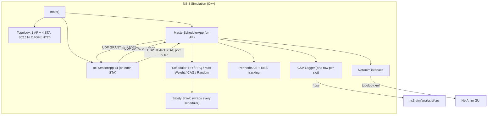

# AoI DRL Scheduler — NS-3 Simulation

A review-ready NS-3 simulation of the 1-AP + 4-STA testbed: a centralized
grant-reply scheduling protocol running as an application-layer overlay on
802.11n, identical in structure to the real ESP32 + Raspberry Pi firmware
(see [`common/contracts/packets.py`](../common/contracts/packets.py)).
It compares five baseline schedulers under a deterministic AoI safety
shield and produces the plots used in the panel demo.

This is a simulation-only deliverable: it does **not** run DRL training
inside NS-3 (that needs `ns3-ai` shared-memory integration and is a later
phase). It demonstrates the baseline schedulers, the safety shield, and
AoI telemetry, and cross-validates its math against the project's frozen
Python contracts.

## Prerequisites

- A native Linux install (Ubuntu 22.04 or 24.04) — NS-3 does not build on
  Windows, and this project assumes a Linux/dual-boot environment rather
  than WSL2.
- ~4 GB free disk space for NS-3 + NetAnim.
- Python 3.11+ with `pandas`, `matplotlib`, `numpy` for the analysis
  scripts (these can run on the same Linux install, or anywhere with a
  copy of this repo).

## Quick Start

```bash
# 1. Install NS-3.41 and symlink this directory into its scratch/ folder
bash ns3-sim/scripts/ns3_setup.sh

# 2. Single run
cd ~/ns3/ns-allinone-3.41/ns-3.41
./ns3 run "scratch/aoi-scheduler/aoi-scheduler-sim --scheduler=cag --seed=0 --csvOutput=results/cag_seed0.csv"

# 3. Full comparison campaign (25 runs + all plots)
bash ns3-sim/scripts/run_all_schedulers.sh

# 4. View the animated topology
netanim  # then open ns3-sim/results/topology.xml
```

## Architecture



## Node Configuration

| Node  | Class     | Weight | Distance | Shield ceiling |
|-------|-----------|--------|----------|-----------------|
| STA-1 | Urgent    | 10     | 5 m      | 2.0 s |
| STA-2 | Urgent    | 10     | 8 m      | 2.0 s |
| STA-3 | Important | 3      | 12 m     | 6.0 s |
| STA-4 | Routine   | 1      | 18 m     | 20.0 s |

These match `config/system.yaml`'s `system.node_classes`,
`scheduler.weights`, and `scheduler.shield_ceilings_s` exactly.

## Scheduler Algorithms

All are wrapped by the safety shield, which force-grants the highest
`weight * AoI` node among any breaching its ceiling:

- **Round Robin**: `a_t = t mod 4`
- **Fixed Priority**: highest class (urgent > important > routine), ties
  broken by AoI.
- **Max-Weight**: `argmax_i  w_i * AoI_i`
- **Channel-Aware Greedy**: `argmax_i  w_i * AoI_i * p_success(RSSI_i)`,
  with a logistic `p_success` (R50 = -82 dBm, slope 4 dB).
- **Random**: uniform over the 4 nodes.

## Parameters

| CLI flag | Meaning | Maps to `config/system.yaml` |
|---|---|---|
| `--scheduler` | `rr\|fpq\|maxweight\|cag\|random` | (new; not in config) |
| `--slotDuration` | Slot duration, seconds | placeholder 100 ms, pending P1 hardware measurement |
| `--simTime` | Simulation duration, seconds | `scheduler.run_duration_s` (300) |
| `--seed` | RNG seed | `rl.train_seeds` / `rl.eval_seeds` |
| `--enableNetAnim` | Emit `topology.xml` | — |
| `--csvOutput` | Per-slot telemetry CSV path | — |

## Output Files

Written next to whatever directory `--csvOutput` points at:

- **CSV** — per-slot telemetry; columns match
  [`common/contracts/log_schema.py`](../common/contracts/log_schema.py)'s
  `SLOT_LOG_COLUMNS` exactly.
- **`flowmon-results.xml`** — NS-3 FlowMonitor per-flow stats.
- **`topology.xml`** — NetAnim animation (only when `--enableNetAnim=true`).

## Analysis Scripts

Run from the project root so `common.contracts` resolves:

```bash
python ns3-sim/analysis/plot_aoi_sawtooth.py ns3-sim/results/cag_seed0.csv
python ns3-sim/analysis/plot_scheduler_comparison.py ns3-sim/results/
python ns3-sim/analysis/generate_flowmon_plots.py ns3-sim/results/flowmon-results.xml
python ns3-sim/analysis/validate_against_contracts.py ns3-sim/results/rr_seed0.csv
```

## Contract Validation

`validate_against_contracts.py` is the bridge that proves the C++
simulation and the Python codebase agree on the math:

1. Checks the CSV's column order against `SLOT_LOG_COLUMNS`.
2. Independently replays every node's AoI trace using
   `common.contracts.aoi.update_aoi_for_slot` and diffs it against what
   NS-3 logged (tolerance well under one slot's floating-point noise).
3. Prints `common.contracts.state_spec.get_state_schema_hash()` for
   provenance.

## Troubleshooting

- **`./ns3 configure` fails on Qt/NetAnim deps** — install
  `qtbase5-dev qtchooser qt5-qmake qtbase5-dev-tools`; NetAnim itself
  builds separately with `qmake NetAnim.pro && make`.
- **`import common.contracts...` fails in the analysis scripts** — run
  them from the project root, or note that
  `validate_against_contracts.py` inserts the project root onto
  `sys.path` itself (two directories up from `ns3-sim/analysis/`).
- **CSV file fails to open (`NS_ASSERT_MSG`)** — the simulation does not
  create output directories; `mkdir -p` the `--csvOutput` parent first
  (both `ns3_setup.sh`'s verification step and `run_all_schedulers.sh`
  already do this for `ns3-sim/results/`).
